# Introduction: The Open Food Facts Dataset
* Data Source: [Kaggle Page](https://www.kaggle.com/datasets/openfoodfacts/world-food-facts) , [Open Food Facts Official Data Page](https://world.openfoodfacts.org/data)  
* What this dataset contains: 356027 records of pre-packaged food/grocery products sold by food retailers worldwidely. But most records are from North America (mainly the US) and West Europe (mainly France).

example of a data record on Open Food Facts:
* ["Sunridge, organic quinoa coconut granola with mango"](https://world.openfoodfacts.org/product/00018319/sunridge-organic-quinoa-coconut-granola-with-mango)
* ["Alpro Mango (meer fruit)"](https://world.openfoodfacts.org/product/5411188125808/alpro-mango-meer-fruit)

Domain expert knowledge -- Nutritional science & Food Industry:
* Nutri-Score:
    * Valid Numeric Range: `[-15 : 40]`; Letter Grades `["a","b", "c", "d", "e"]`
        * the Healthier the Food, the LOWER the score
        * i.e. the healthiest Food gets a `-15` score (i.e. letter grade "a"), the unhealthiest food get a `40` score (i.e. letter grade "e").
    * [Nutri-Score wikipedia](https://en.wikipedia.org/wiki/Nutri-Score)
    * [Nutri-Score System Explanation](https://get.apicbase.com/nutri-score-science-based-nutritional-value-labelling-system/)
* Nutrition labelling: Nutrition facts table
    * Canadian Official Info Website about [Nutrition labelling](https://www.canada.ca/en/health-canada/services/understanding-food-labels/nutrition-facts-tables.html)

# Estimated Notebook Execution Time:
* `16m40s` with Colab Free Tier
* `9m40s` with Colab Pro
* Max RAM used `7.6GB`

# Part 0: Installs & Imports


```python
# Mount Google Drive
from google.colab import drive
drive.mount('/content/drive')
```

    Drive already mounted at /content/drive; to attempt to forcibly remount, call drive.mount("/content/drive", force_remount=True).


```python
%%capture
!pip install sqlalchemy==1.4.46
!pip install pandasql
# Section 2.1
!pip install deep-translator
```


```python
# For EDA and Data Cleaning
import pandas as pd
import pandasql as ps #SQL on Pandas Dataframe
import numpy as np
import datetime as dt
from deep_translator import GoogleTranslator # Section 2.1

# For Visualization
import matplotlib.pyplot as plt
import matplotlib.ticker as tck # for setting minor ticks
import seaborn as sns
from wordcloud import WordCloud
from collections import Counter

# For ML
from sklearn.preprocessing import OrdinalEncoder # Section 3.2
from sklearn.impute import SimpleImputer # Section 3.3
from sklearn.model_selection import train_test_split
from sklearn.preprocessing import StandardScaler
from sklearn.decomposition import PCA
from imblearn.under_sampling import RandomUnderSampler # Section 3.4.4
from sklearn.linear_model import LogisticRegression # Section 3.4
from sklearn.ensemble import RandomForestClassifier # Section 3.5
from sklearn.linear_model import LinearRegression # Section 3.6
from sklearn.model_selection import RandomizedSearchCV # Section 3.4
from sklearn.ensemble import RandomForestRegressor # Section 3.7
from sklearn.linear_model import ElasticNetCV # Section 3.6
from sklearn.metrics import accuracy_score # Section 3.4, 3.5 LogisticReg, RandomForestClassifier
from sklearn.metrics import confusion_matrix # Section 3.4, 3.5
from sklearn.metrics import r2_score # Sectoin 3.6 LinearReg, RandomForestRegressor
from sklearn.metrics import roc_auc_score
```

## Colab Display Formatting


```python
# Adjust Colab DF display Formats:
# https://stackoverflow.com/questions/54692405/output-truncation-in-google-colab
# https://stackoverflow.com/questions/68588977/google-colaboratory-data-table-display-max-20-columns
from google.colab import data_table
#data_table.enable_dataframe_formatter()
data_table.disable_dataframe_formatter()

pd.set_option('display.max_columns', 164) # max can display 164 columns
pd.set_option('display.max_rows', 20) # max can display 20 columns
pd.set_option('display.max_colwidth',100)

# disable the warnings
import warnings
warnings.filterwarnings('ignore')
```

# Part 1: Data Loading and Cleaning

## 1.1 Fetching Dataset

### Option 1: Download Dataset Directly from Kaggle

We are using one TSV (tab seperated values) file for this project -- `en.openfoodfacts.org.products.tsv` from the Kaggle [dataset](https://www.kaggle.com/datasets/openfoodfacts/world-food-facts).

To get the data in here:
1. Go to this [Kaggle link](https://www.kaggle.com) and create a Kaggle account (unless you already have one)
2. Go to Account and click on "Create New API Token" to get the API key in the form of a json file `kaggle.json`
3. Upload the `kaggle.json` file to the default location (i.e.`MyDrive` folder) in your Google Drive.  
    * Please **DO NOT** upload the json file into any other folder locations.   
    Unless you know how to modify the `filepath` variable in the `!cp _filepath_ ~/.kaggle/` command.

Run the following cells to allow Colab to connect to Kaggle and to download the data.


```python
%%capture
!apt update
!pip install kaggle
```


```python
# 1) Create the kaggle API directory
#    >> '-p' option : create a directory only if it does not already exist
# 2) Read the uploaded kaggle.json file
# 3) use Kaggle API to download the dataset
# 4) Unzip the dataset folder into the Colab "Local" directory
#    >> '-n' option: never overwrite pre-existing unzip.
#                    i.e. unzip only if it doesn't already exist.
#    >> http://www.manpagez.com/man/1/unzip/
!mkdir -p ~/.kaggle
!cp /content/drive/MyDrive/kaggle.json ~/.kaggle/
!!kaggle datasets download -d openfoodfacts/world-food-facts
!unzip -n /content/world-food-facts.zip
```

    Archive:  /content/world-food-facts.zip


```python
# Read the tsv file and save it to a dataframe called `df_rawFoodFacts`
# read TSV file: https://stackoverflow.com/questions/9652832/how-to-load-a-tsv-file-into-a-pandas-dataframe
dataFile = "en.openfoodfacts.org.products.tsv"
df_rawFoodFacts = pd.read_csv(dataFile, sep='\t', low_memory=False)
```

### Option 2: Fetch Dataset from Google Drive


```python
# Read the tsv file and save it to a dataframe called `df_rawFoodFacts`
# ########## uncomment these codes ##############################
# dataFile = "en.openfoodfacts.org.products.tsv"
# filePath = "/content/drive/MyDrive/FoodFacts_Project/Notebooks/" + dataFile
# df_rawFoodFacts = pd.read_csv(filePath, sep='\t', low_memory=False)
```

## 1.2 EDA & Data Cleaning

Information Overview of the dataset:
* `356027` Rows: 0 to 356026  
* 163 Columns: `code` to `water-hardness_100g`  
    * dtypes: 107 columns of `float64`, 56 columns of `object`  
* memory usage: `442.8+ MB`  
* columns \[`63`\~`157`, `161`\~`162`\] are the nutrients (i.e. food nutrient related metrics)
* columns `159` & `160` are the _numeric_ nutrition scores: `nutrition-score-fr_100g`, `nutrition-score-uk_100g`
* column `53` is the _categorical_ nutrition grade: `nutrition_grade_fr`
    *  column `52` is `nutrition_grade_uk`, but it is completely empty. We will omit it.


```python
# Get the overall information of this input raw DF
#df_rawFoodFacts.info()
# Or reveal the information in more details
# https://pandas.pydata.org/docs/reference/api/pandas.DataFrame.info.html
df_rawFoodFacts.info(verbose=True, show_counts=True)
```

    <class 'pandas.core.frame.DataFrame'>
    RangeIndex: 356027 entries, 0 to 356026
    Data columns (total 163 columns):
     #    Column                                      Non-Null Count   Dtype  
    ---   ------                                      --------------   -----  
     0    code                                        356001 non-null  object 
     1    url                                         356001 non-null  object 
     2    creator                                     356024 non-null  object 
     3    created_t                                   356024 non-null  object 
     4    created_datetime                            356017 non-null  object 
     5    last_modified_t                             356027 non-null  object 
     6    last_modified_datetime                      356027 non-null  object 
     7    product_name                                338515 non-null  object 
     8    generic_name                                57714 non-null   object 
     9    quantity                                    119285 non-null  object 
     10   packaging                                   89959 non-null   object 
     11   packaging_tags                              89959 non-null   object 
     12   brands                                      326977 non-null  object 
     13   brands_tags                                 326957 non-null  object 
     14   categories                                  103299 non-null  object 
     15   categories_tags                             103275 non-null  object 
     16   categories_en                               103301 non-null  object 
     17   origins                                     25050 non-null   object 
     18   origins_tags                                25012 non-null   object 
     19   manufacturing_places                        42008 non-null   object 
     20   manufacturing_places_tags                   42001 non-null   object 
     21   labels                                      59098 non-null   object 
     22   labels_tags                                 59178 non-null   object 
     23   labels_en                                   59204 non-null   object 
     24   emb_codes                                   32490 non-null   object 
     25   emb_codes_tags                              32486 non-null   object 
     26   first_packaging_code_geo                    20872 non-null   object 
     27   cities                                      26 non-null      object 
     28   cities_tags                                 22502 non-null   object 
     29   purchase_places                             66565 non-null   object 
     30   stores                                      57701 non-null   object 
     31   countries                                   355752 non-null  object 
     32   countries_tags                              355752 non-null  object 
     33   countries_en                                355752 non-null  object 
     34   ingredients_text                            283893 non-null  object 
     35   allergens                                   37176 non-null   object 
     36   allergens_en                                20 non-null      object 
     37   traces                                      28421 non-null   object 
     38   traces_tags                                 28394 non-null   object 
     39   traces_en                                   28420 non-null   object 
     40   serving_size                                216621 non-null  object 
     41   no_nutriments                               0 non-null       float64
     42   additives_n                                 283867 non-null  float64
     43   additives                                   283825 non-null  object 
     44   additives_tags                              170189 non-null  object 
     45   additives_en                                170189 non-null  object 
     46   ingredients_from_palm_oil_n                 283867 non-null  float64
     47   ingredients_from_palm_oil                   0 non-null       float64
     48   ingredients_from_palm_oil_tags              6572 non-null    object 
     49   ingredients_that_may_be_from_palm_oil_n     283867 non-null  float64
     50   ingredients_that_may_be_from_palm_oil       0 non-null       float64
     51   ingredients_that_may_be_from_palm_oil_tags  14328 non-null   object 
     52   nutrition_grade_uk                          0 non-null       float64
     53   nutrition_grade_fr                          254856 non-null  object 
     54   pnns_groups_1                               129006 non-null  object 
     55   pnns_groups_2                               132689 non-null  object 
     56   states                                      355975 non-null  object 
     57   states_tags                                 355975 non-null  object 
     58   states_en                                   355975 non-null  object 
     59   main_category                               103249 non-null  object 
     60   main_category_en                            103249 non-null  object 
     61   image_url                                   75725 non-null   object 
     62   image_small_url                             75725 non-null   object 
     63   energy_100g                                 295367 non-null  float64
     64   energy-from-fat_100g                        869 non-null     float64
     65   fat_100g                                    279497 non-null  float64
     66   saturated-fat_100g                          263823 non-null  float64
     67   -butyric-acid_100g                          0 non-null       float64
     68   -caproic-acid_100g                          0 non-null       float64
     69   -caprylic-acid_100g                         1 non-null       float64
     70   -capric-acid_100g                           2 non-null       float64
     71   -lauric-acid_100g                           4 non-null       float64
     72   -myristic-acid_100g                         1 non-null       float64
     73   -palmitic-acid_100g                         1 non-null       float64
     74   -stearic-acid_100g                          1 non-null       float64
     75   -arachidic-acid_100g                        27 non-null      float64
     76   -behenic-acid_100g                          26 non-null      float64
     77   -lignoceric-acid_100g                       0 non-null       float64
     78   -cerotic-acid_100g                          0 non-null       float64
     79   -montanic-acid_100g                         1 non-null       float64
     80   -melissic-acid_100g                         0 non-null       float64
     81   monounsaturated-fat_100g                    23040 non-null   float64
     82   polyunsaturated-fat_100g                    23075 non-null   float64
     83   omega-3-fat_100g                            938 non-null     float64
     84   -alpha-linolenic-acid_100g                  201 non-null     float64
     85   -eicosapentaenoic-acid_100g                 43 non-null      float64
     86   -docosahexaenoic-acid_100g                  89 non-null      float64
     87   omega-6-fat_100g                            207 non-null     float64
     88   -linoleic-acid_100g                         159 non-null     float64
     89   -arachidonic-acid_100g                      9 non-null       float64
     90   -gamma-linolenic-acid_100g                  27 non-null      float64
     91   -dihomo-gamma-linolenic-acid_100g           26 non-null      float64
     92   omega-9-fat_100g                            25 non-null      float64
     93   -oleic-acid_100g                            15 non-null      float64
     94   -elaidic-acid_100g                          0 non-null       float64
     95   -gondoic-acid_100g                          16 non-null      float64
     96   -mead-acid_100g                             0 non-null       float64
     97   -erucic-acid_100g                           0 non-null       float64
     98   -nervonic-acid_100g                         0 non-null       float64
     99   trans-fat_100g                              143443 non-null  float64
     100  cholesterol_100g                            144170 non-null  float64
     101  carbohydrates_100g                          279220 non-null  float64
     102  sugars_100g                                 279186 non-null  float64
     103  -sucrose_100g                               85 non-null      float64
     104  -glucose_100g                               32 non-null      float64
     105  -fructose_100g                              44 non-null      float64
     106  -lactose_100g                               278 non-null     float64
     107  -maltose_100g                               6 non-null       float64
     108  -maltodextrins_100g                         11 non-null      float64
     109  starch_100g                                 291 non-null     float64
     110  polyols_100g                                451 non-null     float64
     111  fiber_100g                                  220683 non-null  float64
     112  proteins_100g                               294161 non-null  float64
     113  casein_100g                                 29 non-null      float64
     114  serum-proteins_100g                         17 non-null      float64
     115  nucleotides_100g                            9 non-null       float64
     116  salt_100g                                   289739 non-null  float64
     117  sodium_100g                                 289694 non-null  float64
     118  alcohol_100g                                4577 non-null    float64
     119  vitamin-a_100g                              137706 non-null  float64
     120  beta-carotene_100g                          35 non-null      float64
     121  vitamin-d_100g                              7207 non-null    float64
     122  vitamin-e_100g                              1472 non-null    float64
     123  vitamin-k_100g                              930 non-null     float64
     124  vitamin-c_100g                              141060 non-null  float64
     125  vitamin-b1_100g                             11277 non-null   float64
     126  vitamin-b2_100g                             10925 non-null   float64
     127  vitamin-pp_100g                             11831 non-null   float64
     128  vitamin-b6_100g                             6897 non-null    float64
     129  vitamin-b9_100g                             5330 non-null    float64
     130  folates_100g                                3046 non-null    float64
     131  vitamin-b12_100g                            5390 non-null    float64
     132  biotin_100g                                 331 non-null     float64
     133  pantothenic-acid_100g                       2551 non-null    float64
     134  silica_100g                                 73 non-null      float64
     135  bicarbonate_100g                            99 non-null      float64
     136  potassium_100g                              24848 non-null   float64
     137  chloride_100g                               198 non-null     float64
     138  calcium_100g                                141517 non-null  float64
     139  phosphorus_100g                             5938 non-null    float64
     140  iron_100g                                   140660 non-null  float64
     141  magnesium_100g                              6392 non-null    float64
     142  zinc_100g                                   3964 non-null    float64
     143  copper_100g                                 2122 non-null    float64
     144  manganese_100g                              1639 non-null    float64
     145  fluoride_100g                               99 non-null      float64
     146  selenium_100g                               1181 non-null    float64
     147  chromium_100g                               23 non-null      float64
     148  molybdenum_100g                             20 non-null      float64
     149  iodine_100g                                 288 non-null     float64
     150  caffeine_100g                               91 non-null      float64
     151  taurine_100g                                33 non-null      float64
     152  ph_100g                                     52 non-null      float64
     153  fruits-vegetables-nuts_100g                 3228 non-null    float64
     154  fruits-vegetables-nuts-estimate_100g        404 non-null     float64
     155  collagen-meat-protein-ratio_100g            182 non-null     float64
     156  cocoa_100g                                  1383 non-null    float64
     157  chlorophyl_100g                             0 non-null       float64
     158  carbon-footprint_100g                       278 non-null     float64
     159  nutrition-score-fr_100g                     254856 non-null  float64
     160  nutrition-score-uk_100g                     254856 non-null  float64
     161  glycemic-index_100g                         0 non-null       float64
     162  water-hardness_100g                         0 non-null       float64
    dtypes: float64(107), object(56)
    memory usage: 442.8+ MB


### 1.2.1 Examine which Columns are Needed

#### Checking about target colums

1) `nutrition-score-fr_100g` vs `nutrition-score-uk_100g`
* We postulate that `nutrition-score-fr_100g` and/or `nutrition-score-uk_100g` are suitable the **target** column(s) for making continous values predictions (i.e. Linear Regression Models).
* Hence, we want to check if these two columns contain similar values, and if we can keep only one of them.

Observation:
* 342964 entries of similar score = $96.33\%$
* 13063 entries of different score = $3.67\%$
* these two columns have a correlation of `0.98`
* Conclusion: "fr" score and "uk" score are about the same. We can keep only one of them.


```python
# 1) gather the 3 suspected "target" columns together for comparison
df_targets = df_rawFoodFacts[["nutrition-score-uk_100g", "nutrition-score-fr_100g", "nutrition_grade_fr"]]
# 2) Compare "nutrition-score-uk" & "nutrition-score-fr" for similarities and difference.
df_targets['compare'] = (df_targets["nutrition-score-fr_100g"] == df_targets["nutrition-score-uk_100g"]) | \
                        (df_targets["nutrition-score-fr_100g"].isna() & df_targets["nutrition-score-uk_100g"].isna())
res = df_targets['compare'].value_counts()
#res
print("Nutrition Socre \"_uk\" vs \"_fr\":")
print("Similar Score Entries %d,  Percentage:  %.2f %%"%(res.iloc[0], res.iloc[0] / df_rawFoodFacts.shape[0] *100))
print("Different Score Entries %d, Percentage: %.2f %%" %(res.iloc[1],res.iloc[1] / df_rawFoodFacts.shape[0] *100))
```

    Nutrition Socre "_uk" vs "_fr":
    Similar Score Entries 342964,  Percentage:  96.33 %
    Different Score Entries 13063, Percentage: 3.67 %


```python
# 2) Check the correlation between the two columns
ukfr_corr = df_targets[["nutrition-score-uk_100g", "nutrition-score-fr_100g"]].corr()
plt.figure(figsize=(5,3))
htmpAX = sns.heatmap(ukfr_corr,cmap='RdBu', annot=True)
htmpAX.set(title='Correlation of nutrition_score_uk vs nutrition_score_fr',
              xlabel="nutrition score",
              ylabel="nutrition score")
htmpAX.xaxis.label.set_size(10)
htmpAX.yaxis.label.set_size(10)
htmpAX.title.set_size(12)
htmpAX.set_xticklabels(htmpAX.get_xticklabels(), fontsize=9, rotation=0, ha="center", rotation_mode='anchor')
htmpAX.set_yticklabels(htmpAX.get_yticklabels(), fontsize=9, rotation=0, ha="right", rotation_mode='anchor')
plt.show()
```


    
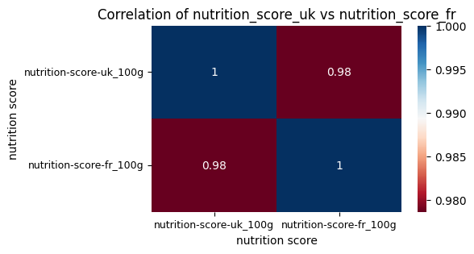
    


2) `nutrition_grade_fr` and `nutrition-score-fr_100g`

* We postulate that `nutrition_grade_fr` is the suitable **target** column for making categorical predictions (i.e. Logstic Regression Models).

Observation:  In accordance with [the Nutri-Score System](https://get.apicbase.com/nutri-score-science-based-nutritional-value-labelling-system/),
* the `nutrition_grade_fr` column contains the 5-Class letter grades of the food's nutritional value, and the grading is ranked as `a < b < c < d < e`
* `nutrition_grade_fr` is tightly related to the `nutrition-score-fr_100g` column.   
i.e. the letter grade [`a` ~ `e`] divides the numeric scores [`-15` ~ `40`] into 5 grading classes.
* Hence, there is "ordering" in the `nutrition_grade_fr` column => an ordinal categorical variable
    * **"Ordinal Encoding"** should to be applied in order to run categorical ML predictions targeting this column.

Our Decision:
* Keep  `nutrition_grade_fr` as the target column for logistic regression models.
* Keep `nutrition-score-fr_100g` as the target column for linear regression models, this is also to maintain better scoring consistency with the `nutrition_grade_fr` column
* Discard `nutrition-score-uk_100g`

Visualize `nutrition_grade_fr` vs `nutrition-score-fr_100g`:


```python
# https://seaborn.pydata.org/tutorial/categorical.html
# http://seaborn.pydata.org/generated/seaborn.boxplot.html
# https://www.codecademy.com/article/seaborn-design-ii
# http://seaborn.pydata.org/generated/seaborn.set_style.html
custom_palette = sns.color_palette("Paired", 9)
plt.figure(figsize=(8, 6))
sns.set_style("ticks")
boxplt = sns.boxplot(data=df_targets.sort_values(by="nutrition_grade_fr", ascending=[True]),
                     x="nutrition_grade_fr", y="nutrition-score-fr_100g", hue="nutrition_grade_fr",
                     showfliers=False, palette = custom_palette, width=0.8, dodge=False)
boxplt.set(title='5-level \'Nutrition Grade\' Distribution Range against \'Nutrition Score\'',
           xlabel='Nutrition Grade (\'nutrition_grade_fr\')',
           ylabel='Nutrition Score (\'nutrition-score-fr_100g\')',
           yticks=range(-15,41,5))
boxplt.yaxis.set_minor_locator(plt.MultipleLocator(1)) # ticks space 1
plt.show()
```


    
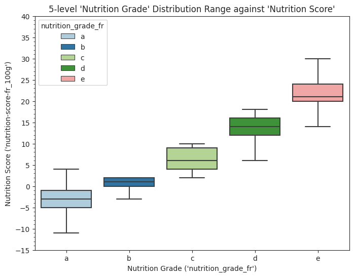
    


#### Drop unnecessary columns
1) Drop the following columns which are not relevant or useful to our project:


```python
df_cleaningFoodFacts = df_rawFoodFacts.drop(columns=[
    'code', 'url','creator', 'created_t', 'created_datetime','last_modified_t', 'last_modified_datetime',
    'packaging_tags','brands_tags',
    'categories', # reason: entries in Franch
    'categories_tags', #tagging format
    'origins_tags', # reason: formatting
    'manufacturing_places', 'manufacturing_places_tags',
    'labels', # reason: entries in Franch
    'labels_tags', # reason: entries in Franch
    'emb_codes', 'emb_codes_tags', #reason: unneeded
    'cities', # reason: 0 entries
    'cities_tags', # all in french
    'stores', 'countries', 'countries_tags',
    'traces', 'traces_tags', # reason: french
    'additives_tags','additives_en',
    'ingredients_from_palm_oil_tags', 'ingredients_that_may_be_from_palm_oil_tags', # unneeded
    'states', 'states_tags','states_en','main_category',
    'image_url','image_small_url',
    'nutrition-score-uk_100g' #no difference from the _fr col
    ])
```

2) For the Nutrient Columns, drop any column that contains less than `25%` valid values i.e. there are more than `75%` missing values.


```python
# dropna() "thresh" param: specifies the minimum number of non-NA values in a row
#                          or column for it to be considered in the final result
totalRows = df_cleaningFoodFacts.shape[0]
percent = 0.25
print(int(percent*totalRows)) # 89006 valid values is the minimal cutoff
df_FdFts_25 = df_cleaningFoodFacts.dropna(thresh=int(percent*totalRows), axis=1)
```

    89006


```python
df_FdFts_25.info() # 356027 x 32
```

    <class 'pandas.core.frame.DataFrame'>
    RangeIndex: 356027 entries, 0 to 356026
    Data columns (total 32 columns):
     #   Column                                   Non-Null Count   Dtype  
    ---  ------                                   --------------   -----  
     0   product_name                             338515 non-null  object 
     1   quantity                                 119285 non-null  object 
     2   packaging                                89959 non-null   object 
     3   brands                                   326977 non-null  object 
     4   categories_en                            103301 non-null  object 
     5   countries_en                             355752 non-null  object 
     6   ingredients_text                         283893 non-null  object 
     7   serving_size                             216621 non-null  object 
     8   additives_n                              283867 non-null  float64
     9   additives                                283825 non-null  object 
     10  ingredients_from_palm_oil_n              283867 non-null  float64
     11  ingredients_that_may_be_from_palm_oil_n  283867 non-null  float64
     12  nutrition_grade_fr                       254856 non-null  object 
     13  pnns_groups_1                            129006 non-null  object 
     14  pnns_groups_2                            132689 non-null  object 
     15  main_category_en                         103249 non-null  object 
     16  energy_100g                              295367 non-null  float64
     17  fat_100g                                 279497 non-null  float64
     18  saturated-fat_100g                       263823 non-null  float64
     19  trans-fat_100g                           143443 non-null  float64
     20  cholesterol_100g                         144170 non-null  float64
     21  carbohydrates_100g                       279220 non-null  float64
     22  sugars_100g                              279186 non-null  float64
     23  fiber_100g                               220683 non-null  float64
     24  proteins_100g                            294161 non-null  float64
     25  salt_100g                                289739 non-null  float64
     26  sodium_100g                              289694 non-null  float64
     27  vitamin-a_100g                           137706 non-null  float64
     28  vitamin-c_100g                           141060 non-null  float64
     29  calcium_100g                             141517 non-null  float64
     30  iron_100g                                140660 non-null  float64
     31  nutrition-score-fr_100g                  254856 non-null  float64
    dtypes: float64(19), object(13)
    memory usage: 86.9+ MB


### 1.2.3 Drop Nulls & Duplicates
* After carefully evaluating our dataset, we have noticed that `product_name`, `nutrition_grade_fr`, and `nutrition-score-fr_100g` are the three "**key**" attributes that a valid food record must have
* Therefore, we perform `dropna()` operation based on the policy that any food record must have valid entries for all 3 attributes, if not, we drop such record.
* Number of Tuples reduced from `356027` to `250128`


```python
sbst = ['product_name', 'nutrition_grade_fr','nutrition-score-fr_100g'] # centrnal ! important columns
df_FdFts_cleaning1 = df_FdFts_25.dropna(how='any', subset=sbst, axis=0).drop_duplicates()
```


```python
df_FdFts_cleaning1.info() # 250128 x 32
```

    <class 'pandas.core.frame.DataFrame'>
    Int64Index: 250128 entries, 1 to 356022
    Data columns (total 32 columns):
     #   Column                                   Non-Null Count   Dtype  
    ---  ------                                   --------------   -----  
     0   product_name                             250128 non-null  object 
     1   quantity                                 74452 non-null   object 
     2   packaging                                64382 non-null   object 
     3   brands                                   247389 non-null  object 
     4   categories_en                            74425 non-null   object 
     5   countries_en                             250076 non-null  object 
     6   ingredients_text                         226948 non-null  object 
     7   serving_size                             175852 non-null  object 
     8   additives_n                              226948 non-null  float64
     9   additives                                226917 non-null  object 
     10  ingredients_from_palm_oil_n              226948 non-null  float64
     11  ingredients_that_may_be_from_palm_oil_n  226948 non-null  float64
     12  nutrition_grade_fr                       250128 non-null  object 
     13  pnns_groups_1                            97515 non-null   object 
     14  pnns_groups_2                            97570 non-null   object 
     15  main_category_en                         74425 non-null   object 
     16  energy_100g                              249932 non-null  float64
     17  fat_100g                                 234114 non-null  float64
     18  saturated-fat_100g                       249932 non-null  float64
     19  trans-fat_100g                           133573 non-null  float64
     20  cholesterol_100g                         135267 non-null  float64
     21  carbohydrates_100g                       234085 non-null  float64
     22  sugars_100g                              249932 non-null  float64
     23  fiber_100g                               209287 non-null  float64
     24  proteins_100g                            249932 non-null  float64
     25  salt_100g                                249932 non-null  float64
     26  sodium_100g                              249932 non-null  float64
     27  vitamin-a_100g                           130278 non-null  float64
     28  vitamin-c_100g                           131146 non-null  float64
     29  calcium_100g                             133781 non-null  float64
     30  iron_100g                                132814 non-null  float64
     31  nutrition-score-fr_100g                  250128 non-null  float64
    dtypes: float64(19), object(13)
    memory usage: 63.0+ MB


### 1.2.4 Data Source Demo Webpages:
* ["Sunridge, organic quinoa coconut granola with mango"](https://world.openfoodfacts.org/product/00018319/)


```python
# #############################################
# If want to check how a data record correspond to a webpage on the "Open Food Fact" website
# ####### uncomment these codes ###############
query = """
    SELECT *
    FROM df_FdFts_cleaning1
    WHERE product_name LIKE '%Organic Quinoa Coconut Granola With Mango%'
    LIMIT 5
"""
demo = ps.sqldf(query, locals())
demo
```


  <div id="df-353ccfcc-7d49-4dac-8182-49805e88cab4">
    <div class="colab-df-container">
      <div>
<style scoped>
    .dataframe tbody tr th:only-of-type {
        vertical-align: middle;
    }

    .dataframe tbody tr th {
        vertical-align: top;
    }

    .dataframe thead th {
        text-align: right;
    }
</style>
<table border="1" class="dataframe">
  <thead>
    <tr style="text-align: right;">
      <th></th>
      <th>product_name</th>
      <th>quantity</th>
      <th>packaging</th>
      <th>brands</th>
      <th>categories_en</th>
      <th>countries_en</th>
      <th>ingredients_text</th>
      <th>serving_size</th>
      <th>additives_n</th>
      <th>additives</th>
      <th>ingredients_from_palm_oil_n</th>
      <th>ingredients_that_may_be_from_palm_oil_n</th>
      <th>nutrition_grade_fr</th>
      <th>pnns_groups_1</th>
      <th>pnns_groups_2</th>
      <th>main_category_en</th>
      <th>energy_100g</th>
      <th>fat_100g</th>
      <th>saturated-fat_100g</th>
      <th>trans-fat_100g</th>
      <th>cholesterol_100g</th>
      <th>carbohydrates_100g</th>
      <th>sugars_100g</th>
      <th>fiber_100g</th>
      <th>proteins_100g</th>
      <th>salt_100g</th>
      <th>sodium_100g</th>
      <th>vitamin-a_100g</th>
      <th>vitamin-c_100g</th>
      <th>calcium_100g</th>
      <th>iron_100g</th>
      <th>nutrition-score-fr_100g</th>
    </tr>
  </thead>
  <tbody>
    <tr>
      <th>0</th>
      <td>Organic Quinoa Coconut Granola With Mango</td>
      <td>None</td>
      <td>None</td>
      <td>Sunridge</td>
      <td>None</td>
      <td>United States</td>
      <td>Organic rolled oats, organic evaporated cane juice, organic quinoa flakes, organic raisins, orga...</td>
      <td>55 g (0.5 cup)</td>
      <td>0.0</td>
      <td>[ organic-rolled-oats -&gt; en:organic-rolled-oats  ]  [ rolled-oats -&gt; en:rolled-oats  ]  [ oats ...</td>
      <td>0.0</td>
      <td>0.0</td>
      <td>c</td>
      <td>None</td>
      <td>None</td>
      <td>None</td>
      <td>1674.0</td>
      <td>10.91</td>
      <td>2.73</td>
      <td>None</td>
      <td>None</td>
      <td>69.09</td>
      <td>27.27</td>
      <td>9.1</td>
      <td>10.91</td>
      <td>0.02286</td>
      <td>0.009</td>
      <td>0.000055</td>
      <td>0.0065</td>
      <td>0.036</td>
      <td>0.00262</td>
      <td>7.0</td>
    </tr>
  </tbody>
</table>
</div>
      <button class="colab-df-convert" onclick="convertToInteractive('df-353ccfcc-7d49-4dac-8182-49805e88cab4')"
              title="Convert this dataframe to an interactive table."
              style="display:none;">

  <svg xmlns="http://www.w3.org/2000/svg" height="24px"viewBox="0 0 24 24"
       width="24px">
    <path d="M0 0h24v24H0V0z" fill="none"/>
    <path d="M18.56 5.44l.94 2.06.94-2.06 2.06-.94-2.06-.94-.94-2.06-.94 2.06-2.06.94zm-11 1L8.5 8.5l.94-2.06 2.06-.94-2.06-.94L8.5 2.5l-.94 2.06-2.06.94zm10 10l.94 2.06.94-2.06 2.06-.94-2.06-.94-.94-2.06-.94 2.06-2.06.94z"/><path d="M17.41 7.96l-1.37-1.37c-.4-.4-.92-.59-1.43-.59-.52 0-1.04.2-1.43.59L10.3 9.45l-7.72 7.72c-.78.78-.78 2.05 0 2.83L4 21.41c.39.39.9.59 1.41.59.51 0 1.02-.2 1.41-.59l7.78-7.78 2.81-2.81c.8-.78.8-2.07 0-2.86zM5.41 20L4 18.59l7.72-7.72 1.47 1.35L5.41 20z"/>
  </svg>
      </button>


    <div id="df-9adbc8ce-1ca5-4d4e-beef-fb292b32fe70">
      <button class="colab-df-quickchart" onclick="quickchart('df-9adbc8ce-1ca5-4d4e-beef-fb292b32fe70')"
              title="Suggest charts."
              style="display:none;">

<svg xmlns="http://www.w3.org/2000/svg" height="24px"viewBox="0 0 24 24"
     width="24px">
    <g>
        <path d="M19 3H5c-1.1 0-2 .9-2 2v14c0 1.1.9 2 2 2h14c1.1 0 2-.9 2-2V5c0-1.1-.9-2-2-2zM9 17H7v-7h2v7zm4 0h-2V7h2v10zm4 0h-2v-4h2v4z"/>
    </g>
</svg>
      </button>
    </div>

<style>
  .colab-df-quickchart {
    background-color: #E8F0FE;
    border: none;
    border-radius: 50%;
    cursor: pointer;
    display: none;
    fill: #1967D2;
    height: 32px;
    padding: 0 0 0 0;
    width: 32px;
  }

  .colab-df-quickchart:hover {
    background-color: #E2EBFA;
    box-shadow: 0px 1px 2px rgba(60, 64, 67, 0.3), 0px 1px 3px 1px rgba(60, 64, 67, 0.15);
    fill: #174EA6;
  }

  [theme=dark] .colab-df-quickchart {
    background-color: #3B4455;
    fill: #D2E3FC;
  }

  [theme=dark] .colab-df-quickchart:hover {
    background-color: #434B5C;
    box-shadow: 0px 1px 3px 1px rgba(0, 0, 0, 0.15);
    filter: drop-shadow(0px 1px 2px rgba(0, 0, 0, 0.3));
    fill: #FFFFFF;
  }
</style>

    <script>
      async function quickchart(key) {
        const containerElement = document.querySelector('#' + key);
        const charts = await google.colab.kernel.invokeFunction(
            'suggestCharts', [key], {});
      }
    </script>

      <script>

function displayQuickchartButton(domScope) {
  let quickchartButtonEl =
    domScope.querySelector('#df-9adbc8ce-1ca5-4d4e-beef-fb292b32fe70 button.colab-df-quickchart');
  quickchartButtonEl.style.display =
    google.colab.kernel.accessAllowed ? 'block' : 'none';
}

        displayQuickchartButton(document);
      </script>
      <style>
    .colab-df-container {
      display:flex;
      flex-wrap:wrap;
      gap: 12px;
    }

    .colab-df-convert {
      background-color: #E8F0FE;
      border: none;
      border-radius: 50%;
      cursor: pointer;
      display: none;
      fill: #1967D2;
      height: 32px;
      padding: 0 0 0 0;
      width: 32px;
    }

    .colab-df-convert:hover {
      background-color: #E2EBFA;
      box-shadow: 0px 1px 2px rgba(60, 64, 67, 0.3), 0px 1px 3px 1px rgba(60, 64, 67, 0.15);
      fill: #174EA6;
    }

    [theme=dark] .colab-df-convert {
      background-color: #3B4455;
      fill: #D2E3FC;
    }

    [theme=dark] .colab-df-convert:hover {
      background-color: #434B5C;
      box-shadow: 0px 1px 3px 1px rgba(0, 0, 0, 0.15);
      filter: drop-shadow(0px 1px 2px rgba(0, 0, 0, 0.3));
      fill: #FFFFFF;
    }
  </style>

      <script>
        const buttonEl =
          document.querySelector('#df-353ccfcc-7d49-4dac-8182-49805e88cab4 button.colab-df-convert');
        buttonEl.style.display =
          google.colab.kernel.accessAllowed ? 'block' : 'none';

        async function convertToInteractive(key) {
          const element = document.querySelector('#df-353ccfcc-7d49-4dac-8182-49805e88cab4');
          const dataTable =
            await google.colab.kernel.invokeFunction('convertToInteractive',
                                                     [key], {});
          if (!dataTable) return;

          const docLinkHtml = 'Like what you see? Visit the ' +
            '<a target="_blank" href=https://colab.research.google.com/notebooks/data_table.ipynb>data table notebook</a>'
            + ' to learn more about interactive tables.';
          element.innerHTML = '';
          dataTable['output_type'] = 'display_data';
          await google.colab.output.renderOutput(dataTable, element);
          const docLink = document.createElement('div');
          docLink.innerHTML = docLinkHtml;
          element.appendChild(docLink);
        }
      </script>
    </div>
  </div>


### 1.2.5 `df_FdFts_cleaning1` Stats Overview

We have checked the measurement units of each nutrient column by verifying with the data provider's webpage:
* ex. ["Sunridge, organic quinoa coconut granola with mango"](https://world.openfoodfacts.org/product/00018319/)
* ex. [Alpro Mango (meer fruit)](https://world.openfoodfacts.org/product/5411188125808/alpro-mango-meer-fruit)
---
* `energy_100g` is measured in `kj` (kilojules)
    * theoratical min value is `0.0 kj`, max value is `3765.6 kj`
    * Rationale: the most energy-dense type of foods are dietary oils (ex. butter, cooking oils etc.). And the max amount of energy contained in 100g of dietary oil is **`900 kcal`** ("kilocalories" is used as the measurement unit in North America), which is **`3765.6 kj`** ("kilojules" is used by West European countries like France). This dataset is provided and maintained by a French group.
* Both **Macro-nutrients** and **Micro-nutrients** are measured in `g` (gram):  
    Macro-nutrients: `fat_100g`, `saturated-fat_100g`, `trans-fat_100g`, `cholesterol_100g`, `carbohydrates_100g`, `sugars_100g`, `fiber_100g`, `proteins_100g`, `salt_100g`, `sodium_100g`   
    Micro-nutrients: `vitamin-a_100g`, `vitamin-c_100g`, `calcium_100g`, `iron_100g`
    * theoratical min value is `0 g`, max value is `100 g`  
_Note: on [Open Food Facts](https://world.openfoodfacts.org/product/00018319/sunridge-organic-quinoa-coconut-granola-with-mango) Website, `vitamin-a_100g` is displayed in `μg` (microgram); `vitamin-c_100g`, `calcium_100g`, `iron_100g` are displayed in `mg` (miligram). But in the database, they are stored in `g`._
* `nutrition-score-fr_100g`: according to the French [Nutri-Score evalution system](https://get.apicbase.com/nutri-score-science-based-nutritional-value-labelling-system/), the valid range is `[-15 : 40]`.
    * theoratical min value is `-15`, max value is `40`
    * Reminder: **the healthier foods actually get LOWER scores !**  
    i.e. the healthiest Food gets a `-15` score, the unhealthiest food get a `40` score.
---
Then by reviewing the overall statistic of `df_FdFts_cleaning1`, we spotted some abnomalities:
* certain columns have unreasonable `min` values => negative values:  
`trans-fat_100g`, `sugars_100g`, `proteins_100g`, `vitamin-c_100g`, `iron_100g`
* certain columns have unreasonble `max` values => "ridiculusly" large values:  
`energy_100g`, `fat_100g`, `saturated-fat_100g`, `trans-fat_100g`, `carbohydrates_100g`, `sugars_100g`, `fiber_100g`, `proteins_100g`, `salt_100g`, `sodium_100g`, `vitamin-c_100g`, `calcium_100g`
    * i.e. can't have more than 100g fat in 100g food, it doesn't make real-world sense.


```python
# 1) get the statistics description
summ = df_FdFts_cleaning1.describe()
#summ
# 2) Zoom into looking at the MIN & MAX of each column
# https://stackoverflow.com/a/56647748
summ.loc[['min','max']]
```


  <div id="df-421a1aa0-0d02-419c-b50a-a55bb4fbb3f9">
    <div class="colab-df-container">
      <div>
<style scoped>
    .dataframe tbody tr th:only-of-type {
        vertical-align: middle;
    }

    .dataframe tbody tr th {
        vertical-align: top;
    }

    .dataframe thead th {
        text-align: right;
    }
</style>
<table border="1" class="dataframe">
  <thead>
    <tr style="text-align: right;">
      <th></th>
      <th>additives_n</th>
      <th>ingredients_from_palm_oil_n</th>
      <th>ingredients_that_may_be_from_palm_oil_n</th>
      <th>energy_100g</th>
      <th>fat_100g</th>
      <th>saturated-fat_100g</th>
      <th>trans-fat_100g</th>
      <th>cholesterol_100g</th>
      <th>carbohydrates_100g</th>
      <th>sugars_100g</th>
      <th>fiber_100g</th>
      <th>proteins_100g</th>
      <th>salt_100g</th>
      <th>sodium_100g</th>
      <th>vitamin-a_100g</th>
      <th>vitamin-c_100g</th>
      <th>calcium_100g</th>
      <th>iron_100g</th>
      <th>nutrition-score-fr_100g</th>
    </tr>
  </thead>
  <tbody>
    <tr>
      <th>min</th>
      <td>0.0</td>
      <td>0.0</td>
      <td>0.0</td>
      <td>0.0</td>
      <td>0.0</td>
      <td>0.0</td>
      <td>-3.57</td>
      <td>0.000</td>
      <td>0.00</td>
      <td>-17.86</td>
      <td>0.000000e+00</td>
      <td>-3.57</td>
      <td>0.0</td>
      <td>0.0</td>
      <td>0.0</td>
      <td>-0.0021</td>
      <td>0.000</td>
      <td>-0.00026</td>
      <td>-15.0</td>
    </tr>
    <tr>
      <th>max</th>
      <td>30.0</td>
      <td>2.0</td>
      <td>6.0</td>
      <td>231199.0</td>
      <td>105.0</td>
      <td>550.0</td>
      <td>369.00</td>
      <td>95.238</td>
      <td>209.38</td>
      <td>3520.00</td>
      <td>8.481815e+10</td>
      <td>430.00</td>
      <td>64312.8</td>
      <td>25320.0</td>
      <td>0.8</td>
      <td>152.9412</td>
      <td>694.737</td>
      <td>50.00000</td>
      <td>40.0</td>
    </tr>
  </tbody>
</table>
</div>
      <button class="colab-df-convert" onclick="convertToInteractive('df-421a1aa0-0d02-419c-b50a-a55bb4fbb3f9')"
              title="Convert this dataframe to an interactive table."
              style="display:none;">

  <svg xmlns="http://www.w3.org/2000/svg" height="24px"viewBox="0 0 24 24"
       width="24px">
    <path d="M0 0h24v24H0V0z" fill="none"/>
    <path d="M18.56 5.44l.94 2.06.94-2.06 2.06-.94-2.06-.94-.94-2.06-.94 2.06-2.06.94zm-11 1L8.5 8.5l.94-2.06 2.06-.94-2.06-.94L8.5 2.5l-.94 2.06-2.06.94zm10 10l.94 2.06.94-2.06 2.06-.94-2.06-.94-.94-2.06-.94 2.06-2.06.94z"/><path d="M17.41 7.96l-1.37-1.37c-.4-.4-.92-.59-1.43-.59-.52 0-1.04.2-1.43.59L10.3 9.45l-7.72 7.72c-.78.78-.78 2.05 0 2.83L4 21.41c.39.39.9.59 1.41.59.51 0 1.02-.2 1.41-.59l7.78-7.78 2.81-2.81c.8-.78.8-2.07 0-2.86zM5.41 20L4 18.59l7.72-7.72 1.47 1.35L5.41 20z"/>
  </svg>
      </button>


    <div id="df-5e0cee33-bfb7-486c-b63d-996970871977">
      <button class="colab-df-quickchart" onclick="quickchart('df-5e0cee33-bfb7-486c-b63d-996970871977')"
              title="Suggest charts."
              style="display:none;">

<svg xmlns="http://www.w3.org/2000/svg" height="24px"viewBox="0 0 24 24"
     width="24px">
    <g>
        <path d="M19 3H5c-1.1 0-2 .9-2 2v14c0 1.1.9 2 2 2h14c1.1 0 2-.9 2-2V5c0-1.1-.9-2-2-2zM9 17H7v-7h2v7zm4 0h-2V7h2v10zm4 0h-2v-4h2v4z"/>
    </g>
</svg>
      </button>
    </div>

<style>
  .colab-df-quickchart {
    background-color: #E8F0FE;
    border: none;
    border-radius: 50%;
    cursor: pointer;
    display: none;
    fill: #1967D2;
    height: 32px;
    padding: 0 0 0 0;
    width: 32px;
  }

  .colab-df-quickchart:hover {
    background-color: #E2EBFA;
    box-shadow: 0px 1px 2px rgba(60, 64, 67, 0.3), 0px 1px 3px 1px rgba(60, 64, 67, 0.15);
    fill: #174EA6;
  }

  [theme=dark] .colab-df-quickchart {
    background-color: #3B4455;
    fill: #D2E3FC;
  }

  [theme=dark] .colab-df-quickchart:hover {
    background-color: #434B5C;
    box-shadow: 0px 1px 3px 1px rgba(0, 0, 0, 0.15);
    filter: drop-shadow(0px 1px 2px rgba(0, 0, 0, 0.3));
    fill: #FFFFFF;
  }
</style>

    <script>
      async function quickchart(key) {
        const containerElement = document.querySelector('#' + key);
        const charts = await google.colab.kernel.invokeFunction(
            'suggestCharts', [key], {});
      }
    </script>

      <script>

function displayQuickchartButton(domScope) {
  let quickchartButtonEl =
    domScope.querySelector('#df-5e0cee33-bfb7-486c-b63d-996970871977 button.colab-df-quickchart');
  quickchartButtonEl.style.display =
    google.colab.kernel.accessAllowed ? 'block' : 'none';
}

        displayQuickchartButton(document);
      </script>
      <style>
    .colab-df-container {
      display:flex;
      flex-wrap:wrap;
      gap: 12px;
    }

    .colab-df-convert {
      background-color: #E8F0FE;
      border: none;
      border-radius: 50%;
      cursor: pointer;
      display: none;
      fill: #1967D2;
      height: 32px;
      padding: 0 0 0 0;
      width: 32px;
    }

    .colab-df-convert:hover {
      background-color: #E2EBFA;
      box-shadow: 0px 1px 2px rgba(60, 64, 67, 0.3), 0px 1px 3px 1px rgba(60, 64, 67, 0.15);
      fill: #174EA6;
    }

    [theme=dark] .colab-df-convert {
      background-color: #3B4455;
      fill: #D2E3FC;
    }

    [theme=dark] .colab-df-convert:hover {
      background-color: #434B5C;
      box-shadow: 0px 1px 3px 1px rgba(0, 0, 0, 0.15);
      filter: drop-shadow(0px 1px 2px rgba(0, 0, 0, 0.3));
      fill: #FFFFFF;
    }
  </style>

      <script>
        const buttonEl =
          document.querySelector('#df-421a1aa0-0d02-419c-b50a-a55bb4fbb3f9 button.colab-df-convert');
        buttonEl.style.display =
          google.colab.kernel.accessAllowed ? 'block' : 'none';

        async function convertToInteractive(key) {
          const element = document.querySelector('#df-421a1aa0-0d02-419c-b50a-a55bb4fbb3f9');
          const dataTable =
            await google.colab.kernel.invokeFunction('convertToInteractive',
                                                     [key], {});
          if (!dataTable) return;

          const docLinkHtml = 'Like what you see? Visit the ' +
            '<a target="_blank" href=https://colab.research.google.com/notebooks/data_table.ipynb>data table notebook</a>'
            + ' to learn more about interactive tables.';
          element.innerHTML = '';
          dataTable['output_type'] = 'display_data';
          await google.colab.output.renderOutput(dataTable, element);
          const docLink = document.createElement('div');
          docLink.innerHTML = docLinkHtml;
          element.appendChild(docLink);
        }
      </script>
    </div>
  </div>


#### 1) Visualize Outliers
* In the figures below, left side graphs is more directly presenting that there are some extremely large outlying values in columns like `sugar`, `salt`, `sodium`, `fiber`


```python
# https://stackoverflow.com/questions/35131798/tweaking-seaborn-boxplot
# https://stackoverflow.com/questions/43131274/how-do-i-plot-two-countplot-graphs-side-by-side
# subplots layout: https://stackoverflow.com/questions/6541123/improve-subplot-size-spacing-with-many-subplots
fig, axs =plt.subplots(2,2, figsize=(14,10), constrained_layout=True)

fig.suptitle('Value Distribution Ranges of All Nutrients Columns ')
cols = ['fat_100g',	'saturated-fat_100g','trans-fat_100g','cholesterol_100g',
        'carbohydrates_100g', 'sugars_100g','proteins_100g', 'salt_100g', 'sodium_100g',
        'vitamin-a_100g', 'vitamin-c_100g', 'calcium_100g', 'iron_100g']
sns.boxplot(df_FdFts_cleaning1.loc[:,cols],showfliers=True, ax=axs[0][0])
axs[0][0].set_title('All Nutrients Exluding \"fiber\", With outliers')
axs[0][0].yaxis.set_minor_locator(tck.AutoMinorLocator())
axs[0][0].set_xticklabels(axs[0][0].get_xticklabels(), rotation=30, ha="right", rotation_mode='anchor')
sns.boxplot(df_FdFts_cleaning1.loc[:,cols], showfliers=False, ax=axs[0][1])
axs[0][1].set_title('All Nutrients Exluding \"fiber\", Without outliers (y-axis re-scaled)')
axs[0][1].yaxis.set_minor_locator(tck.AutoMinorLocator())
axs[0][1].set_xticklabels(axs[0][1].get_xticklabels(), rotation=30, ha="right", rotation_mode='anchor')
##########################
sns.boxplot(df_FdFts_cleaning1[['fiber_100g']], width=0.2, showfliers=True, ax=axs[1][0])
axs[1][0].set_title('\"fiber\" With Outliers')
axs[1][0].yaxis.set_minor_locator(tck.AutoMinorLocator())
sns.boxplot(df_FdFts_cleaning1[['fiber_100g']], width=0.2, showfliers=False, ax=axs[1][1])
axs[1][1].set_title('\"fiber\" Without outliers (y-axis re-scaled)')
axs[1][1].yaxis.set_minor_locator(tck.AutoMinorLocator())
plt.show()
```


    
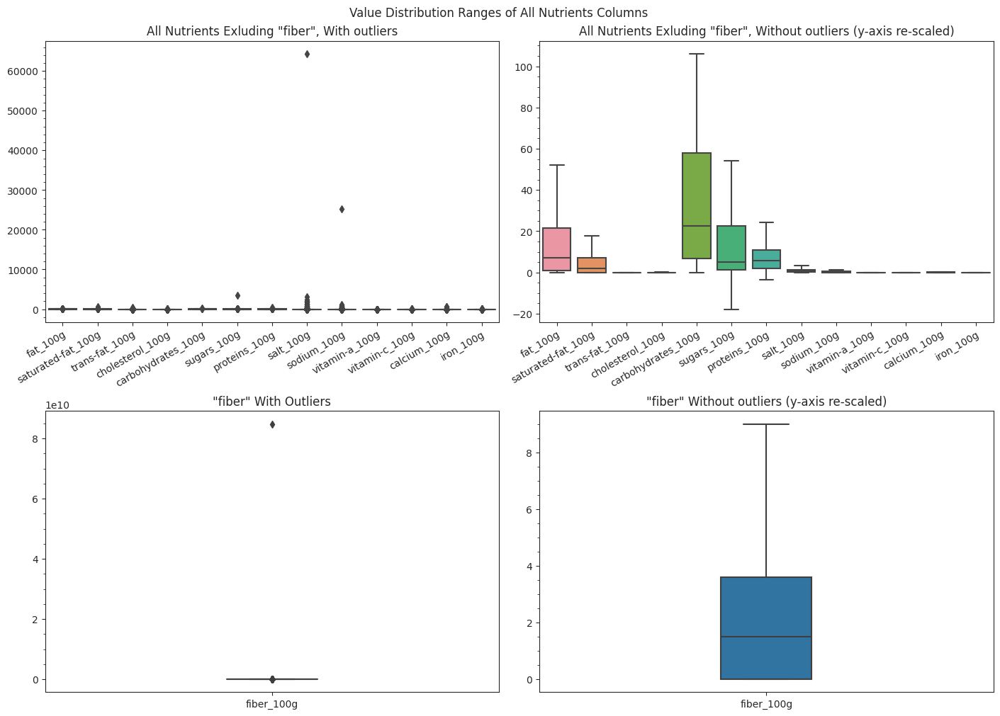
    


#### 2) Remove Outliers
* Lower Bound Outlier Removal: exclude the values that are below the theoractical MIN values for the Nutrient Columns (i.e. the negative values)
* Upper Bound Outliers Removal: exclude values that are above the theoratically MAX


```python
# Lower Bound Outlier Removal: exclude the negative values for the Nutrient Columns
# Upper Bound Outlier Removal: remove "ridiculusly" large values
query = """
    SELECT *
    FROM df_FdFts_cleaning1
    WHERE (energy_100g <= 3766.0 OR energy_100g IS NULL)
        AND (fat_100g <= 100.0 OR fat_100g IS NULL)
        AND (`saturated-fat_100g` <= 100.0 OR `saturated-fat_100g` IS NULL)
        AND ((`trans-fat_100g` BETWEEN 0.0 AND 100.0) OR `trans-fat_100g` IS NULL)
        AND (carbohydrates_100g <= 100.0 OR carbohydrates_100g IS NULL)
        AND ((sugars_100g BETWEEN 0.0 AND 100.0) OR sugars_100g IS NULL)
        AND (fiber_100g <= 100.0  OR fiber_100g IS NULL)
        AND ((proteins_100g BETWEEN 0.0 AND 100.0) OR proteins_100g IS NULL)
        AND (salt_100g <= 100.0 OR salt_100g IS NULL)
        AND ((`vitamin-c_100g` BETWEEN 0.0 AND 100.0) OR `vitamin-c_100g` IS NULL)
        AND ((calcium_100g BETWEEN 0.0 AND 100.0) OR calcium_100g IS NULL)
        AND (iron_100g >= 0.0 OR iron_100g IS NULL)
"""
df_FdFts_rmvOutliers = ps.sqldf(query, locals())
df_FdFts_rmvOutliers.shape[0] # 249826
```


    249826


#### 3) Revisualize the Distribution Range
Now, the values of the nutrient columns are all within the sensible ranges.
* as shown by the `describe()` table, and the boxplots below.


```python
df_FdFts_rmvOutliers.describe().loc[['min','max']]
```


  <div id="df-5f0ae0a7-791a-433e-90d4-3d3ccba1f2e6">
    <div class="colab-df-container">
      <div>
<style scoped>
    .dataframe tbody tr th:only-of-type {
        vertical-align: middle;
    }

    .dataframe tbody tr th {
        vertical-align: top;
    }

    .dataframe thead th {
        text-align: right;
    }
</style>
<table border="1" class="dataframe">
  <thead>
    <tr style="text-align: right;">
      <th></th>
      <th>additives_n</th>
      <th>ingredients_from_palm_oil_n</th>
      <th>ingredients_that_may_be_from_palm_oil_n</th>
      <th>energy_100g</th>
      <th>fat_100g</th>
      <th>saturated-fat_100g</th>
      <th>trans-fat_100g</th>
      <th>cholesterol_100g</th>
      <th>carbohydrates_100g</th>
      <th>sugars_100g</th>
      <th>fiber_100g</th>
      <th>proteins_100g</th>
      <th>salt_100g</th>
      <th>sodium_100g</th>
      <th>vitamin-a_100g</th>
      <th>vitamin-c_100g</th>
      <th>calcium_100g</th>
      <th>iron_100g</th>
      <th>nutrition-score-fr_100g</th>
    </tr>
  </thead>
  <tbody>
    <tr>
      <th>min</th>
      <td>0.0</td>
      <td>0.0</td>
      <td>0.0</td>
      <td>0.0</td>
      <td>0.0</td>
      <td>0.0</td>
      <td>0.0</td>
      <td>0.000</td>
      <td>0.0</td>
      <td>0.0</td>
      <td>0.0</td>
      <td>0.0</td>
      <td>0.0</td>
      <td>0.000000</td>
      <td>0.0</td>
      <td>0.0000</td>
      <td>0.0</td>
      <td>0.0</td>
      <td>-15.0</td>
    </tr>
    <tr>
      <th>max</th>
      <td>30.0</td>
      <td>2.0</td>
      <td>6.0</td>
      <td>3766.0</td>
      <td>100.0</td>
      <td>100.0</td>
      <td>100.0</td>
      <td>95.238</td>
      <td>100.0</td>
      <td>100.0</td>
      <td>100.0</td>
      <td>100.0</td>
      <td>100.0</td>
      <td>39.370079</td>
      <td>0.8</td>
      <td>35.7143</td>
      <td>82.0</td>
      <td>50.0</td>
      <td>40.0</td>
    </tr>
  </tbody>
</table>
</div>
      <button class="colab-df-convert" onclick="convertToInteractive('df-5f0ae0a7-791a-433e-90d4-3d3ccba1f2e6')"
              title="Convert this dataframe to an interactive table."
              style="display:none;">

  <svg xmlns="http://www.w3.org/2000/svg" height="24px"viewBox="0 0 24 24"
       width="24px">
    <path d="M0 0h24v24H0V0z" fill="none"/>
    <path d="M18.56 5.44l.94 2.06.94-2.06 2.06-.94-2.06-.94-.94-2.06-.94 2.06-2.06.94zm-11 1L8.5 8.5l.94-2.06 2.06-.94-2.06-.94L8.5 2.5l-.94 2.06-2.06.94zm10 10l.94 2.06.94-2.06 2.06-.94-2.06-.94-.94-2.06-.94 2.06-2.06.94z"/><path d="M17.41 7.96l-1.37-1.37c-.4-.4-.92-.59-1.43-.59-.52 0-1.04.2-1.43.59L10.3 9.45l-7.72 7.72c-.78.78-.78 2.05 0 2.83L4 21.41c.39.39.9.59 1.41.59.51 0 1.02-.2 1.41-.59l7.78-7.78 2.81-2.81c.8-.78.8-2.07 0-2.86zM5.41 20L4 18.59l7.72-7.72 1.47 1.35L5.41 20z"/>
  </svg>
      </button>


    <div id="df-06999458-14fd-4c33-947b-5d1b6aa0b922">
      <button class="colab-df-quickchart" onclick="quickchart('df-06999458-14fd-4c33-947b-5d1b6aa0b922')"
              title="Suggest charts."
              style="display:none;">

<svg xmlns="http://www.w3.org/2000/svg" height="24px"viewBox="0 0 24 24"
     width="24px">
    <g>
        <path d="M19 3H5c-1.1 0-2 .9-2 2v14c0 1.1.9 2 2 2h14c1.1 0 2-.9 2-2V5c0-1.1-.9-2-2-2zM9 17H7v-7h2v7zm4 0h-2V7h2v10zm4 0h-2v-4h2v4z"/>
    </g>
</svg>
      </button>
    </div>

<style>
  .colab-df-quickchart {
    background-color: #E8F0FE;
    border: none;
    border-radius: 50%;
    cursor: pointer;
    display: none;
    fill: #1967D2;
    height: 32px;
    padding: 0 0 0 0;
    width: 32px;
  }

  .colab-df-quickchart:hover {
    background-color: #E2EBFA;
    box-shadow: 0px 1px 2px rgba(60, 64, 67, 0.3), 0px 1px 3px 1px rgba(60, 64, 67, 0.15);
    fill: #174EA6;
  }

  [theme=dark] .colab-df-quickchart {
    background-color: #3B4455;
    fill: #D2E3FC;
  }

  [theme=dark] .colab-df-quickchart:hover {
    background-color: #434B5C;
    box-shadow: 0px 1px 3px 1px rgba(0, 0, 0, 0.15);
    filter: drop-shadow(0px 1px 2px rgba(0, 0, 0, 0.3));
    fill: #FFFFFF;
  }
</style>

    <script>
      async function quickchart(key) {
        const containerElement = document.querySelector('#' + key);
        const charts = await google.colab.kernel.invokeFunction(
            'suggestCharts', [key], {});
      }
    </script>

      <script>

function displayQuickchartButton(domScope) {
  let quickchartButtonEl =
    domScope.querySelector('#df-06999458-14fd-4c33-947b-5d1b6aa0b922 button.colab-df-quickchart');
  quickchartButtonEl.style.display =
    google.colab.kernel.accessAllowed ? 'block' : 'none';
}

        displayQuickchartButton(document);
      </script>
      <style>
    .colab-df-container {
      display:flex;
      flex-wrap:wrap;
      gap: 12px;
    }

    .colab-df-convert {
      background-color: #E8F0FE;
      border: none;
      border-radius: 50%;
      cursor: pointer;
      display: none;
      fill: #1967D2;
      height: 32px;
      padding: 0 0 0 0;
      width: 32px;
    }

    .colab-df-convert:hover {
      background-color: #E2EBFA;
      box-shadow: 0px 1px 2px rgba(60, 64, 67, 0.3), 0px 1px 3px 1px rgba(60, 64, 67, 0.15);
      fill: #174EA6;
    }

    [theme=dark] .colab-df-convert {
      background-color: #3B4455;
      fill: #D2E3FC;
    }

    [theme=dark] .colab-df-convert:hover {
      background-color: #434B5C;
      box-shadow: 0px 1px 3px 1px rgba(0, 0, 0, 0.15);
      filter: drop-shadow(0px 1px 2px rgba(0, 0, 0, 0.3));
      fill: #FFFFFF;
    }
  </style>

      <script>
        const buttonEl =
          document.querySelector('#df-5f0ae0a7-791a-433e-90d4-3d3ccba1f2e6 button.colab-df-convert');
        buttonEl.style.display =
          google.colab.kernel.accessAllowed ? 'block' : 'none';

        async function convertToInteractive(key) {
          const element = document.querySelector('#df-5f0ae0a7-791a-433e-90d4-3d3ccba1f2e6');
          const dataTable =
            await google.colab.kernel.invokeFunction('convertToInteractive',
                                                     [key], {});
          if (!dataTable) return;

          const docLinkHtml = 'Like what you see? Visit the ' +
            '<a target="_blank" href=https://colab.research.google.com/notebooks/data_table.ipynb>data table notebook</a>'
            + ' to learn more about interactive tables.';
          element.innerHTML = '';
          dataTable['output_type'] = 'display_data';
          await google.colab.output.renderOutput(dataTable, element);
          const docLink = document.createElement('div');
          docLink.innerHTML = docLinkHtml;
          element.appendChild(docLink);
        }
      </script>
    </div>
  </div>


```python
fig, axs =plt.subplots(1,2, figsize=(14,5))
fig.suptitle('Value Ranges of All Nutrients Columns')
newdt = df_FdFts_rmvOutliers.loc[:,'fat_100g':'iron_100g']
sns.boxplot(data=newdt,showfliers=True, ax=axs[0])
axs[0].set_title('With outliers')
axs[0].yaxis.set_minor_locator(tck.AutoMinorLocator())
axs[0].set_xticklabels(axs[0].get_xticklabels(), rotation=30, ha="right", rotation_mode='anchor')
sns.boxplot(data=newdt,showfliers=False, ax=axs[1])
axs[1].set_title('Without outliers (y-axis scale unchanged)')
axs[1].yaxis.set_minor_locator(tck.AutoMinorLocator())
axs[1].set_xticklabels(axs[1].get_xticklabels(), rotation=30, ha="right", rotation_mode='anchor')
plt.show()
```


    
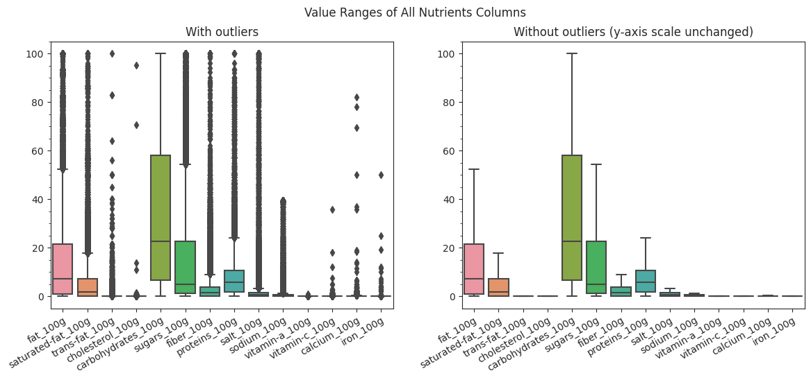
    


### 1.2.6 Reorder Columns:


```python
df_FdFts_cleaned = df_FdFts_rmvOutliers[[
    'product_name', 'quantity', 'packaging', 'brands',
    'categories_en', 'pnns_groups_1', 'pnns_groups_2', 'main_category_en',
    'countries_en', 'ingredients_text', 'serving_size', 'additives',
    'additives_n', 'ingredients_from_palm_oil_n', 'ingredients_that_may_be_from_palm_oil_n',
    'energy_100g', 'fat_100g', 'saturated-fat_100g', 'trans-fat_100g',
    'cholesterol_100g', 'carbohydrates_100g', 'sugars_100g',
    'fiber_100g', 'proteins_100g', 'salt_100g', 'sodium_100g',
    'vitamin-a_100g', 'vitamin-c_100g', 'calcium_100g', 'iron_100g',
    'nutrition_grade_fr','nutrition-score-fr_100g'
]]
```

#### `df_FdFts_cleaned` is ready
* This dataframe will serve as the basis for Part 2 and Part 3.


```python
df_FdFts_cleaned.info()
```

    <class 'pandas.core.frame.DataFrame'>
    RangeIndex: 249826 entries, 0 to 249825
    Data columns (total 32 columns):
     #   Column                                   Non-Null Count   Dtype  
    ---  ------                                   --------------   -----  
     0   product_name                             249826 non-null  object 
     1   quantity                                 74402 non-null   object 
     2   packaging                                64341 non-null   object 
     3   brands                                   247096 non-null  object 
     4   categories_en                            74368 non-null   object 
     5   pnns_groups_1                            97417 non-null   object 
     6   pnns_groups_2                            97472 non-null   object 
     7   main_category_en                         74368 non-null   object 
     8   countries_en                             249774 non-null  object 
     9   ingredients_text                         226688 non-null  object 
     10  serving_size                             175657 non-null  object 
     11  additives                                226657 non-null  object 
     12  additives_n                              226688 non-null  float64
     13  ingredients_from_palm_oil_n              226688 non-null  float64
     14  ingredients_that_may_be_from_palm_oil_n  226688 non-null  float64
     15  energy_100g                              249630 non-null  float64
     16  fat_100g                                 233839 non-null  float64
     17  saturated-fat_100g                       249630 non-null  float64
     18  trans-fat_100g                           133407 non-null  float64
     19  cholesterol_100g                         135092 non-null  float64
     20  carbohydrates_100g                       233810 non-null  float64
     21  sugars_100g                              249630 non-null  float64
     22  fiber_100g                               209036 non-null  float64
     23  proteins_100g                            249630 non-null  float64
     24  salt_100g                                249630 non-null  float64
     25  sodium_100g                              249630 non-null  float64
     26  vitamin-a_100g                           130122 non-null  float64
     27  vitamin-c_100g                           130991 non-null  float64
     28  calcium_100g                             133620 non-null  float64
     29  iron_100g                                132655 non-null  float64
     30  nutrition_grade_fr                       249826 non-null  object 
     31  nutrition-score-fr_100g                  249826 non-null  float64
    dtypes: float64(19), object(13)
    memory usage: 61.0+ MB


# Part 2: Basic Analysis & Visualization  
Note: `df_FdFts_cleaned` is mainly used for this section
* except for Allergens WordCloud which re-derive the `allergens` columns from `df_rawFoodFacts`


## 2.1 Task 1: Common Allergens

* Note: the `allergens` column contains more than 75% missing values, was therefore not included in `df_FdFts_cleaned`
* Our rationale for still doing this section: Allergen-containing foods are actually rare on the market (i.e. most foods are allergen free), and for the purpose of visualizing common allergens, we will re-fetch the `allergens` column from the original loading dataframe `df_rawFoodFacts`

The `"allergens"` column contains 37176 valid entries

### Challenge: Other to English Translation
* Issue with google translator package:
    * takes too long to finish translating all 37176 records:
        * it took `5m14s` to go through & translate 1000 rows, and there are a total of 37176 rows to be translated... would require at least `195 min` to execute
* Hence, we decided to skip the translation for words appeared in WordCloud.
* We will perform a quick translation (~`43s`) for the following task "Top 50 Common Allergens"


```python
# gather all foods who have allergens specified into one table
# https://stackoverflow.com/questions/41337477/select-non-null-rows-from-a-specific-column-in-a-dataframe-and-take-a-sub-select
df_allergens = df_rawFoodFacts.loc[df_rawFoodFacts['allergens'].notnull() ,['product_name','brands','allergens']]
df_allergens # 37176 rows × 3 columns
```


  <div id="df-db81d11c-2990-4896-8a3b-04585a772cae">
    <div class="colab-df-container">
      <div>
<style scoped>
    .dataframe tbody tr th:only-of-type {
        vertical-align: middle;
    }

    .dataframe tbody tr th {
        vertical-align: top;
    }

    .dataframe thead th {
        text-align: right;
    }
</style>
<table border="1" class="dataframe">
  <thead>
    <tr style="text-align: right;">
      <th></th>
      <th>product_name</th>
      <th>brands</th>
      <th>allergens</th>
    </tr>
  </thead>
  <tbody>
    <tr>
      <th>186</th>
      <td>Biscuits sablés fourrage au cacao</td>
      <td>St Michel</td>
      <td>Blé, Beurre, Oeufs, Noisette</td>
    </tr>
    <tr>
      <th>199</th>
      <td>Côtes du Rhône Villages 2014</td>
      <td>Union des Vignerons des Cotes du Rhône</td>
      <td>sulfites</td>
    </tr>
    <tr>
      <th>223</th>
      <td>Belgische Pralinen</td>
      <td>J. D. Gross</td>
      <td>Vollmilchpulver, Vollmilchpulver, Soja, Butterreinfett, Haselnusskerne, Soja, Mandeln, Pisatazie...</td>
    </tr>
    <tr>
      <th>227</th>
      <td>Luxury Christmas Pudding</td>
      <td>Asda,Asda Extra Special</td>
      <td>Wheat Flour, Milk, Walnuts, Almonds, Nut, Wheat Flour, Barley</td>
    </tr>
    <tr>
      <th>228</th>
      <td>Luxury Christmas Pudding</td>
      <td>Asda,Asda Extra Special</td>
      <td>Wheat Flour, Milk, Walnuts, Almonds, Nut, Wheat Flour, Barley Malt Extract</td>
    </tr>
    <tr>
      <th>...</th>
      <td>...</td>
      <td>...</td>
      <td>...</td>
    </tr>
    <tr>
      <th>355869</th>
      <td>Mini Paratha</td>
      <td>Kawan</td>
      <td>blé</td>
    </tr>
    <tr>
      <th>355912</th>
      <td>Peanut &amp; Popcorn With Dark Chocolate 12 x 45G</td>
      <td>Great value</td>
      <td>CACAHUETES, SOJA</td>
    </tr>
    <tr>
      <th>355921</th>
      <td>Marmite Yeast Exract</td>
      <td>NaN</td>
      <td>ORGE, CELERI</td>
    </tr>
    <tr>
      <th>355923</th>
      <td>Dairy Milk Wholenut</td>
      <td>Cadbury</td>
      <td>Milk, hazelnuts, NUTS, WHEAT</td>
    </tr>
    <tr>
      <th>355978</th>
      <td>Les schtroumpfs &amp; le village des fille</td>
      <td>Les Schtroumpfs</td>
      <td>ŒUF</td>
    </tr>
  </tbody>
</table>
<p>37176 rows × 3 columns</p>
</div>
      <button class="colab-df-convert" onclick="convertToInteractive('df-db81d11c-2990-4896-8a3b-04585a772cae')"
              title="Convert this dataframe to an interactive table."
              style="display:none;">

  <svg xmlns="http://www.w3.org/2000/svg" height="24px"viewBox="0 0 24 24"
       width="24px">
    <path d="M0 0h24v24H0V0z" fill="none"/>
    <path d="M18.56 5.44l.94 2.06.94-2.06 2.06-.94-2.06-.94-.94-2.06-.94 2.06-2.06.94zm-11 1L8.5 8.5l.94-2.06 2.06-.94-2.06-.94L8.5 2.5l-.94 2.06-2.06.94zm10 10l.94 2.06.94-2.06 2.06-.94-2.06-.94-.94-2.06-.94 2.06-2.06.94z"/><path d="M17.41 7.96l-1.37-1.37c-.4-.4-.92-.59-1.43-.59-.52 0-1.04.2-1.43.59L10.3 9.45l-7.72 7.72c-.78.78-.78 2.05 0 2.83L4 21.41c.39.39.9.59 1.41.59.51 0 1.02-.2 1.41-.59l7.78-7.78 2.81-2.81c.8-.78.8-2.07 0-2.86zM5.41 20L4 18.59l7.72-7.72 1.47 1.35L5.41 20z"/>
  </svg>
      </button>


    <div id="df-1e903f47-f1ca-40fb-9e8d-e08958b23fdc">
      <button class="colab-df-quickchart" onclick="quickchart('df-1e903f47-f1ca-40fb-9e8d-e08958b23fdc')"
              title="Suggest charts."
              style="display:none;">

<svg xmlns="http://www.w3.org/2000/svg" height="24px"viewBox="0 0 24 24"
     width="24px">
    <g>
        <path d="M19 3H5c-1.1 0-2 .9-2 2v14c0 1.1.9 2 2 2h14c1.1 0 2-.9 2-2V5c0-1.1-.9-2-2-2zM9 17H7v-7h2v7zm4 0h-2V7h2v10zm4 0h-2v-4h2v4z"/>
    </g>
</svg>
      </button>
    </div>

<style>
  .colab-df-quickchart {
    background-color: #E8F0FE;
    border: none;
    border-radius: 50%;
    cursor: pointer;
    display: none;
    fill: #1967D2;
    height: 32px;
    padding: 0 0 0 0;
    width: 32px;
  }

  .colab-df-quickchart:hover {
    background-color: #E2EBFA;
    box-shadow: 0px 1px 2px rgba(60, 64, 67, 0.3), 0px 1px 3px 1px rgba(60, 64, 67, 0.15);
    fill: #174EA6;
  }

  [theme=dark] .colab-df-quickchart {
    background-color: #3B4455;
    fill: #D2E3FC;
  }

  [theme=dark] .colab-df-quickchart:hover {
    background-color: #434B5C;
    box-shadow: 0px 1px 3px 1px rgba(0, 0, 0, 0.15);
    filter: drop-shadow(0px 1px 2px rgba(0, 0, 0, 0.3));
    fill: #FFFFFF;
  }
</style>

    <script>
      async function quickchart(key) {
        const containerElement = document.querySelector('#' + key);
        const charts = await google.colab.kernel.invokeFunction(
            'suggestCharts', [key], {});
      }
    </script>

      <script>

function displayQuickchartButton(domScope) {
  let quickchartButtonEl =
    domScope.querySelector('#df-1e903f47-f1ca-40fb-9e8d-e08958b23fdc button.colab-df-quickchart');
  quickchartButtonEl.style.display =
    google.colab.kernel.accessAllowed ? 'block' : 'none';
}

        displayQuickchartButton(document);
      </script>
      <style>
    .colab-df-container {
      display:flex;
      flex-wrap:wrap;
      gap: 12px;
    }

    .colab-df-convert {
      background-color: #E8F0FE;
      border: none;
      border-radius: 50%;
      cursor: pointer;
      display: none;
      fill: #1967D2;
      height: 32px;
      padding: 0 0 0 0;
      width: 32px;
    }

    .colab-df-convert:hover {
      background-color: #E2EBFA;
      box-shadow: 0px 1px 2px rgba(60, 64, 67, 0.3), 0px 1px 3px 1px rgba(60, 64, 67, 0.15);
      fill: #174EA6;
    }

    [theme=dark] .colab-df-convert {
      background-color: #3B4455;
      fill: #D2E3FC;
    }

    [theme=dark] .colab-df-convert:hover {
      background-color: #434B5C;
      box-shadow: 0px 1px 3px 1px rgba(0, 0, 0, 0.15);
      filter: drop-shadow(0px 1px 2px rgba(0, 0, 0, 0.3));
      fill: #FFFFFF;
    }
  </style>

      <script>
        const buttonEl =
          document.querySelector('#df-db81d11c-2990-4896-8a3b-04585a772cae button.colab-df-convert');
        buttonEl.style.display =
          google.colab.kernel.accessAllowed ? 'block' : 'none';

        async function convertToInteractive(key) {
          const element = document.querySelector('#df-db81d11c-2990-4896-8a3b-04585a772cae');
          const dataTable =
            await google.colab.kernel.invokeFunction('convertToInteractive',
                                                     [key], {});
          if (!dataTable) return;

          const docLinkHtml = 'Like what you see? Visit the ' +
            '<a target="_blank" href=https://colab.research.google.com/notebooks/data_table.ipynb>data table notebook</a>'
            + ' to learn more about interactive tables.';
          element.innerHTML = '';
          dataTable['output_type'] = 'display_data';
          await google.colab.output.renderOutput(dataTable, element);
          const docLink = document.createElement('div');
          docLink.innerHTML = docLinkHtml;
          element.appendChild(docLink);
        }
      </script>
    </div>
  </div>


### Prepare string for WordCloud


```python
# Helper Function 1: convert a string of allergens (one big string piece) into a list of allergens
# for each allergen, remove any leading & tailing spaces
def tokenize_allergens(content):
    algnslist = content.split(",")
    reslist = []
    for algn in algnslist:
        reslist.append(algn.strip().lower())
        #remove leading & tailing spaces, convert to all lowercases
    return reslist

# Helper Function 2: take a string of allergens (not well formatted) => well-format and return a string
def restringfy_allergens(rawStr):
    algnslist = rawStr.split(",")
    reslist = []
    for algn in algnslist:
        reslist.append(algn.strip().lower())
        #remove leading & tailing spaces, convert to all lowercases
    allergens_str = ", ".join(reslist)
    return allergens_str
```


```python
# all allergens contained in ONE BIG string (properly formatted), will be used for WordCloud
allergens_text = restringfy_allergens(','.join(df_allergens['allergens'].tolist()))
#allergens_text
```


```python
# https://stackoverflow.com/questions/43954114/python-wordcloud-repetitive-words
wordcloud = WordCloud(width=800, height=400, max_font_size=200, max_words=200, collocations=False,
                      background_color='gold', colormap='ocean').generate(allergens_text)
plt.figure(figsize=(10, 5), facecolor="gold")
plt.imshow(wordcloud, interpolation='bilinear',)
plt.axis('off')
plt.title('Most Common Allergens', fontsize=16)
plt.show()
```


    
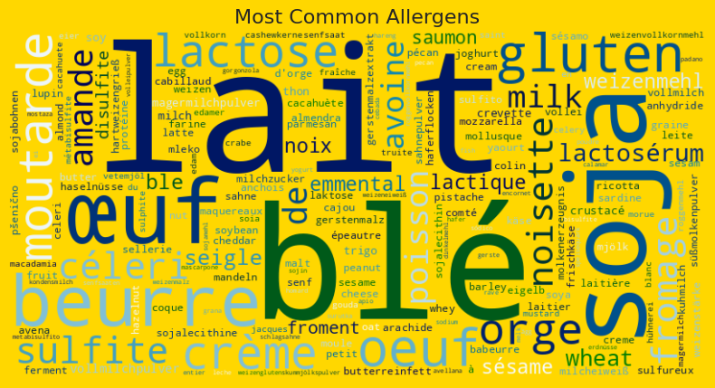
    


### Plot the top 50 common allergens in a Barplot


```python
# 1) concatenate all allergen entries into one string (this string is NOT properly formatted yet ....)
#    then create a list of all allergens (with repetitions), each allergen is well formatted
allergens_list = tokenize_allergens(','.join(df_allergens['allergens'].tolist()))
#allergens_list

# 2) gather all allergens (with repetitions) into one table
df_algns = pd.DataFrame(data=allergens_list, columns=["allergens"])
#df_algns # 129171 allergens (with repetitions) amoung 37176 food records

# 3) Get the top 100 allergens, untranslated
query = """
    SELECT allergens, COUNT(allergens) as count
    FROM df_algns
    GROUP BY allergens
    ORDER BY count DESC
    LIMIT 100
"""
top100algns = ps.sqldf(query, locals())
#top100algns

# 4) translate the top 100 allergens from different language sources to English
#   >> takes 43s to translate 100 allergen entries
#   >> auto -> english (contains a mixed of source languages fr, de...),
#   >> french -> english (not the best result)
top100algns['allergens_en'] = top100algns['allergens'].apply(lambda cell: GoogleTranslator(source='auto', target='en').translate(cell))
top100algns
```


  <div id="df-0be55aa8-61b1-46f6-8bd0-e42da54c4f57">
    <div class="colab-df-container">
      <div>
<style scoped>
    .dataframe tbody tr th:only-of-type {
        vertical-align: middle;
    }

    .dataframe tbody tr th {
        vertical-align: top;
    }

    .dataframe thead th {
        text-align: right;
    }
</style>
<table border="1" class="dataframe">
  <thead>
    <tr style="text-align: right;">
      <th></th>
      <th>allergens</th>
      <th>count</th>
      <th>allergens_en</th>
    </tr>
  </thead>
  <tbody>
    <tr>
      <th>0</th>
      <td>lait</td>
      <td>25543</td>
      <td>lait</td>
    </tr>
    <tr>
      <th>1</th>
      <td>blé</td>
      <td>19721</td>
      <td>wheat</td>
    </tr>
    <tr>
      <th>2</th>
      <td>soja</td>
      <td>8152</td>
      <td>military</td>
    </tr>
    <tr>
      <th>3</th>
      <td>beurre</td>
      <td>4256</td>
      <td>butter</td>
    </tr>
    <tr>
      <th>4</th>
      <td>gluten</td>
      <td>3644</td>
      <td>gluten</td>
    </tr>
    <tr>
      <th>...</th>
      <td>...</td>
      <td>...</td>
      <td>...</td>
    </tr>
    <tr>
      <th>95</th>
      <td>moules</td>
      <td>106</td>
      <td>molds</td>
    </tr>
    <tr>
      <th>96</th>
      <td>weizen</td>
      <td>105</td>
      <td>wheat</td>
    </tr>
    <tr>
      <th>97</th>
      <td>peanuts</td>
      <td>105</td>
      <td>peanuts</td>
    </tr>
    <tr>
      <th>98</th>
      <td>cream</td>
      <td>104</td>
      <td>cream</td>
    </tr>
    <tr>
      <th>99</th>
      <td>senf</td>
      <td>103</td>
      <td>mustard</td>
    </tr>
  </tbody>
</table>
<p>100 rows × 3 columns</p>
</div>
      <button class="colab-df-convert" onclick="convertToInteractive('df-0be55aa8-61b1-46f6-8bd0-e42da54c4f57')"
              title="Convert this dataframe to an interactive table."
              style="display:none;">

  <svg xmlns="http://www.w3.org/2000/svg" height="24px"viewBox="0 0 24 24"
       width="24px">
    <path d="M0 0h24v24H0V0z" fill="none"/>
    <path d="M18.56 5.44l.94 2.06.94-2.06 2.06-.94-2.06-.94-.94-2.06-.94 2.06-2.06.94zm-11 1L8.5 8.5l.94-2.06 2.06-.94-2.06-.94L8.5 2.5l-.94 2.06-2.06.94zm10 10l.94 2.06.94-2.06 2.06-.94-2.06-.94-.94-2.06-.94 2.06-2.06.94z"/><path d="M17.41 7.96l-1.37-1.37c-.4-.4-.92-.59-1.43-.59-.52 0-1.04.2-1.43.59L10.3 9.45l-7.72 7.72c-.78.78-.78 2.05 0 2.83L4 21.41c.39.39.9.59 1.41.59.51 0 1.02-.2 1.41-.59l7.78-7.78 2.81-2.81c.8-.78.8-2.07 0-2.86zM5.41 20L4 18.59l7.72-7.72 1.47 1.35L5.41 20z"/>
  </svg>
      </button>


    <div id="df-1b9703d2-ed94-44d5-810e-d6d15004ce43">
      <button class="colab-df-quickchart" onclick="quickchart('df-1b9703d2-ed94-44d5-810e-d6d15004ce43')"
              title="Suggest charts."
              style="display:none;">

<svg xmlns="http://www.w3.org/2000/svg" height="24px"viewBox="0 0 24 24"
     width="24px">
    <g>
        <path d="M19 3H5c-1.1 0-2 .9-2 2v14c0 1.1.9 2 2 2h14c1.1 0 2-.9 2-2V5c0-1.1-.9-2-2-2zM9 17H7v-7h2v7zm4 0h-2V7h2v10zm4 0h-2v-4h2v4z"/>
    </g>
</svg>
      </button>
    </div>

<style>
  .colab-df-quickchart {
    background-color: #E8F0FE;
    border: none;
    border-radius: 50%;
    cursor: pointer;
    display: none;
    fill: #1967D2;
    height: 32px;
    padding: 0 0 0 0;
    width: 32px;
  }

  .colab-df-quickchart:hover {
    background-color: #E2EBFA;
    box-shadow: 0px 1px 2px rgba(60, 64, 67, 0.3), 0px 1px 3px 1px rgba(60, 64, 67, 0.15);
    fill: #174EA6;
  }

  [theme=dark] .colab-df-quickchart {
    background-color: #3B4455;
    fill: #D2E3FC;
  }

  [theme=dark] .colab-df-quickchart:hover {
    background-color: #434B5C;
    box-shadow: 0px 1px 3px 1px rgba(0, 0, 0, 0.15);
    filter: drop-shadow(0px 1px 2px rgba(0, 0, 0, 0.3));
    fill: #FFFFFF;
  }
</style>

    <script>
      async function quickchart(key) {
        const containerElement = document.querySelector('#' + key);
        const charts = await google.colab.kernel.invokeFunction(
            'suggestCharts', [key], {});
      }
    </script>

      <script>

function displayQuickchartButton(domScope) {
  let quickchartButtonEl =
    domScope.querySelector('#df-1b9703d2-ed94-44d5-810e-d6d15004ce43 button.colab-df-quickchart');
  quickchartButtonEl.style.display =
    google.colab.kernel.accessAllowed ? 'block' : 'none';
}

        displayQuickchartButton(document);
      </script>
      <style>
    .colab-df-container {
      display:flex;
      flex-wrap:wrap;
      gap: 12px;
    }

    .colab-df-convert {
      background-color: #E8F0FE;
      border: none;
      border-radius: 50%;
      cursor: pointer;
      display: none;
      fill: #1967D2;
      height: 32px;
      padding: 0 0 0 0;
      width: 32px;
    }

    .colab-df-convert:hover {
      background-color: #E2EBFA;
      box-shadow: 0px 1px 2px rgba(60, 64, 67, 0.3), 0px 1px 3px 1px rgba(60, 64, 67, 0.15);
      fill: #174EA6;
    }

    [theme=dark] .colab-df-convert {
      background-color: #3B4455;
      fill: #D2E3FC;
    }

    [theme=dark] .colab-df-convert:hover {
      background-color: #434B5C;
      box-shadow: 0px 1px 3px 1px rgba(0, 0, 0, 0.15);
      filter: drop-shadow(0px 1px 2px rgba(0, 0, 0, 0.3));
      fill: #FFFFFF;
    }
  </style>

      <script>
        const buttonEl =
          document.querySelector('#df-0be55aa8-61b1-46f6-8bd0-e42da54c4f57 button.colab-df-convert');
        buttonEl.style.display =
          google.colab.kernel.accessAllowed ? 'block' : 'none';

        async function convertToInteractive(key) {
          const element = document.querySelector('#df-0be55aa8-61b1-46f6-8bd0-e42da54c4f57');
          const dataTable =
            await google.colab.kernel.invokeFunction('convertToInteractive',
                                                     [key], {});
          if (!dataTable) return;

          const docLinkHtml = 'Like what you see? Visit the ' +
            '<a target="_blank" href=https://colab.research.google.com/notebooks/data_table.ipynb>data table notebook</a>'
            + ' to learn more about interactive tables.';
          element.innerHTML = '';
          dataTable['output_type'] = 'display_data';
          await google.colab.output.renderOutput(dataTable, element);
          const docLink = document.createElement('div');
          docLink.innerHTML = docLinkHtml;
          element.appendChild(docLink);
        }
      </script>
    </div>
  </div>


```python
# 5) Convert any plural allergens into singular.
#    Also, we have to hardcode the translation on certain words, since googletranslator
#    cannot handle these correctly
def manual_translation(allergenRecord):
    if allergenRecord.allergens == "lait":
        return "milk"
    elif allergenRecord.allergens == "soja":
        return "soy"
    else:
        return allergenRecord.allergens_en.rstrip('s')
top100algns['allergens_en_singular'] = top100algns.apply(lambda row: manual_translation(row), axis=1)
#top100algns

# 6) group and sum() the appearance of each allergen
topAlgns = top100algns.groupby(by="allergens_en_singular", as_index=False)['count'].sum().sort_values(by=["count"],ascending=[False])
topAlgns #77 unique allergens extracted
```


  <div id="df-aa39e768-c45b-4fa5-b903-41b152653eed">
    <div class="colab-df-container">
      <div>
<style scoped>
    .dataframe tbody tr th:only-of-type {
        vertical-align: middle;
    }

    .dataframe tbody tr th {
        vertical-align: top;
    }

    .dataframe thead th {
        text-align: right;
    }
</style>
<table border="1" class="dataframe">
  <thead>
    <tr style="text-align: right;">
      <th></th>
      <th>allergens_en_singular</th>
      <th>count</th>
    </tr>
  </thead>
  <tbody>
    <tr>
      <th>37</th>
      <td>milk</td>
      <td>27028</td>
    </tr>
    <tr>
      <th>71</th>
      <td>wheat</td>
      <td>21784</td>
    </tr>
    <tr>
      <th>25</th>
      <td>egg</td>
      <td>9183</td>
    </tr>
    <tr>
      <th>62</th>
      <td>soy</td>
      <td>8573</td>
    </tr>
    <tr>
      <th>9</th>
      <td>butter</td>
      <td>4541</td>
    </tr>
    <tr>
      <th>...</th>
      <td>...</td>
      <td>...</td>
    </tr>
    <tr>
      <th>35</th>
      <td>malt</td>
      <td>112</td>
    </tr>
    <tr>
      <th>32</th>
      <td>leite</td>
      <td>112</td>
    </tr>
    <tr>
      <th>33</th>
      <td>mackerel</td>
      <td>110</td>
    </tr>
    <tr>
      <th>42</th>
      <td>mold</td>
      <td>106</td>
    </tr>
    <tr>
      <th>18</th>
      <td>cream</td>
      <td>104</td>
    </tr>
  </tbody>
</table>
<p>77 rows × 2 columns</p>
</div>
      <button class="colab-df-convert" onclick="convertToInteractive('df-aa39e768-c45b-4fa5-b903-41b152653eed')"
              title="Convert this dataframe to an interactive table."
              style="display:none;">

  <svg xmlns="http://www.w3.org/2000/svg" height="24px"viewBox="0 0 24 24"
       width="24px">
    <path d="M0 0h24v24H0V0z" fill="none"/>
    <path d="M18.56 5.44l.94 2.06.94-2.06 2.06-.94-2.06-.94-.94-2.06-.94 2.06-2.06.94zm-11 1L8.5 8.5l.94-2.06 2.06-.94-2.06-.94L8.5 2.5l-.94 2.06-2.06.94zm10 10l.94 2.06.94-2.06 2.06-.94-2.06-.94-.94-2.06-.94 2.06-2.06.94z"/><path d="M17.41 7.96l-1.37-1.37c-.4-.4-.92-.59-1.43-.59-.52 0-1.04.2-1.43.59L10.3 9.45l-7.72 7.72c-.78.78-.78 2.05 0 2.83L4 21.41c.39.39.9.59 1.41.59.51 0 1.02-.2 1.41-.59l7.78-7.78 2.81-2.81c.8-.78.8-2.07 0-2.86zM5.41 20L4 18.59l7.72-7.72 1.47 1.35L5.41 20z"/>
  </svg>
      </button>


    <div id="df-e0ffacd9-0391-4335-85d0-8d84ba4dbfeb">
      <button class="colab-df-quickchart" onclick="quickchart('df-e0ffacd9-0391-4335-85d0-8d84ba4dbfeb')"
              title="Suggest charts."
              style="display:none;">

<svg xmlns="http://www.w3.org/2000/svg" height="24px"viewBox="0 0 24 24"
     width="24px">
    <g>
        <path d="M19 3H5c-1.1 0-2 .9-2 2v14c0 1.1.9 2 2 2h14c1.1 0 2-.9 2-2V5c0-1.1-.9-2-2-2zM9 17H7v-7h2v7zm4 0h-2V7h2v10zm4 0h-2v-4h2v4z"/>
    </g>
</svg>
      </button>
    </div>

<style>
  .colab-df-quickchart {
    background-color: #E8F0FE;
    border: none;
    border-radius: 50%;
    cursor: pointer;
    display: none;
    fill: #1967D2;
    height: 32px;
    padding: 0 0 0 0;
    width: 32px;
  }

  .colab-df-quickchart:hover {
    background-color: #E2EBFA;
    box-shadow: 0px 1px 2px rgba(60, 64, 67, 0.3), 0px 1px 3px 1px rgba(60, 64, 67, 0.15);
    fill: #174EA6;
  }

  [theme=dark] .colab-df-quickchart {
    background-color: #3B4455;
    fill: #D2E3FC;
  }

  [theme=dark] .colab-df-quickchart:hover {
    background-color: #434B5C;
    box-shadow: 0px 1px 3px 1px rgba(0, 0, 0, 0.15);
    filter: drop-shadow(0px 1px 2px rgba(0, 0, 0, 0.3));
    fill: #FFFFFF;
  }
</style>

    <script>
      async function quickchart(key) {
        const containerElement = document.querySelector('#' + key);
        const charts = await google.colab.kernel.invokeFunction(
            'suggestCharts', [key], {});
      }
    </script>

      <script>

function displayQuickchartButton(domScope) {
  let quickchartButtonEl =
    domScope.querySelector('#df-e0ffacd9-0391-4335-85d0-8d84ba4dbfeb button.colab-df-quickchart');
  quickchartButtonEl.style.display =
    google.colab.kernel.accessAllowed ? 'block' : 'none';
}

        displayQuickchartButton(document);
      </script>
      <style>
    .colab-df-container {
      display:flex;
      flex-wrap:wrap;
      gap: 12px;
    }

    .colab-df-convert {
      background-color: #E8F0FE;
      border: none;
      border-radius: 50%;
      cursor: pointer;
      display: none;
      fill: #1967D2;
      height: 32px;
      padding: 0 0 0 0;
      width: 32px;
    }

    .colab-df-convert:hover {
      background-color: #E2EBFA;
      box-shadow: 0px 1px 2px rgba(60, 64, 67, 0.3), 0px 1px 3px 1px rgba(60, 64, 67, 0.15);
      fill: #174EA6;
    }

    [theme=dark] .colab-df-convert {
      background-color: #3B4455;
      fill: #D2E3FC;
    }

    [theme=dark] .colab-df-convert:hover {
      background-color: #434B5C;
      box-shadow: 0px 1px 3px 1px rgba(0, 0, 0, 0.15);
      filter: drop-shadow(0px 1px 2px rgba(0, 0, 0, 0.3));
      fill: #FFFFFF;
    }
  </style>

      <script>
        const buttonEl =
          document.querySelector('#df-aa39e768-c45b-4fa5-b903-41b152653eed button.colab-df-convert');
        buttonEl.style.display =
          google.colab.kernel.accessAllowed ? 'block' : 'none';

        async function convertToInteractive(key) {
          const element = document.querySelector('#df-aa39e768-c45b-4fa5-b903-41b152653eed');
          const dataTable =
            await google.colab.kernel.invokeFunction('convertToInteractive',
                                                     [key], {});
          if (!dataTable) return;

          const docLinkHtml = 'Like what you see? Visit the ' +
            '<a target="_blank" href=https://colab.research.google.com/notebooks/data_table.ipynb>data table notebook</a>'
            + ' to learn more about interactive tables.';
          element.innerHTML = '';
          dataTable['output_type'] = 'display_data';
          await google.colab.output.renderOutput(dataTable, element);
          const docLink = document.createElement('div');
          docLink.innerHTML = docLinkHtml;
          element.appendChild(docLink);
        }
      </script>
    </div>
  </div>


```python
# https://www.datacamp.com/tutorial/wordcloud-python
# https://seaborn.pydata.org/tutorial/color_palettes.html
# 7) visualize the top 50 allergens
plt.figure(figsize=(6,7))
barpltAX = sns.barplot(data=topAlgns.head(50), y="allergens_en_singular", x="count", palette = 'viridis_r', errorbar=None)
barpltAX.set(title='Top 50 allergens', xlabel="counts", ylabel="allergens")
barpltAX.set_xticklabels(barpltAX.get_xticklabels(), rotation=0, ha="center", rotation_mode='anchor')
barpltAX.set_yticklabels(barpltAX.get_yticklabels(), fontsize=9)
barpltAX.xaxis.set_minor_locator(tck.AutoMinorLocator())
plt.show()
```


    
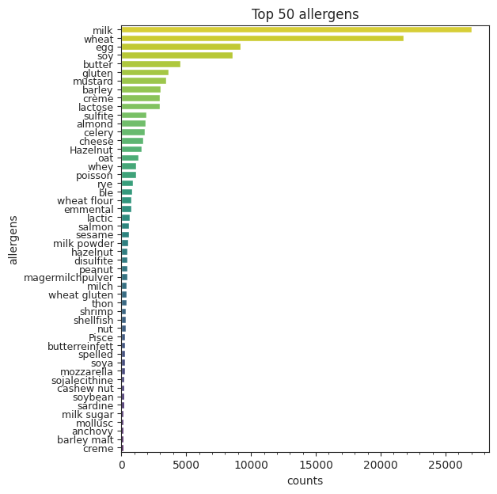
    


```python
top4 = sum(topAlgns['count'].head(50)[0:4]) / sum(topAlgns['count'].head(50)) * 100
print("The Top 4 Common Allergens: " + ", ".join(topAlgns['allergens_en_singular'][0:4].values.tolist()))
print("They take up %.2f%% of the top 50 common allergen occurance"%(top4))
```

    The Top 4 Common Allergens: milk, wheat, egg, soy
    They take up 58.95% of the top 50 common allergen occurance


### Observation:
* _milk, wheat, egg, soy_ are over dominantly the 4 most common allergens, as they together account for $58.95\%$ of the Top 50 allergens

## 2.2 Task 2: Most Sugar Brands


```python
query = """
    SELECT brands, AVG(sugars_100g) AS avg_sugars_100g
    FROM df_FdFts_cleaned
    GROUP BY brands
    ORDER BY avg_sugars_100g DESC
    LIMIT 20
"""
topSugarBrand = ps.sqldf(query, locals())
topSugarBrand
```


  <div id="df-0e6b8cd3-2954-4345-867b-fc00b367cc44">
    <div class="colab-df-container">
      <div>
<style scoped>
    .dataframe tbody tr th:only-of-type {
        vertical-align: middle;
    }

    .dataframe tbody tr th {
        vertical-align: top;
    }

    .dataframe thead th {
        text-align: right;
    }
</style>
<table border="1" class="dataframe">
  <thead>
    <tr style="text-align: right;">
      <th></th>
      <th>brands</th>
      <th>avg_sugars_100g</th>
    </tr>
  </thead>
  <tbody>
    <tr>
      <th>0</th>
      <td>tirlemont</td>
      <td>100.0</td>
    </tr>
    <tr>
      <th>1</th>
      <td>cristal</td>
      <td>100.0</td>
    </tr>
    <tr>
      <th>2</th>
      <td>Wholesome,  Wholesome Sweeteners</td>
      <td>100.0</td>
    </tr>
    <tr>
      <th>3</th>
      <td>Whitfield Foods  Inc.</td>
      <td>100.0</td>
    </tr>
    <tr>
      <th>4</th>
      <td>Wakefern Food Coporation</td>
      <td>100.0</td>
    </tr>
    <tr>
      <th>5</th>
      <td>Téva,Marque repère</td>
      <td>100.0</td>
    </tr>
    <tr>
      <th>6</th>
      <td>Tiger Pops</td>
      <td>100.0</td>
    </tr>
    <tr>
      <th>7</th>
      <td>Tiense suiker,Tirlemont</td>
      <td>100.0</td>
    </tr>
    <tr>
      <th>8</th>
      <td>The Aspen Mulling Company  Inc.</td>
      <td>100.0</td>
    </tr>
    <tr>
      <th>9</th>
      <td>Sweet'N Low</td>
      <td>100.0</td>
    </tr>
    <tr>
      <th>10</th>
      <td>Sweet N Fun</td>
      <td>100.0</td>
    </tr>
    <tr>
      <th>11</th>
      <td>Sweet 'N Low</td>
      <td>100.0</td>
    </tr>
    <tr>
      <th>12</th>
      <td>Sunny Days Entertainment  Llc</td>
      <td>100.0</td>
    </tr>
    <tr>
      <th>13</th>
      <td>Sucran</td>
      <td>100.0</td>
    </tr>
    <tr>
      <th>14</th>
      <td>Stewart Candy Manufacturing Inc.</td>
      <td>100.0</td>
    </tr>
    <tr>
      <th>15</th>
      <td>Stevia In The Raw</td>
      <td>100.0</td>
    </tr>
    <tr>
      <th>16</th>
      <td>Sp Enterprises Inc</td>
      <td>100.0</td>
    </tr>
    <tr>
      <th>17</th>
      <td>Silver Spoon</td>
      <td>100.0</td>
    </tr>
    <tr>
      <th>18</th>
      <td>Select Quality</td>
      <td>100.0</td>
    </tr>
    <tr>
      <th>19</th>
      <td>Saint-Louis,Saint Louis</td>
      <td>100.0</td>
    </tr>
  </tbody>
</table>
</div>
      <button class="colab-df-convert" onclick="convertToInteractive('df-0e6b8cd3-2954-4345-867b-fc00b367cc44')"
              title="Convert this dataframe to an interactive table."
              style="display:none;">

  <svg xmlns="http://www.w3.org/2000/svg" height="24px"viewBox="0 0 24 24"
       width="24px">
    <path d="M0 0h24v24H0V0z" fill="none"/>
    <path d="M18.56 5.44l.94 2.06.94-2.06 2.06-.94-2.06-.94-.94-2.06-.94 2.06-2.06.94zm-11 1L8.5 8.5l.94-2.06 2.06-.94-2.06-.94L8.5 2.5l-.94 2.06-2.06.94zm10 10l.94 2.06.94-2.06 2.06-.94-2.06-.94-.94-2.06-.94 2.06-2.06.94z"/><path d="M17.41 7.96l-1.37-1.37c-.4-.4-.92-.59-1.43-.59-.52 0-1.04.2-1.43.59L10.3 9.45l-7.72 7.72c-.78.78-.78 2.05 0 2.83L4 21.41c.39.39.9.59 1.41.59.51 0 1.02-.2 1.41-.59l7.78-7.78 2.81-2.81c.8-.78.8-2.07 0-2.86zM5.41 20L4 18.59l7.72-7.72 1.47 1.35L5.41 20z"/>
  </svg>
      </button>


    <div id="df-b33bbe41-0f82-45c6-bbcc-fdd556e29d8a">
      <button class="colab-df-quickchart" onclick="quickchart('df-b33bbe41-0f82-45c6-bbcc-fdd556e29d8a')"
              title="Suggest charts."
              style="display:none;">

<svg xmlns="http://www.w3.org/2000/svg" height="24px"viewBox="0 0 24 24"
     width="24px">
    <g>
        <path d="M19 3H5c-1.1 0-2 .9-2 2v14c0 1.1.9 2 2 2h14c1.1 0 2-.9 2-2V5c0-1.1-.9-2-2-2zM9 17H7v-7h2v7zm4 0h-2V7h2v10zm4 0h-2v-4h2v4z"/>
    </g>
</svg>
      </button>
    </div>

<style>
  .colab-df-quickchart {
    background-color: #E8F0FE;
    border: none;
    border-radius: 50%;
    cursor: pointer;
    display: none;
    fill: #1967D2;
    height: 32px;
    padding: 0 0 0 0;
    width: 32px;
  }

  .colab-df-quickchart:hover {
    background-color: #E2EBFA;
    box-shadow: 0px 1px 2px rgba(60, 64, 67, 0.3), 0px 1px 3px 1px rgba(60, 64, 67, 0.15);
    fill: #174EA6;
  }

  [theme=dark] .colab-df-quickchart {
    background-color: #3B4455;
    fill: #D2E3FC;
  }

  [theme=dark] .colab-df-quickchart:hover {
    background-color: #434B5C;
    box-shadow: 0px 1px 3px 1px rgba(0, 0, 0, 0.15);
    filter: drop-shadow(0px 1px 2px rgba(0, 0, 0, 0.3));
    fill: #FFFFFF;
  }
</style>

    <script>
      async function quickchart(key) {
        const containerElement = document.querySelector('#' + key);
        const charts = await google.colab.kernel.invokeFunction(
            'suggestCharts', [key], {});
      }
    </script>

      <script>

function displayQuickchartButton(domScope) {
  let quickchartButtonEl =
    domScope.querySelector('#df-b33bbe41-0f82-45c6-bbcc-fdd556e29d8a button.colab-df-quickchart');
  quickchartButtonEl.style.display =
    google.colab.kernel.accessAllowed ? 'block' : 'none';
}

        displayQuickchartButton(document);
      </script>
      <style>
    .colab-df-container {
      display:flex;
      flex-wrap:wrap;
      gap: 12px;
    }

    .colab-df-convert {
      background-color: #E8F0FE;
      border: none;
      border-radius: 50%;
      cursor: pointer;
      display: none;
      fill: #1967D2;
      height: 32px;
      padding: 0 0 0 0;
      width: 32px;
    }

    .colab-df-convert:hover {
      background-color: #E2EBFA;
      box-shadow: 0px 1px 2px rgba(60, 64, 67, 0.3), 0px 1px 3px 1px rgba(60, 64, 67, 0.15);
      fill: #174EA6;
    }

    [theme=dark] .colab-df-convert {
      background-color: #3B4455;
      fill: #D2E3FC;
    }

    [theme=dark] .colab-df-convert:hover {
      background-color: #434B5C;
      box-shadow: 0px 1px 3px 1px rgba(0, 0, 0, 0.15);
      filter: drop-shadow(0px 1px 2px rgba(0, 0, 0, 0.3));
      fill: #FFFFFF;
    }
  </style>

      <script>
        const buttonEl =
          document.querySelector('#df-0e6b8cd3-2954-4345-867b-fc00b367cc44 button.colab-df-convert');
        buttonEl.style.display =
          google.colab.kernel.accessAllowed ? 'block' : 'none';

        async function convertToInteractive(key) {
          const element = document.querySelector('#df-0e6b8cd3-2954-4345-867b-fc00b367cc44');
          const dataTable =
            await google.colab.kernel.invokeFunction('convertToInteractive',
                                                     [key], {});
          if (!dataTable) return;

          const docLinkHtml = 'Like what you see? Visit the ' +
            '<a target="_blank" href=https://colab.research.google.com/notebooks/data_table.ipynb>data table notebook</a>'
            + ' to learn more about interactive tables.';
          element.innerHTML = '';
          dataTable['output_type'] = 'display_data';
          await google.colab.output.renderOutput(dataTable, element);
          const docLink = document.createElement('div');
          docLink.innerHTML = docLinkHtml;
          element.appendChild(docLink);
        }
      </script>
    </div>
  </div>


## 2.3 Task 3: Top Energy-Dense Brands


```python
query = """
    SELECT DISTINCT(lower(brands)) AS brands, AVG(energy_100g) AS avg_energy,
        AVG(fat_100g) AS avg_fat, AVG(`saturated-fat_100g`) as avg_saturated_fat
    FROM df_FdFts_cleaned
    GROUP BY LOWER(brands)
    ORDER BY avg_energy DESC, avg_fat DESC, avg_saturated_fat DESC, brands ASC
    LIMIT 30
"""
topEnergyBrands = ps.sqldf(query, locals())
topEnergyBrands
```


  <div id="df-8efd0054-b29d-472a-a6eb-7813e16e87df">
    <div class="colab-df-container">
      <div>
<style scoped>
    .dataframe tbody tr th:only-of-type {
        vertical-align: middle;
    }

    .dataframe tbody tr th {
        vertical-align: top;
    }

    .dataframe thead th {
        text-align: right;
    }
</style>
<table border="1" class="dataframe">
  <thead>
    <tr style="text-align: right;">
      <th></th>
      <th>brands</th>
      <th>avg_energy</th>
      <th>avg_fat</th>
      <th>avg_saturated_fat</th>
    </tr>
  </thead>
  <tbody>
    <tr>
      <th>0</th>
      <td>renuka</td>
      <td>3766.0</td>
      <td>100.0</td>
      <td>92.55</td>
    </tr>
    <tr>
      <th>1</th>
      <td>bumble bee foods</td>
      <td>3766.0</td>
      <td>100.0</td>
      <td>91.00</td>
    </tr>
    <tr>
      <th>2</th>
      <td>foods by ann</td>
      <td>3766.0</td>
      <td>100.0</td>
      <td>91.00</td>
    </tr>
    <tr>
      <th>3</th>
      <td>4th &amp; heart</td>
      <td>3766.0</td>
      <td>100.0</td>
      <td>60.00</td>
    </tr>
    <tr>
      <th>4</th>
      <td>deep foods  inc.</td>
      <td>3766.0</td>
      <td>100.0</td>
      <td>60.00</td>
    </tr>
    <tr>
      <th>...</th>
      <td>...</td>
      <td>...</td>
      <td>...</td>
      <td>...</td>
    </tr>
    <tr>
      <th>25</th>
      <td>kalamata</td>
      <td>3766.0</td>
      <td>100.0</td>
      <td>14.50</td>
    </tr>
    <tr>
      <th>26</th>
      <td>la pedriza</td>
      <td>3766.0</td>
      <td>100.0</td>
      <td>14.00</td>
    </tr>
    <tr>
      <th>27</th>
      <td>vigean maitre huilier</td>
      <td>3766.0</td>
      <td>100.0</td>
      <td>14.00</td>
    </tr>
    <tr>
      <th>28</th>
      <td>soléou,la compagnie des saveurs</td>
      <td>3766.0</td>
      <td>100.0</td>
      <td>13.80</td>
    </tr>
    <tr>
      <th>29</th>
      <td>echiolivia</td>
      <td>3766.0</td>
      <td>100.0</td>
      <td>13.00</td>
    </tr>
  </tbody>
</table>
<p>30 rows × 4 columns</p>
</div>
      <button class="colab-df-convert" onclick="convertToInteractive('df-8efd0054-b29d-472a-a6eb-7813e16e87df')"
              title="Convert this dataframe to an interactive table."
              style="display:none;">

  <svg xmlns="http://www.w3.org/2000/svg" height="24px"viewBox="0 0 24 24"
       width="24px">
    <path d="M0 0h24v24H0V0z" fill="none"/>
    <path d="M18.56 5.44l.94 2.06.94-2.06 2.06-.94-2.06-.94-.94-2.06-.94 2.06-2.06.94zm-11 1L8.5 8.5l.94-2.06 2.06-.94-2.06-.94L8.5 2.5l-.94 2.06-2.06.94zm10 10l.94 2.06.94-2.06 2.06-.94-2.06-.94-.94-2.06-.94 2.06-2.06.94z"/><path d="M17.41 7.96l-1.37-1.37c-.4-.4-.92-.59-1.43-.59-.52 0-1.04.2-1.43.59L10.3 9.45l-7.72 7.72c-.78.78-.78 2.05 0 2.83L4 21.41c.39.39.9.59 1.41.59.51 0 1.02-.2 1.41-.59l7.78-7.78 2.81-2.81c.8-.78.8-2.07 0-2.86zM5.41 20L4 18.59l7.72-7.72 1.47 1.35L5.41 20z"/>
  </svg>
      </button>


    <div id="df-51337cb8-7c41-4c48-94bf-34e89a70801a">
      <button class="colab-df-quickchart" onclick="quickchart('df-51337cb8-7c41-4c48-94bf-34e89a70801a')"
              title="Suggest charts."
              style="display:none;">

<svg xmlns="http://www.w3.org/2000/svg" height="24px"viewBox="0 0 24 24"
     width="24px">
    <g>
        <path d="M19 3H5c-1.1 0-2 .9-2 2v14c0 1.1.9 2 2 2h14c1.1 0 2-.9 2-2V5c0-1.1-.9-2-2-2zM9 17H7v-7h2v7zm4 0h-2V7h2v10zm4 0h-2v-4h2v4z"/>
    </g>
</svg>
      </button>
    </div>

<style>
  .colab-df-quickchart {
    background-color: #E8F0FE;
    border: none;
    border-radius: 50%;
    cursor: pointer;
    display: none;
    fill: #1967D2;
    height: 32px;
    padding: 0 0 0 0;
    width: 32px;
  }

  .colab-df-quickchart:hover {
    background-color: #E2EBFA;
    box-shadow: 0px 1px 2px rgba(60, 64, 67, 0.3), 0px 1px 3px 1px rgba(60, 64, 67, 0.15);
    fill: #174EA6;
  }

  [theme=dark] .colab-df-quickchart {
    background-color: #3B4455;
    fill: #D2E3FC;
  }

  [theme=dark] .colab-df-quickchart:hover {
    background-color: #434B5C;
    box-shadow: 0px 1px 3px 1px rgba(0, 0, 0, 0.15);
    filter: drop-shadow(0px 1px 2px rgba(0, 0, 0, 0.3));
    fill: #FFFFFF;
  }
</style>

    <script>
      async function quickchart(key) {
        const containerElement = document.querySelector('#' + key);
        const charts = await google.colab.kernel.invokeFunction(
            'suggestCharts', [key], {});
      }
    </script>

      <script>

function displayQuickchartButton(domScope) {
  let quickchartButtonEl =
    domScope.querySelector('#df-51337cb8-7c41-4c48-94bf-34e89a70801a button.colab-df-quickchart');
  quickchartButtonEl.style.display =
    google.colab.kernel.accessAllowed ? 'block' : 'none';
}

        displayQuickchartButton(document);
      </script>
      <style>
    .colab-df-container {
      display:flex;
      flex-wrap:wrap;
      gap: 12px;
    }

    .colab-df-convert {
      background-color: #E8F0FE;
      border: none;
      border-radius: 50%;
      cursor: pointer;
      display: none;
      fill: #1967D2;
      height: 32px;
      padding: 0 0 0 0;
      width: 32px;
    }

    .colab-df-convert:hover {
      background-color: #E2EBFA;
      box-shadow: 0px 1px 2px rgba(60, 64, 67, 0.3), 0px 1px 3px 1px rgba(60, 64, 67, 0.15);
      fill: #174EA6;
    }

    [theme=dark] .colab-df-convert {
      background-color: #3B4455;
      fill: #D2E3FC;
    }

    [theme=dark] .colab-df-convert:hover {
      background-color: #434B5C;
      box-shadow: 0px 1px 3px 1px rgba(0, 0, 0, 0.15);
      filter: drop-shadow(0px 1px 2px rgba(0, 0, 0, 0.3));
      fill: #FFFFFF;
    }
  </style>

      <script>
        const buttonEl =
          document.querySelector('#df-8efd0054-b29d-472a-a6eb-7813e16e87df button.colab-df-convert');
        buttonEl.style.display =
          google.colab.kernel.accessAllowed ? 'block' : 'none';

        async function convertToInteractive(key) {
          const element = document.querySelector('#df-8efd0054-b29d-472a-a6eb-7813e16e87df');
          const dataTable =
            await google.colab.kernel.invokeFunction('convertToInteractive',
                                                     [key], {});
          if (!dataTable) return;

          const docLinkHtml = 'Like what you see? Visit the ' +
            '<a target="_blank" href=https://colab.research.google.com/notebooks/data_table.ipynb>data table notebook</a>'
            + ' to learn more about interactive tables.';
          element.innerHTML = '';
          dataTable['output_type'] = 'display_data';
          await google.colab.output.renderOutput(dataTable, element);
          const docLink = document.createElement('div');
          docLink.innerHTML = docLinkHtml;
          element.appendChild(docLink);
        }
      </script>
    </div>
  </div>


## 2.4 Task 4: sold in the US vs in France
We want to compare if there is any differences on the nutrition values of the foods that are being sold exclusively in US vs those sold exclusively in France.


```python
# "countries_en" is the countries that the food products are sold in
query = """
    SELECT *
    FROM df_FdFts_cleaned
    WHERE LOWER(countries_en) IN ('united states', 'france')
"""
usfrProducts = ps.sqldf(query, locals())
#usfrProducts # 225481 = US 136890 + France 88591
usfrProducts["countries_en"].value_counts()
```


    United States    136884
    France            88589
    Name: countries_en, dtype: int64


```python
# "countries_en" means "countries where the food product is sold"
query = """
    SELECT countries_en, AVG(energy_100g), AVG(fat_100g), AVG(additives_n),
        AVG(sugars_100g), AVG(fiber_100g), AVG(salt_100g), AVG(`nutrition-score-fr_100g`)
    FROM usfrProducts
    GROUP BY countries_en
"""
usfr_compare = ps.sqldf(query, locals())
usfr_compare
```


  <div id="df-4e37f398-0830-4642-b278-344df244afeb">
    <div class="colab-df-container">
      <div>
<style scoped>
    .dataframe tbody tr th:only-of-type {
        vertical-align: middle;
    }

    .dataframe tbody tr th {
        vertical-align: top;
    }

    .dataframe thead th {
        text-align: right;
    }
</style>
<table border="1" class="dataframe">
  <thead>
    <tr style="text-align: right;">
      <th></th>
      <th>countries_en</th>
      <th>AVG(energy_100g)</th>
      <th>AVG(fat_100g)</th>
      <th>AVG(additives_n)</th>
      <th>AVG(sugars_100g)</th>
      <th>AVG(fiber_100g)</th>
      <th>AVG(salt_100g)</th>
      <th>AVG(`nutrition-score-fr_100g`)</th>
    </tr>
  </thead>
  <tbody>
    <tr>
      <th>0</th>
      <td>France</td>
      <td>1113.279543</td>
      <td>13.309550</td>
      <td>1.805503</td>
      <td>13.252217</td>
      <td>2.657863</td>
      <td>1.107738</td>
      <td>8.788123</td>
    </tr>
    <tr>
      <th>1</th>
      <td>United States</td>
      <td>1205.613408</td>
      <td>13.199864</td>
      <td>2.042188</td>
      <td>15.813778</td>
      <td>2.867536</td>
      <td>1.335920</td>
      <td>9.461668</td>
    </tr>
  </tbody>
</table>
</div>
      <button class="colab-df-convert" onclick="convertToInteractive('df-4e37f398-0830-4642-b278-344df244afeb')"
              title="Convert this dataframe to an interactive table."
              style="display:none;">

  <svg xmlns="http://www.w3.org/2000/svg" height="24px"viewBox="0 0 24 24"
       width="24px">
    <path d="M0 0h24v24H0V0z" fill="none"/>
    <path d="M18.56 5.44l.94 2.06.94-2.06 2.06-.94-2.06-.94-.94-2.06-.94 2.06-2.06.94zm-11 1L8.5 8.5l.94-2.06 2.06-.94-2.06-.94L8.5 2.5l-.94 2.06-2.06.94zm10 10l.94 2.06.94-2.06 2.06-.94-2.06-.94-.94-2.06-.94 2.06-2.06.94z"/><path d="M17.41 7.96l-1.37-1.37c-.4-.4-.92-.59-1.43-.59-.52 0-1.04.2-1.43.59L10.3 9.45l-7.72 7.72c-.78.78-.78 2.05 0 2.83L4 21.41c.39.39.9.59 1.41.59.51 0 1.02-.2 1.41-.59l7.78-7.78 2.81-2.81c.8-.78.8-2.07 0-2.86zM5.41 20L4 18.59l7.72-7.72 1.47 1.35L5.41 20z"/>
  </svg>
      </button>


    <div id="df-ff197470-cf59-4bde-b95d-2db83712fada">
      <button class="colab-df-quickchart" onclick="quickchart('df-ff197470-cf59-4bde-b95d-2db83712fada')"
              title="Suggest charts."
              style="display:none;">

<svg xmlns="http://www.w3.org/2000/svg" height="24px"viewBox="0 0 24 24"
     width="24px">
    <g>
        <path d="M19 3H5c-1.1 0-2 .9-2 2v14c0 1.1.9 2 2 2h14c1.1 0 2-.9 2-2V5c0-1.1-.9-2-2-2zM9 17H7v-7h2v7zm4 0h-2V7h2v10zm4 0h-2v-4h2v4z"/>
    </g>
</svg>
      </button>
    </div>

<style>
  .colab-df-quickchart {
    background-color: #E8F0FE;
    border: none;
    border-radius: 50%;
    cursor: pointer;
    display: none;
    fill: #1967D2;
    height: 32px;
    padding: 0 0 0 0;
    width: 32px;
  }

  .colab-df-quickchart:hover {
    background-color: #E2EBFA;
    box-shadow: 0px 1px 2px rgba(60, 64, 67, 0.3), 0px 1px 3px 1px rgba(60, 64, 67, 0.15);
    fill: #174EA6;
  }

  [theme=dark] .colab-df-quickchart {
    background-color: #3B4455;
    fill: #D2E3FC;
  }

  [theme=dark] .colab-df-quickchart:hover {
    background-color: #434B5C;
    box-shadow: 0px 1px 3px 1px rgba(0, 0, 0, 0.15);
    filter: drop-shadow(0px 1px 2px rgba(0, 0, 0, 0.3));
    fill: #FFFFFF;
  }
</style>

    <script>
      async function quickchart(key) {
        const containerElement = document.querySelector('#' + key);
        const charts = await google.colab.kernel.invokeFunction(
            'suggestCharts', [key], {});
      }
    </script>

      <script>

function displayQuickchartButton(domScope) {
  let quickchartButtonEl =
    domScope.querySelector('#df-ff197470-cf59-4bde-b95d-2db83712fada button.colab-df-quickchart');
  quickchartButtonEl.style.display =
    google.colab.kernel.accessAllowed ? 'block' : 'none';
}

        displayQuickchartButton(document);
      </script>
      <style>
    .colab-df-container {
      display:flex;
      flex-wrap:wrap;
      gap: 12px;
    }

    .colab-df-convert {
      background-color: #E8F0FE;
      border: none;
      border-radius: 50%;
      cursor: pointer;
      display: none;
      fill: #1967D2;
      height: 32px;
      padding: 0 0 0 0;
      width: 32px;
    }

    .colab-df-convert:hover {
      background-color: #E2EBFA;
      box-shadow: 0px 1px 2px rgba(60, 64, 67, 0.3), 0px 1px 3px 1px rgba(60, 64, 67, 0.15);
      fill: #174EA6;
    }

    [theme=dark] .colab-df-convert {
      background-color: #3B4455;
      fill: #D2E3FC;
    }

    [theme=dark] .colab-df-convert:hover {
      background-color: #434B5C;
      box-shadow: 0px 1px 3px 1px rgba(0, 0, 0, 0.15);
      filter: drop-shadow(0px 1px 2px rgba(0, 0, 0, 0.3));
      fill: #FFFFFF;
    }
  </style>

      <script>
        const buttonEl =
          document.querySelector('#df-4e37f398-0830-4642-b278-344df244afeb button.colab-df-convert');
        buttonEl.style.display =
          google.colab.kernel.accessAllowed ? 'block' : 'none';

        async function convertToInteractive(key) {
          const element = document.querySelector('#df-4e37f398-0830-4642-b278-344df244afeb');
          const dataTable =
            await google.colab.kernel.invokeFunction('convertToInteractive',
                                                     [key], {});
          if (!dataTable) return;

          const docLinkHtml = 'Like what you see? Visit the ' +
            '<a target="_blank" href=https://colab.research.google.com/notebooks/data_table.ipynb>data table notebook</a>'
            + ' to learn more about interactive tables.';
          element.innerHTML = '';
          dataTable['output_type'] = 'display_data';
          await google.colab.output.renderOutput(dataTable, element);
          const docLink = document.createElement('div');
          docLink.innerHTML = docLinkHtml;
          element.appendChild(docLink);
        }
      </script>
    </div>
  </div>


### Observation:
* On Average, Foods being sold exclusively in France is a bit Healthier than their counterparts which are exclusively sold in the US
    * less energy dense (`energy_100g`)
    * less number of additives (`additives_n`)
    * less sugar contents (`fiber_100g`)
    * less salt contents (`salt_100g`)
    * overall Better Nutri-Score (`nutrition-score-fr_100g`)
    * French foods do contains more fat than US foods


## 2.4 Task 5: Correlation Matrix Heatmap

`.corr()`: https://pandas.pydata.org/docs/reference/api/pandas.DataFrame.corr.html


```python
nutriFeature_cols = [
    'additives_n','ingredients_from_palm_oil_n','ingredients_that_may_be_from_palm_oil_n',
    'energy_100g','fat_100g','saturated-fat_100g','trans-fat_100g', 'cholesterol_100g',
    'carbohydrates_100g','sugars_100g','fiber_100g','proteins_100g','salt_100g','sodium_100g',
    'vitamin-a_100g','vitamin-c_100g', 'calcium_100g','iron_100g',
    ]
corrMatrix = df_FdFts_cleaned[nutriFeature_cols].corr()
```


```python
# Quick Visualization of Features' Correlation (see M10L1 Notebook)
#corrMatrix.style.background_gradient()
```


```python
# Plot correlation heatmap
# https://seaborn.pydata.org/generated/seaborn.heatmap.html
# "ha" = horizontal Alignment
plt.figure(figsize=(18,15))
htmpAX = sns.heatmap(corrMatrix,cmap='RdBu', annot=True)
htmpAX.set(title='Correlation of All Numeric Nutrients Features',
              xlabel="Nurtients", ylabel="Nutrients")
htmpAX.xaxis.label.set_size(22)
htmpAX.yaxis.label.set_size(22)
htmpAX.title.set_size(20)
htmpAX.set_xticklabels(htmpAX.get_xticklabels(), rotation=45, ha="right", rotation_mode='anchor')
htmpAX.set_yticklabels(htmpAX.get_yticklabels(), rotation=-45, ha="right", rotation_mode='anchor')
plt.show()
```


    
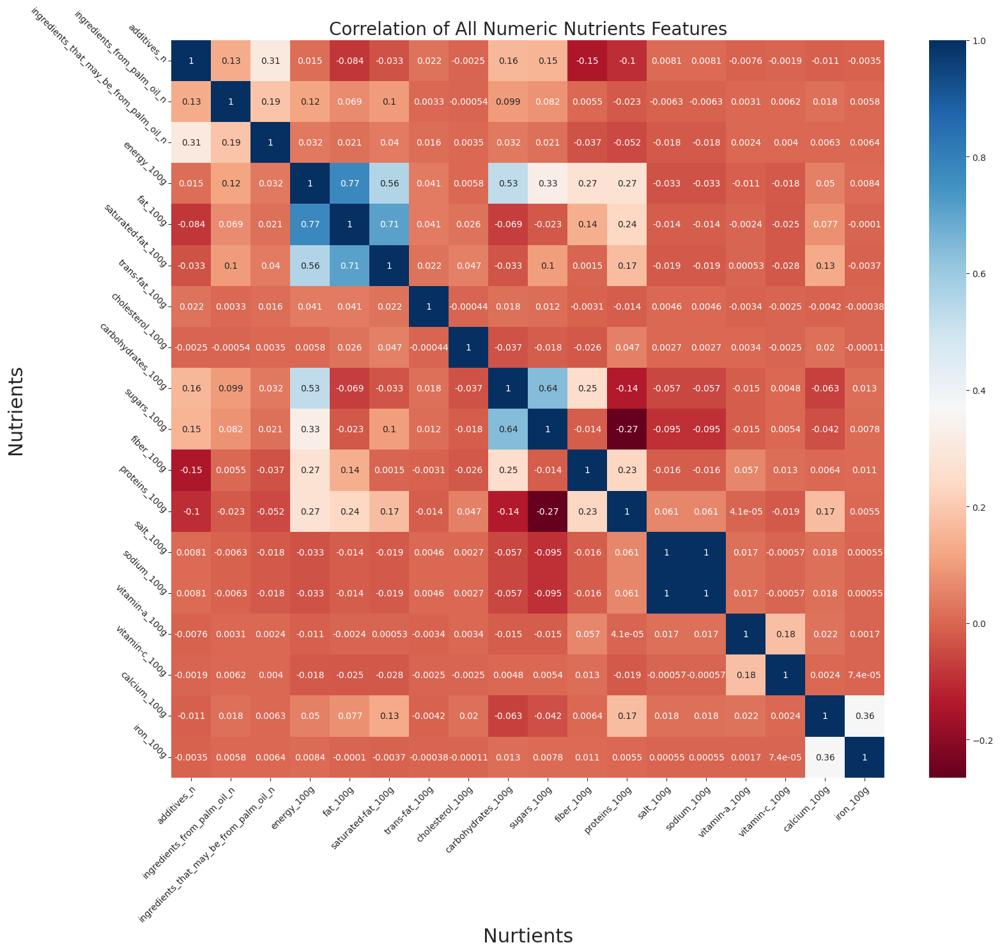
    


### Observation:
correlated features (Multicollinearity):
* `sodium_100g` & `salt_100g` => highly correlated
    * comment: make sense ! Salt as _Sodium Chloride_ (`NaCl`) is the primary source for dietary sodium
* `sugar_100g` & `carbohydrates_100g` => 0.64
    * make sense ! https://www.canada.ca/en/health-canada/services/nutrients/carbohydrates.html
* `energy_100g` with `carbohydrates_100g` (0.53), `sugar_100g` (0.33), `fiber_100g` (0.27), `protein_100g` (0.27)
    * make sense !
* `additive_n` & `ingredients_that_may_be_from_palm_oil_n` => `0.31`
* `protein_100g` & `sugar_100g` => `-0.27`


For the ML section, we can use `PCA()` to resolve this Multicollinearity


```python
# Note: `salt_100g` doesn't have the exact same values as `sodium_100g` but they are highly correlated !
df_FdFts_cleaned['salt_100g'].equals(df_FdFts_cleaned['sodium_100g'])
```


    False


# Part 3: ML Models for Predictions

## 3.1 Prepare the dataset used for ML models: `df_FdFts_ML`
* We only need the numerical features for building our ML models.
* From `df_FdFts_cleaned`, slice the nutrient columns and the target columns into a new dataframe `df_FdFts_ML`
    * Feature Columns:  
 `energy_100g`,
 `fat_100g`,
 `saturated-fat_100g`,
 `trans-fat_100g`,
 `cholesterol_100g`,
 `carbohydrates_100g`,
 `sugars_100g`,
 `fiber_100g`,
 `proteins_100g`,
 `salt_100g`,
 `sodium_100g`,
 `vitamin-a_100g`,
 `vitamin-c_100g`,
 `calcium_100g`,
 `iron_100g`  
    * Target columns:
        * `nutrition_grade_fr` is the target for Linear Regression Models
        * `nutrition-score-fr_100g` is the target for Logistic Regression Models


```python
df_FdFts_ML = df_FdFts_cleaned.loc[:,'additives_n':'nutrition-score-fr_100g']
df_FdFts_ML
```


  <div id="df-cd516d58-3171-47ac-9e84-0f2edf858964">
    <div class="colab-df-container">
      <div>
<style scoped>
    .dataframe tbody tr th:only-of-type {
        vertical-align: middle;
    }

    .dataframe tbody tr th {
        vertical-align: top;
    }

    .dataframe thead th {
        text-align: right;
    }
</style>
<table border="1" class="dataframe">
  <thead>
    <tr style="text-align: right;">
      <th></th>
      <th>additives_n</th>
      <th>ingredients_from_palm_oil_n</th>
      <th>ingredients_that_may_be_from_palm_oil_n</th>
      <th>energy_100g</th>
      <th>fat_100g</th>
      <th>saturated-fat_100g</th>
      <th>trans-fat_100g</th>
      <th>cholesterol_100g</th>
      <th>carbohydrates_100g</th>
      <th>sugars_100g</th>
      <th>fiber_100g</th>
      <th>proteins_100g</th>
      <th>salt_100g</th>
      <th>sodium_100g</th>
      <th>vitamin-a_100g</th>
      <th>vitamin-c_100g</th>
      <th>calcium_100g</th>
      <th>iron_100g</th>
      <th>nutrition_grade_fr</th>
      <th>nutrition-score-fr_100g</th>
    </tr>
  </thead>
  <tbody>
    <tr>
      <th>0</th>
      <td>0.0</td>
      <td>0.0</td>
      <td>0.0</td>
      <td>2243.0</td>
      <td>28.57</td>
      <td>28.57</td>
      <td>0.0</td>
      <td>0.018</td>
      <td>64.29</td>
      <td>14.29</td>
      <td>3.6</td>
      <td>3.57</td>
      <td>0.00000</td>
      <td>0.000000</td>
      <td>0.0</td>
      <td>0.0214</td>
      <td>0.000</td>
      <td>0.00129</td>
      <td>d</td>
      <td>14.0</td>
    </tr>
    <tr>
      <th>1</th>
      <td>0.0</td>
      <td>0.0</td>
      <td>0.0</td>
      <td>1941.0</td>
      <td>17.86</td>
      <td>0.00</td>
      <td>0.0</td>
      <td>0.000</td>
      <td>60.71</td>
      <td>17.86</td>
      <td>7.1</td>
      <td>17.86</td>
      <td>0.63500</td>
      <td>0.250000</td>
      <td>0.0</td>
      <td>0.0000</td>
      <td>0.071</td>
      <td>0.00129</td>
      <td>b</td>
      <td>0.0</td>
    </tr>
    <tr>
      <th>2</th>
      <td>0.0</td>
      <td>0.0</td>
      <td>0.0</td>
      <td>2540.0</td>
      <td>57.14</td>
      <td>5.36</td>
      <td>NaN</td>
      <td>NaN</td>
      <td>17.86</td>
      <td>3.57</td>
      <td>7.1</td>
      <td>17.86</td>
      <td>1.22428</td>
      <td>0.482000</td>
      <td>NaN</td>
      <td>NaN</td>
      <td>0.143</td>
      <td>0.00514</td>
      <td>d</td>
      <td>12.0</td>
    </tr>
    <tr>
      <th>3</th>
      <td>1.0</td>
      <td>0.0</td>
      <td>0.0</td>
      <td>1833.0</td>
      <td>18.75</td>
      <td>4.69</td>
      <td>NaN</td>
      <td>NaN</td>
      <td>57.81</td>
      <td>15.62</td>
      <td>9.4</td>
      <td>14.06</td>
      <td>0.13970</td>
      <td>0.055000</td>
      <td>NaN</td>
      <td>NaN</td>
      <td>0.062</td>
      <td>0.00422</td>
      <td>c</td>
      <td>7.0</td>
    </tr>
    <tr>
      <th>4</th>
      <td>0.0</td>
      <td>0.0</td>
      <td>0.0</td>
      <td>2230.0</td>
      <td>36.67</td>
      <td>5.00</td>
      <td>NaN</td>
      <td>NaN</td>
      <td>36.67</td>
      <td>3.33</td>
      <td>6.7</td>
      <td>16.67</td>
      <td>1.60782</td>
      <td>0.633000</td>
      <td>NaN</td>
      <td>NaN</td>
      <td>0.133</td>
      <td>0.00360</td>
      <td>d</td>
      <td>12.0</td>
    </tr>
    <tr>
      <th>...</th>
      <td>...</td>
      <td>...</td>
      <td>...</td>
      <td>...</td>
      <td>...</td>
      <td>...</td>
      <td>...</td>
      <td>...</td>
      <td>...</td>
      <td>...</td>
      <td>...</td>
      <td>...</td>
      <td>...</td>
      <td>...</td>
      <td>...</td>
      <td>...</td>
      <td>...</td>
      <td>...</td>
      <td>...</td>
      <td>...</td>
    </tr>
    <tr>
      <th>249821</th>
      <td>NaN</td>
      <td>NaN</td>
      <td>NaN</td>
      <td>837.0</td>
      <td>NaN</td>
      <td>99.00</td>
      <td>NaN</td>
      <td>NaN</td>
      <td>NaN</td>
      <td>3.00</td>
      <td>99.0</td>
      <td>7.00</td>
      <td>78.00000</td>
      <td>30.708661</td>
      <td>NaN</td>
      <td>NaN</td>
      <td>NaN</td>
      <td>NaN</td>
      <td>d</td>
      <td>17.0</td>
    </tr>
    <tr>
      <th>249822</th>
      <td>0.0</td>
      <td>0.0</td>
      <td>0.0</td>
      <td>1477.0</td>
      <td>0.00</td>
      <td>0.00</td>
      <td>0.0</td>
      <td>0.000</td>
      <td>87.06</td>
      <td>2.35</td>
      <td>4.7</td>
      <td>1.18</td>
      <td>0.03048</td>
      <td>0.012000</td>
      <td>0.0</td>
      <td>0.0000</td>
      <td>0.000</td>
      <td>0.00127</td>
      <td>a</td>
      <td>-1.0</td>
    </tr>
    <tr>
      <th>249823</th>
      <td>NaN</td>
      <td>NaN</td>
      <td>NaN</td>
      <td>1643.0</td>
      <td>2.80</td>
      <td>0.60</td>
      <td>NaN</td>
      <td>NaN</td>
      <td>74.80</td>
      <td>2.60</td>
      <td>5.9</td>
      <td>13.00</td>
      <td>0.68000</td>
      <td>0.267717</td>
      <td>NaN</td>
      <td>NaN</td>
      <td>NaN</td>
      <td>0.00380</td>
      <td>a</td>
      <td>-4.0</td>
    </tr>
    <tr>
      <th>249824</th>
      <td>NaN</td>
      <td>NaN</td>
      <td>NaN</td>
      <td>2406.0</td>
      <td>NaN</td>
      <td>3.73</td>
      <td>NaN</td>
      <td>NaN</td>
      <td>NaN</td>
      <td>3.89</td>
      <td>12.2</td>
      <td>21.22</td>
      <td>0.10000</td>
      <td>0.039370</td>
      <td>NaN</td>
      <td>NaN</td>
      <td>NaN</td>
      <td>NaN</td>
      <td>b</td>
      <td>0.0</td>
    </tr>
    <tr>
      <th>249825</th>
      <td>0.0</td>
      <td>0.0</td>
      <td>0.0</td>
      <td>0.0</td>
      <td>0.00</td>
      <td>0.00</td>
      <td>0.0</td>
      <td>0.000</td>
      <td>0.00</td>
      <td>0.00</td>
      <td>0.0</td>
      <td>0.00</td>
      <td>0.00000</td>
      <td>0.000000</td>
      <td>0.0</td>
      <td>0.0000</td>
      <td>0.000</td>
      <td>0.00000</td>
      <td>b</td>
      <td>0.0</td>
    </tr>
  </tbody>
</table>
<p>249826 rows × 20 columns</p>
</div>
      <button class="colab-df-convert" onclick="convertToInteractive('df-cd516d58-3171-47ac-9e84-0f2edf858964')"
              title="Convert this dataframe to an interactive table."
              style="display:none;">

  <svg xmlns="http://www.w3.org/2000/svg" height="24px"viewBox="0 0 24 24"
       width="24px">
    <path d="M0 0h24v24H0V0z" fill="none"/>
    <path d="M18.56 5.44l.94 2.06.94-2.06 2.06-.94-2.06-.94-.94-2.06-.94 2.06-2.06.94zm-11 1L8.5 8.5l.94-2.06 2.06-.94-2.06-.94L8.5 2.5l-.94 2.06-2.06.94zm10 10l.94 2.06.94-2.06 2.06-.94-2.06-.94-.94-2.06-.94 2.06-2.06.94z"/><path d="M17.41 7.96l-1.37-1.37c-.4-.4-.92-.59-1.43-.59-.52 0-1.04.2-1.43.59L10.3 9.45l-7.72 7.72c-.78.78-.78 2.05 0 2.83L4 21.41c.39.39.9.59 1.41.59.51 0 1.02-.2 1.41-.59l7.78-7.78 2.81-2.81c.8-.78.8-2.07 0-2.86zM5.41 20L4 18.59l7.72-7.72 1.47 1.35L5.41 20z"/>
  </svg>
      </button>


    <div id="df-a8e153e3-1af1-4ffc-87dd-a2639d94fe94">
      <button class="colab-df-quickchart" onclick="quickchart('df-a8e153e3-1af1-4ffc-87dd-a2639d94fe94')"
              title="Suggest charts."
              style="display:none;">

<svg xmlns="http://www.w3.org/2000/svg" height="24px"viewBox="0 0 24 24"
     width="24px">
    <g>
        <path d="M19 3H5c-1.1 0-2 .9-2 2v14c0 1.1.9 2 2 2h14c1.1 0 2-.9 2-2V5c0-1.1-.9-2-2-2zM9 17H7v-7h2v7zm4 0h-2V7h2v10zm4 0h-2v-4h2v4z"/>
    </g>
</svg>
      </button>
    </div>

<style>
  .colab-df-quickchart {
    background-color: #E8F0FE;
    border: none;
    border-radius: 50%;
    cursor: pointer;
    display: none;
    fill: #1967D2;
    height: 32px;
    padding: 0 0 0 0;
    width: 32px;
  }

  .colab-df-quickchart:hover {
    background-color: #E2EBFA;
    box-shadow: 0px 1px 2px rgba(60, 64, 67, 0.3), 0px 1px 3px 1px rgba(60, 64, 67, 0.15);
    fill: #174EA6;
  }

  [theme=dark] .colab-df-quickchart {
    background-color: #3B4455;
    fill: #D2E3FC;
  }

  [theme=dark] .colab-df-quickchart:hover {
    background-color: #434B5C;
    box-shadow: 0px 1px 3px 1px rgba(0, 0, 0, 0.15);
    filter: drop-shadow(0px 1px 2px rgba(0, 0, 0, 0.3));
    fill: #FFFFFF;
  }
</style>

    <script>
      async function quickchart(key) {
        const containerElement = document.querySelector('#' + key);
        const charts = await google.colab.kernel.invokeFunction(
            'suggestCharts', [key], {});
      }
    </script>

      <script>

function displayQuickchartButton(domScope) {
  let quickchartButtonEl =
    domScope.querySelector('#df-a8e153e3-1af1-4ffc-87dd-a2639d94fe94 button.colab-df-quickchart');
  quickchartButtonEl.style.display =
    google.colab.kernel.accessAllowed ? 'block' : 'none';
}

        displayQuickchartButton(document);
      </script>
      <style>
    .colab-df-container {
      display:flex;
      flex-wrap:wrap;
      gap: 12px;
    }

    .colab-df-convert {
      background-color: #E8F0FE;
      border: none;
      border-radius: 50%;
      cursor: pointer;
      display: none;
      fill: #1967D2;
      height: 32px;
      padding: 0 0 0 0;
      width: 32px;
    }

    .colab-df-convert:hover {
      background-color: #E2EBFA;
      box-shadow: 0px 1px 2px rgba(60, 64, 67, 0.3), 0px 1px 3px 1px rgba(60, 64, 67, 0.15);
      fill: #174EA6;
    }

    [theme=dark] .colab-df-convert {
      background-color: #3B4455;
      fill: #D2E3FC;
    }

    [theme=dark] .colab-df-convert:hover {
      background-color: #434B5C;
      box-shadow: 0px 1px 3px 1px rgba(0, 0, 0, 0.15);
      filter: drop-shadow(0px 1px 2px rgba(0, 0, 0, 0.3));
      fill: #FFFFFF;
    }
  </style>

      <script>
        const buttonEl =
          document.querySelector('#df-cd516d58-3171-47ac-9e84-0f2edf858964 button.colab-df-convert');
        buttonEl.style.display =
          google.colab.kernel.accessAllowed ? 'block' : 'none';

        async function convertToInteractive(key) {
          const element = document.querySelector('#df-cd516d58-3171-47ac-9e84-0f2edf858964');
          const dataTable =
            await google.colab.kernel.invokeFunction('convertToInteractive',
                                                     [key], {});
          if (!dataTable) return;

          const docLinkHtml = 'Like what you see? Visit the ' +
            '<a target="_blank" href=https://colab.research.google.com/notebooks/data_table.ipynb>data table notebook</a>'
            + ' to learn more about interactive tables.';
          element.innerHTML = '';
          dataTable['output_type'] = 'display_data';
          await google.colab.output.renderOutput(dataTable, element);
          const docLink = document.createElement('div');
          docLink.innerHTML = docLinkHtml;
          element.appendChild(docLink);
        }
      </script>
    </div>
  </div>


## 3.2 Ordinal Encoding
* As discussed in section 1.2.1, the `nutrition_grade_fr` column contains 5-level letter grades of nutritional values, and the grading is ranked as `a < b < c < d < e`
* As we know, under the hood, the machine learning classifiers only work with numeric values. Therefore, we need to perform an _**ordinal encoding**_ on these letter grades.
    * About [Ordinal Encoding](https://machinelearningmastery.com/one-hot-encoding-for-categorical-data/)
* We will name the ordinally encoded column as `nutrition_grade`, and it will be the **target column** for the **LogisticRegression** Classifiers (also for **RandomForestClassifier**)
    * After the ordinal encoding, the grades become `[0, 1, 2, 3, 4]`, which corresponds to `{0:a, 1:b, 2:c, 3:d, 4:e}`


```python
ordinalencoder = OrdinalEncoder() # see Part 0 "imports"
df_FdFts_ML['nutrition_grade'] = ordinalencoder.fit_transform(df_FdFts_ML[['nutrition_grade_fr']])
# drop the "nutrition_grade_fr" column
df_FdFts_ML.drop(columns=["nutrition_grade_fr"], inplace=True)
#df_FdFts_ML[['nutrition_grade']]
df_FdFts_ML
```


  <div id="df-dc79fb68-8299-4c1c-8a1e-2187d155e3f1">
    <div class="colab-df-container">
      <div>
<style scoped>
    .dataframe tbody tr th:only-of-type {
        vertical-align: middle;
    }

    .dataframe tbody tr th {
        vertical-align: top;
    }

    .dataframe thead th {
        text-align: right;
    }
</style>
<table border="1" class="dataframe">
  <thead>
    <tr style="text-align: right;">
      <th></th>
      <th>additives_n</th>
      <th>ingredients_from_palm_oil_n</th>
      <th>ingredients_that_may_be_from_palm_oil_n</th>
      <th>energy_100g</th>
      <th>fat_100g</th>
      <th>saturated-fat_100g</th>
      <th>trans-fat_100g</th>
      <th>cholesterol_100g</th>
      <th>carbohydrates_100g</th>
      <th>sugars_100g</th>
      <th>fiber_100g</th>
      <th>proteins_100g</th>
      <th>salt_100g</th>
      <th>sodium_100g</th>
      <th>vitamin-a_100g</th>
      <th>vitamin-c_100g</th>
      <th>calcium_100g</th>
      <th>iron_100g</th>
      <th>nutrition-score-fr_100g</th>
      <th>nutrition_grade</th>
    </tr>
  </thead>
  <tbody>
    <tr>
      <th>0</th>
      <td>0.0</td>
      <td>0.0</td>
      <td>0.0</td>
      <td>2243.0</td>
      <td>28.57</td>
      <td>28.57</td>
      <td>0.0</td>
      <td>0.018</td>
      <td>64.29</td>
      <td>14.29</td>
      <td>3.6</td>
      <td>3.57</td>
      <td>0.00000</td>
      <td>0.000000</td>
      <td>0.0</td>
      <td>0.0214</td>
      <td>0.000</td>
      <td>0.00129</td>
      <td>14.0</td>
      <td>3.0</td>
    </tr>
    <tr>
      <th>1</th>
      <td>0.0</td>
      <td>0.0</td>
      <td>0.0</td>
      <td>1941.0</td>
      <td>17.86</td>
      <td>0.00</td>
      <td>0.0</td>
      <td>0.000</td>
      <td>60.71</td>
      <td>17.86</td>
      <td>7.1</td>
      <td>17.86</td>
      <td>0.63500</td>
      <td>0.250000</td>
      <td>0.0</td>
      <td>0.0000</td>
      <td>0.071</td>
      <td>0.00129</td>
      <td>0.0</td>
      <td>1.0</td>
    </tr>
    <tr>
      <th>2</th>
      <td>0.0</td>
      <td>0.0</td>
      <td>0.0</td>
      <td>2540.0</td>
      <td>57.14</td>
      <td>5.36</td>
      <td>NaN</td>
      <td>NaN</td>
      <td>17.86</td>
      <td>3.57</td>
      <td>7.1</td>
      <td>17.86</td>
      <td>1.22428</td>
      <td>0.482000</td>
      <td>NaN</td>
      <td>NaN</td>
      <td>0.143</td>
      <td>0.00514</td>
      <td>12.0</td>
      <td>3.0</td>
    </tr>
    <tr>
      <th>3</th>
      <td>1.0</td>
      <td>0.0</td>
      <td>0.0</td>
      <td>1833.0</td>
      <td>18.75</td>
      <td>4.69</td>
      <td>NaN</td>
      <td>NaN</td>
      <td>57.81</td>
      <td>15.62</td>
      <td>9.4</td>
      <td>14.06</td>
      <td>0.13970</td>
      <td>0.055000</td>
      <td>NaN</td>
      <td>NaN</td>
      <td>0.062</td>
      <td>0.00422</td>
      <td>7.0</td>
      <td>2.0</td>
    </tr>
    <tr>
      <th>4</th>
      <td>0.0</td>
      <td>0.0</td>
      <td>0.0</td>
      <td>2230.0</td>
      <td>36.67</td>
      <td>5.00</td>
      <td>NaN</td>
      <td>NaN</td>
      <td>36.67</td>
      <td>3.33</td>
      <td>6.7</td>
      <td>16.67</td>
      <td>1.60782</td>
      <td>0.633000</td>
      <td>NaN</td>
      <td>NaN</td>
      <td>0.133</td>
      <td>0.00360</td>
      <td>12.0</td>
      <td>3.0</td>
    </tr>
    <tr>
      <th>...</th>
      <td>...</td>
      <td>...</td>
      <td>...</td>
      <td>...</td>
      <td>...</td>
      <td>...</td>
      <td>...</td>
      <td>...</td>
      <td>...</td>
      <td>...</td>
      <td>...</td>
      <td>...</td>
      <td>...</td>
      <td>...</td>
      <td>...</td>
      <td>...</td>
      <td>...</td>
      <td>...</td>
      <td>...</td>
      <td>...</td>
    </tr>
    <tr>
      <th>249821</th>
      <td>NaN</td>
      <td>NaN</td>
      <td>NaN</td>
      <td>837.0</td>
      <td>NaN</td>
      <td>99.00</td>
      <td>NaN</td>
      <td>NaN</td>
      <td>NaN</td>
      <td>3.00</td>
      <td>99.0</td>
      <td>7.00</td>
      <td>78.00000</td>
      <td>30.708661</td>
      <td>NaN</td>
      <td>NaN</td>
      <td>NaN</td>
      <td>NaN</td>
      <td>17.0</td>
      <td>3.0</td>
    </tr>
    <tr>
      <th>249822</th>
      <td>0.0</td>
      <td>0.0</td>
      <td>0.0</td>
      <td>1477.0</td>
      <td>0.00</td>
      <td>0.00</td>
      <td>0.0</td>
      <td>0.000</td>
      <td>87.06</td>
      <td>2.35</td>
      <td>4.7</td>
      <td>1.18</td>
      <td>0.03048</td>
      <td>0.012000</td>
      <td>0.0</td>
      <td>0.0000</td>
      <td>0.000</td>
      <td>0.00127</td>
      <td>-1.0</td>
      <td>0.0</td>
    </tr>
    <tr>
      <th>249823</th>
      <td>NaN</td>
      <td>NaN</td>
      <td>NaN</td>
      <td>1643.0</td>
      <td>2.80</td>
      <td>0.60</td>
      <td>NaN</td>
      <td>NaN</td>
      <td>74.80</td>
      <td>2.60</td>
      <td>5.9</td>
      <td>13.00</td>
      <td>0.68000</td>
      <td>0.267717</td>
      <td>NaN</td>
      <td>NaN</td>
      <td>NaN</td>
      <td>0.00380</td>
      <td>-4.0</td>
      <td>0.0</td>
    </tr>
    <tr>
      <th>249824</th>
      <td>NaN</td>
      <td>NaN</td>
      <td>NaN</td>
      <td>2406.0</td>
      <td>NaN</td>
      <td>3.73</td>
      <td>NaN</td>
      <td>NaN</td>
      <td>NaN</td>
      <td>3.89</td>
      <td>12.2</td>
      <td>21.22</td>
      <td>0.10000</td>
      <td>0.039370</td>
      <td>NaN</td>
      <td>NaN</td>
      <td>NaN</td>
      <td>NaN</td>
      <td>0.0</td>
      <td>1.0</td>
    </tr>
    <tr>
      <th>249825</th>
      <td>0.0</td>
      <td>0.0</td>
      <td>0.0</td>
      <td>0.0</td>
      <td>0.00</td>
      <td>0.00</td>
      <td>0.0</td>
      <td>0.000</td>
      <td>0.00</td>
      <td>0.00</td>
      <td>0.0</td>
      <td>0.00</td>
      <td>0.00000</td>
      <td>0.000000</td>
      <td>0.0</td>
      <td>0.0000</td>
      <td>0.000</td>
      <td>0.00000</td>
      <td>0.0</td>
      <td>1.0</td>
    </tr>
  </tbody>
</table>
<p>249826 rows × 20 columns</p>
</div>
      <button class="colab-df-convert" onclick="convertToInteractive('df-dc79fb68-8299-4c1c-8a1e-2187d155e3f1')"
              title="Convert this dataframe to an interactive table."
              style="display:none;">

  <svg xmlns="http://www.w3.org/2000/svg" height="24px"viewBox="0 0 24 24"
       width="24px">
    <path d="M0 0h24v24H0V0z" fill="none"/>
    <path d="M18.56 5.44l.94 2.06.94-2.06 2.06-.94-2.06-.94-.94-2.06-.94 2.06-2.06.94zm-11 1L8.5 8.5l.94-2.06 2.06-.94-2.06-.94L8.5 2.5l-.94 2.06-2.06.94zm10 10l.94 2.06.94-2.06 2.06-.94-2.06-.94-.94-2.06-.94 2.06-2.06.94z"/><path d="M17.41 7.96l-1.37-1.37c-.4-.4-.92-.59-1.43-.59-.52 0-1.04.2-1.43.59L10.3 9.45l-7.72 7.72c-.78.78-.78 2.05 0 2.83L4 21.41c.39.39.9.59 1.41.59.51 0 1.02-.2 1.41-.59l7.78-7.78 2.81-2.81c.8-.78.8-2.07 0-2.86zM5.41 20L4 18.59l7.72-7.72 1.47 1.35L5.41 20z"/>
  </svg>
      </button>


    <div id="df-75744d8c-7e25-4a6a-a7f2-adb66cf207d9">
      <button class="colab-df-quickchart" onclick="quickchart('df-75744d8c-7e25-4a6a-a7f2-adb66cf207d9')"
              title="Suggest charts."
              style="display:none;">

<svg xmlns="http://www.w3.org/2000/svg" height="24px"viewBox="0 0 24 24"
     width="24px">
    <g>
        <path d="M19 3H5c-1.1 0-2 .9-2 2v14c0 1.1.9 2 2 2h14c1.1 0 2-.9 2-2V5c0-1.1-.9-2-2-2zM9 17H7v-7h2v7zm4 0h-2V7h2v10zm4 0h-2v-4h2v4z"/>
    </g>
</svg>
      </button>
    </div>

<style>
  .colab-df-quickchart {
    background-color: #E8F0FE;
    border: none;
    border-radius: 50%;
    cursor: pointer;
    display: none;
    fill: #1967D2;
    height: 32px;
    padding: 0 0 0 0;
    width: 32px;
  }

  .colab-df-quickchart:hover {
    background-color: #E2EBFA;
    box-shadow: 0px 1px 2px rgba(60, 64, 67, 0.3), 0px 1px 3px 1px rgba(60, 64, 67, 0.15);
    fill: #174EA6;
  }

  [theme=dark] .colab-df-quickchart {
    background-color: #3B4455;
    fill: #D2E3FC;
  }

  [theme=dark] .colab-df-quickchart:hover {
    background-color: #434B5C;
    box-shadow: 0px 1px 3px 1px rgba(0, 0, 0, 0.15);
    filter: drop-shadow(0px 1px 2px rgba(0, 0, 0, 0.3));
    fill: #FFFFFF;
  }
</style>

    <script>
      async function quickchart(key) {
        const containerElement = document.querySelector('#' + key);
        const charts = await google.colab.kernel.invokeFunction(
            'suggestCharts', [key], {});
      }
    </script>

      <script>

function displayQuickchartButton(domScope) {
  let quickchartButtonEl =
    domScope.querySelector('#df-75744d8c-7e25-4a6a-a7f2-adb66cf207d9 button.colab-df-quickchart');
  quickchartButtonEl.style.display =
    google.colab.kernel.accessAllowed ? 'block' : 'none';
}

        displayQuickchartButton(document);
      </script>
      <style>
    .colab-df-container {
      display:flex;
      flex-wrap:wrap;
      gap: 12px;
    }

    .colab-df-convert {
      background-color: #E8F0FE;
      border: none;
      border-radius: 50%;
      cursor: pointer;
      display: none;
      fill: #1967D2;
      height: 32px;
      padding: 0 0 0 0;
      width: 32px;
    }

    .colab-df-convert:hover {
      background-color: #E2EBFA;
      box-shadow: 0px 1px 2px rgba(60, 64, 67, 0.3), 0px 1px 3px 1px rgba(60, 64, 67, 0.15);
      fill: #174EA6;
    }

    [theme=dark] .colab-df-convert {
      background-color: #3B4455;
      fill: #D2E3FC;
    }

    [theme=dark] .colab-df-convert:hover {
      background-color: #434B5C;
      box-shadow: 0px 1px 3px 1px rgba(0, 0, 0, 0.15);
      filter: drop-shadow(0px 1px 2px rgba(0, 0, 0, 0.3));
      fill: #FFFFFF;
    }
  </style>

      <script>
        const buttonEl =
          document.querySelector('#df-dc79fb68-8299-4c1c-8a1e-2187d155e3f1 button.colab-df-convert');
        buttonEl.style.display =
          google.colab.kernel.accessAllowed ? 'block' : 'none';

        async function convertToInteractive(key) {
          const element = document.querySelector('#df-dc79fb68-8299-4c1c-8a1e-2187d155e3f1');
          const dataTable =
            await google.colab.kernel.invokeFunction('convertToInteractive',
                                                     [key], {});
          if (!dataTable) return;

          const docLinkHtml = 'Like what you see? Visit the ' +
            '<a target="_blank" href=https://colab.research.google.com/notebooks/data_table.ipynb>data table notebook</a>'
            + ' to learn more about interactive tables.';
          element.innerHTML = '';
          dataTable['output_type'] = 'display_data';
          await google.colab.output.renderOutput(dataTable, element);
          const docLink = document.createElement('div');
          docLink.innerHTML = docLinkHtml;
          element.appendChild(docLink);
        }
      </script>
    </div>
  </div>


## 3.3 Value Imputation -- Zero Imputation
* Value Imputation Tutorial: [sklearn ](https://scikit-learn.org/stable/modules/impute.html#univariate-feature-imputation)
* We opted to apply **Zero Imputation** to each feature column for the following reasons, grounded in our domain expertise in Nutrition Labelling:
    * Food Regulations of North America (covering the US and Canada) and the European Union (covering France) mandate a **Nutrient Fact Table** on every food packaging. However, the detailed listing of various nutrients are enforced at different levels:
        * Macronutrients are typically obligatory to be listed.
        * Micronutrients (i.e. various vitamins and minerals) are more context dependent.  
    * In the context of our project:
        * Macronutrients: `energy_100g`, `fat_100g`, `saturated-fat_100g`, `trans-fat_100g`, `cholesterol_100g`, `carbohydrates_100g`, `sugars_100g`,`fiber_100g`, `proteins_100g`, `salt_100g`,`sodium_100g`
        * Micronutrients:  `vitamin-a_100g`, `vitamin-c_100g`, `calcium_100g`, `iron_100g`
    * Consequently, if a food product lacks a specific nutrient (especially if it's a micronutrient), then it's generally omitted from the "Nutrient Facts Table." This practice frequently leads to the presence of `NaN` values.
    * Our data collection process predominantly involved extracting nutrient values from the **Nutrient Facts Table** on food packaging.
        * ex. if a bottle of water lacks "vitamin-c", "vitamin-a", "calcium", and "iron", these nutrients would not appear on its packaging. Correspondingly, the database entry for this water product contains `NaN` entries in the corresponding columns ("vitamin-c", "vitamin-a", "calcium", "iron").
    * As a result, it's reasonable to assume that for all nutrient columns, a `NaN` value should be more appropriately imputed as `0.0`.
        * We believe this approach can better maintain data consistency and ensures a more accurate representations of nutrient content even in cases where nutrients are not explicitly listed on the packaging.
* Feature Columns:  
 `energy_100g`,
 `fat_100g`,
 `saturated-fat_100g`,
 `trans-fat_100g`,
 `cholesterol_100g`,
 `carbohydrates_100g`,
 `sugars_100g`,
 `fiber_100g`,
 `proteins_100g`,
 `salt_100g`,
 `sodium_100g`,
 `vitamin-a_100g`,
 `vitamin-c_100g`,
 `calcium_100g`,
 `iron_100g`  
    * all of these columns contain certain percentage of missing values, hence they need some degree of value imputation
* Target columns:
    * `nutrition_grade` (i.e. the ordinally encoded `nutrition_grade_fr`) is the target for Linear Regression Model
    * `nutrition-score-fr_100g` is the target for Logistic Regression Model

1) Before Imputation: Visualize Missing vs Non-Missing
* a significant proportion of missing values is present in each column


```python
# Helper Function: Gather the statistic of Valid Values vs Missing Values for each Feature Columns
# https://stackoverflow.com/questions/35830833/concat-a-dataframe-with-a-series-in-pandas
def miss_vs_nonmiss(featureCols):
    null_stats = featureCols.isna().sum()
    null_stats = null_stats.to_frame(name="missing_values_counts")
    notnull_stats = featureCols.notnull().sum()
    null_notnull_stats = pd.concat([null_stats,notnull_stats.to_frame(name="non-missing_values_counts")], axis=1)
    null_notnull_stats['total_samples_counts'] = df_FdFts_ML.shape[0]
    return null_notnull_stats

df_featureCols = df_FdFts_ML.loc[:,'additives_n':'iron_100g']
df_miss_vs_nonmiss = miss_vs_nonmiss(df_featureCols)
#df_miss_vs_nonmiss
```


```python
# https://stackoverflow.com/questions/4700614/how-to-put-the-legend-outside-the-plot
# Visualize the Amount of missing vs valid values for each feature column
barAX = df_miss_vs_nonmiss.plot(kind='bar', stacked=False, figsize=(9,5),
                                color=['darkorange', 'teal', 'powderblue'])
barAX.set_xticklabels(barAX.get_xticklabels(), rotation=-30, ha="left", rotation_mode='anchor')
plt.xlabel('Nutrients (Feature Columns)')
plt.ylabel('Number of Samples')
plt.title('Number of Missing vs Non-missing Values for Each Nutrient (Before Imputation)')
barAX.axhline(y=df_FdFts_cleaned.shape[0]*0.5, color='maroon', linestyle="--", label ='50%')
barAX.set_yticks(range(0,df_FdFts_cleaned.shape[0]+25000,25000))
barAX.yaxis.set_minor_locator(tck.AutoMinorLocator())
plt.legend(bbox_to_anchor=(1, 1), loc="upper left")
plt.show()
```


    
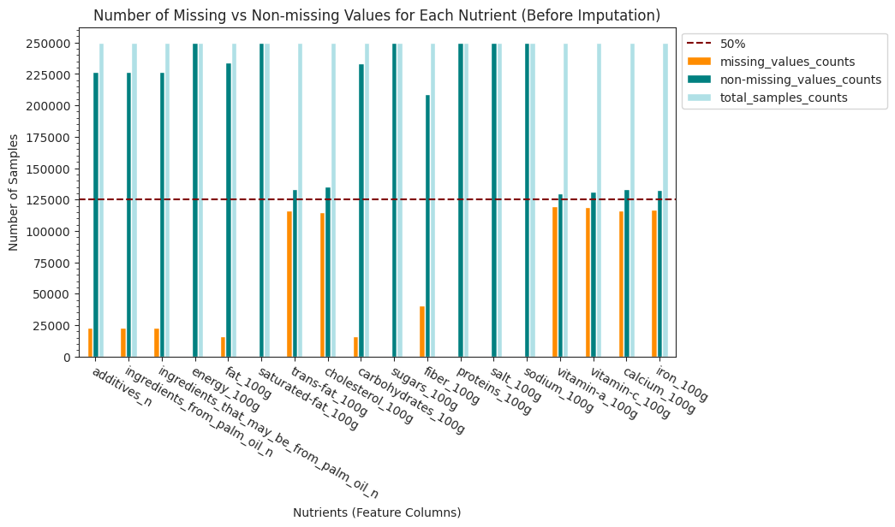
    


2) Zero-Imputation
* We impute all missing values `NaN` with a constant value of `0`
* `SimpleImputer()` [sklearn doc](https://scikit-learn.org/stable/modules/generated/sklearn.impute.SimpleImputer.html)
* the result is stored in a new dataframe `df_FdFts_zeroimp`


```python
# 1) Zero-Impute all feature columns
# Note: the fit_transformed() array is returned as a Numpy 2D array (with no column names, no indexing)
#       need to convert back to a Pandas Dataframe
zeroImputer = SimpleImputer(missing_values=np.nan, strategy='constant',fill_value=0) # see Part 0 "imports"
df_FdFts_zeroimp = zeroImputer.fit_transform(df_FdFts_ML)

# 2) convert the "df_FdFts_zeroimp" from a numpy 2D array to a Pandas DF
# https://stackoverflow.com/questions/57797952/using-simple-imputer-with-pandas-dataframe
df_FdFts_zeroimp = pd.DataFrame(df_FdFts_zeroimp)
df_FdFts_zeroimp.columns = df_FdFts_ML.columns
df_FdFts_zeroimp.index = df_FdFts_ML.index
```

3) After Imputation: Re-visualize Missing vs Non-Missing
* all missing-values are gone.


```python
# Visualize the Amount of missing vs valid values after Value Imputation
barAX = miss_vs_nonmiss(df_FdFts_zeroimp).plot(kind='bar', stacked=False, figsize=(9,5),
                                               color=['darkorange', 'teal', 'powderblue'])
barAX.set_xticklabels(barAX.get_xticklabels(), rotation=-30, ha="left", rotation_mode='anchor')
plt.xlabel('Nutrients (Feature Columns)')
plt.ylabel('Number of Samples')
plt.title('Number of Missing vs Non-missing Values for Each Nutrient (After Imputation)')
barAX.axhline(y=df_FdFts_cleaned.shape[0]*0.5, color='maroon', linestyle="--", label ='50%')
barAX.set_yticks(range(0,df_FdFts_cleaned.shape[0]+25000,25000))
barAX.yaxis.set_minor_locator(tck.AutoMinorLocator())
plt.legend(bbox_to_anchor=(1, 1), loc="upper left")
plt.show()
```


    
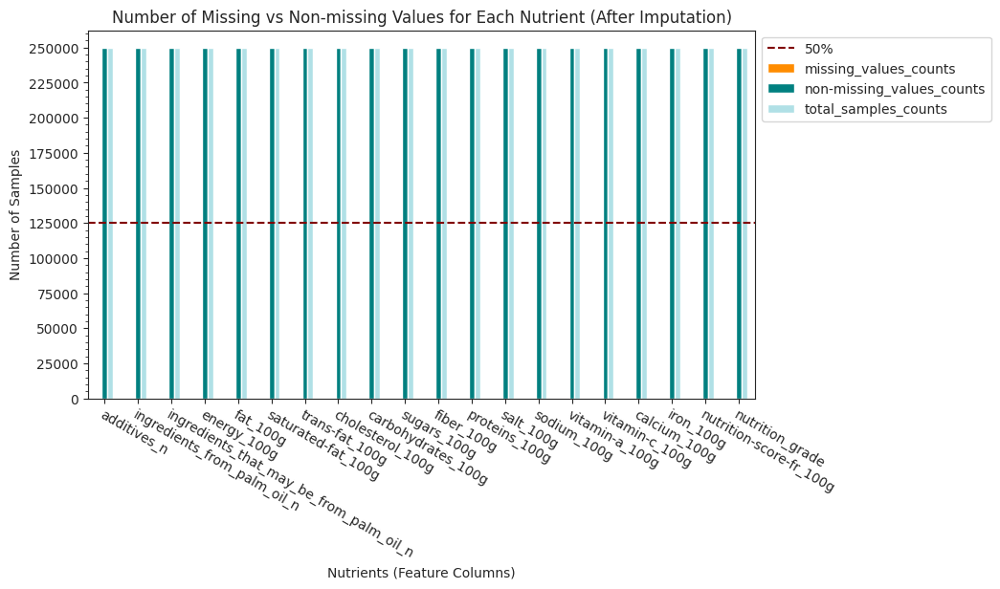
    


## 3.4 Logistic Regression Classifier (Classification)
Build a model to predict _Nutrition_Grade_
* From `df_FdFts_zeroimp`, collect the relevant features columns and target column into a new DataFrame called `df_FdFts_LinReg`
    * the categorical target column has been ordinal encoded in Section 3.2
    * missing values have been handled in Section 3.3
* Feature Columns: Feature Columns: `energy_100g`, `fat_100g`, `saturated-fat_100g`, `trans-fat_100g`, `cholesterol_100g`, `carbohydrates_100g`, `sugars_100g`, `fiber_100g`, `proteins_100g`, `salt_100g`, `sodium_100g`, `vitamin-a_100g`, `vitamin-c_100g`, `calcium_100g`, `iron_100g`
* Target Column: `nutrition_grade`


```python
features_logreg = df_FdFts_zeroimp.drop(columns=["nutrition-score-fr_100g","nutrition_grade"])
target_logreg = df_FdFts_zeroimp['nutrition_grade']
```

### 3.4.1 Splitting into training and testing data


```python
X_train_logreg, X_test_logreg, y_train_logreg, y_test_logreg = train_test_split(features_logreg, target_logreg, test_size=0.20, random_state = 42)
```

### 3.4.2 Standard Scaling


```python
stdscaler = StandardScaler()
X_train_logreg_scaled = stdscaler.fit_transform(X_train_logreg)
```

### 3.4.3 Dimensionality-Reduction PCA()

1) Initial PCA


```python
pca_init = PCA()
pca_init.fit(X_train_logreg_scaled)
```


<style>#sk-container-id-1 {color: black;background-color: white;}#sk-container-id-1 pre{padding: 0;}#sk-container-id-1 div.sk-toggleable {background-color: white;}#sk-container-id-1 label.sk-toggleable__label {cursor: pointer;display: block;width: 100%;margin-bottom: 0;padding: 0.3em;box-sizing: border-box;text-align: center;}#sk-container-id-1 label.sk-toggleable__label-arrow:before {content: "▸";float: left;margin-right: 0.25em;color: #696969;}#sk-container-id-1 label.sk-toggleable__label-arrow:hover:before {color: black;}#sk-container-id-1 div.sk-estimator:hover label.sk-toggleable__label-arrow:before {color: black;}#sk-container-id-1 div.sk-toggleable__content {max-height: 0;max-width: 0;overflow: hidden;text-align: left;background-color: #f0f8ff;}#sk-container-id-1 div.sk-toggleable__content pre {margin: 0.2em;color: black;border-radius: 0.25em;background-color: #f0f8ff;}#sk-container-id-1 input.sk-toggleable__control:checked~div.sk-toggleable__content {max-height: 200px;max-width: 100%;overflow: auto;}#sk-container-id-1 input.sk-toggleable__control:checked~label.sk-toggleable__label-arrow:before {content: "▾";}#sk-container-id-1 div.sk-estimator input.sk-toggleable__control:checked~label.sk-toggleable__label {background-color: #d4ebff;}#sk-container-id-1 div.sk-label input.sk-toggleable__control:checked~label.sk-toggleable__label {background-color: #d4ebff;}#sk-container-id-1 input.sk-hidden--visually {border: 0;clip: rect(1px 1px 1px 1px);clip: rect(1px, 1px, 1px, 1px);height: 1px;margin: -1px;overflow: hidden;padding: 0;position: absolute;width: 1px;}#sk-container-id-1 div.sk-estimator {font-family: monospace;background-color: #f0f8ff;border: 1px dotted black;border-radius: 0.25em;box-sizing: border-box;margin-bottom: 0.5em;}#sk-container-id-1 div.sk-estimator:hover {background-color: #d4ebff;}#sk-container-id-1 div.sk-parallel-item::after {content: "";width: 100%;border-bottom: 1px solid gray;flex-grow: 1;}#sk-container-id-1 div.sk-label:hover label.sk-toggleable__label {background-color: #d4ebff;}#sk-container-id-1 div.sk-serial::before {content: "";position: absolute;border-left: 1px solid gray;box-sizing: border-box;top: 0;bottom: 0;left: 50%;z-index: 0;}#sk-container-id-1 div.sk-serial {display: flex;flex-direction: column;align-items: center;background-color: white;padding-right: 0.2em;padding-left: 0.2em;position: relative;}#sk-container-id-1 div.sk-item {position: relative;z-index: 1;}#sk-container-id-1 div.sk-parallel {display: flex;align-items: stretch;justify-content: center;background-color: white;position: relative;}#sk-container-id-1 div.sk-item::before, #sk-container-id-1 div.sk-parallel-item::before {content: "";position: absolute;border-left: 1px solid gray;box-sizing: border-box;top: 0;bottom: 0;left: 50%;z-index: -1;}#sk-container-id-1 div.sk-parallel-item {display: flex;flex-direction: column;z-index: 1;position: relative;background-color: white;}#sk-container-id-1 div.sk-parallel-item:first-child::after {align-self: flex-end;width: 50%;}#sk-container-id-1 div.sk-parallel-item:last-child::after {align-self: flex-start;width: 50%;}#sk-container-id-1 div.sk-parallel-item:only-child::after {width: 0;}#sk-container-id-1 div.sk-dashed-wrapped {border: 1px dashed gray;margin: 0 0.4em 0.5em 0.4em;box-sizing: border-box;padding-bottom: 0.4em;background-color: white;}#sk-container-id-1 div.sk-label label {font-family: monospace;font-weight: bold;display: inline-block;line-height: 1.2em;}#sk-container-id-1 div.sk-label-container {text-align: center;}#sk-container-id-1 div.sk-container {/* jupyter's `normalize.less` sets `[hidden] { display: none; }` but bootstrap.min.css set `[hidden] { display: none !important; }` so we also need the `!important` here to be able to override the default hidden behavior on the sphinx rendered scikit-learn.org. See: https://github.com/scikit-learn/scikit-learn/issues/21755 */display: inline-block !important;position: relative;}#sk-container-id-1 div.sk-text-repr-fallback {display: none;}</style><div id="sk-container-id-1" class="sk-top-container"><div class="sk-text-repr-fallback"><pre>PCA()</pre><b>In a Jupyter environment, please rerun this cell to show the HTML representation or trust the notebook. <br />On GitHub, the HTML representation is unable to render, please try loading this page with nbviewer.org.</b></div><div class="sk-container" hidden><div class="sk-item"><div class="sk-estimator sk-toggleable"><input class="sk-toggleable__control sk-hidden--visually" id="sk-estimator-id-1" type="checkbox" checked><label for="sk-estimator-id-1" class="sk-toggleable__label sk-toggleable__label-arrow">PCA</label><div class="sk-toggleable__content"><pre>PCA()</pre></div></div></div></div></div>


2) Cumulative Explained Variance Ratios


```python
explained_variance_ratios = pca_init.explained_variance_ratio_
cum_evr = np.cumsum(explained_variance_ratios)
#cum_evr
```

3) Plot the Cumulative Explained Variance Ratios


```python
# 1) calculate the x-axis intercept with the 95% variance cutoff line
x_intercept = np.where(cum_evr >0.95)[0][0] #13
# 2) Make the Plot
fig, pltAX = plt.subplots(figsize=(8,5))
pltAX.plot(cum_evr, marker='o', markersize=5)
pltAX.set(title='Cumulative Explained Variance Ratio vs Number of Components (features)',
           xlabel="Number of Components (features)",
           ylabel="Cumulative Explained Variance Ratio")
pltAX.set_yticks(np.arange(0.1, 1.05, step=0.05))
pltAX.set_xticks(range(0,len(cum_evr),1), range(1,len(cum_evr)+1,1))
pltAX.axhline(y=0.95, color='r', linestyle="--")
pltAX.axvline(x=x_intercept, color='g', linestyle="--") # the 14th feature, index=13, hits above 90%
plt.show()
```


    
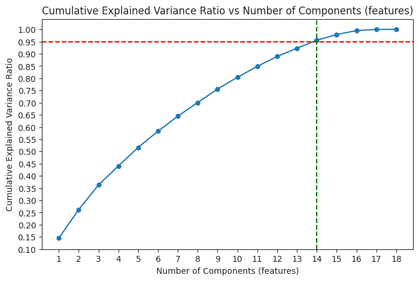
    


Oberservation:
* Since the 14th feature (index = 13) hits 95% , then `n=14` should be the principle components cutoff for PCA

4) Finalizing PCA
* use `n_components=14`


```python
# 1) Re-inistantiate a new PCA() with n=14 (as deduced from the last step),
# then fit and transform the Training Set
pca = PCA(n_components=14, random_state=42)
X_train_logreg_pca = pca.fit_transform(X_train_logreg_scaled)
# 2) StandardScale() the Testing Set
# then PCA() transform the Testing Set
X_test_logreg_scaled = stdscaler.transform(X_test_logreg)
X_test_logreg_pca = pca.transform(X_test_logreg_scaled)
```

As of this step, the dataset is scaled & PCA():  
* Training Set: `X_train_logreg_pca`, `y_train_logreg`  
* Testing Set: `X_test_logreg_pca`, `y_test_logreg`

### 3.4.4 Resampling
1) the training samples are not very balanced. i.e. class "3" (i.e. class "d") has significantly more samples than the rest


```python
y_train_logreg.value_counts().sort_index()
```


    0.0    31614
    1.0    30526
    2.0    41427
    3.0    57019
    4.0    39274
    Name: nutrition_grade, dtype: int64


2) Perform "Undersampling" with [`RandomUnderSampler()`](https://imbalanced-learn.org/stable/references/generated/imblearn.under_sampling.RandomUnderSampler.html)


```python
RUSampler = RandomUnderSampler(random_state=7) # see Part 0 "imports"
(X_train_logreg_rus, y_train_logreg_rus) = RUSampler.fit_resample(X_train_logreg_pca, y_train_logreg)
```

3) Now, all 5 classes are perfectly balanced


```python
y_train_logreg_rus.value_counts()
```


    0.0    30526
    1.0    30526
    2.0    30526
    3.0    30526
    4.0    30526
    Name: nutrition_grade, dtype: int64


As of this step, the dataset is scaled, PCA() and balanced:
* Training Set: `X_train_logreg_rus`, `y_train_logreg_rus`
* Testing Set: `X_test_logreg_pca`, `y_test_logreg`

### 3.4.5 Logistic Regression (OLS) Unbalanced vs Balanced

Logistic Regression (OLS) Trained with Unbalanced Samples  

Use _scaled & PCA()_ datasets:  
* Training Set: **`X_train_logreg_pca`**, **`y_train_logreg`**  
* Testing Set: `X_test_logreg_pca`, `y_test_logreg`

Evaluation Metric: Accuracy Score
* see `accuracy_score()` [sklearn Doc](https://scikit-learn.org/stable/modules/generated/sklearn.metrics.accuracy_score.html)


```python
# takes 7s
# 1) train the model with the unbalanced training set
# 2) make predictions on the testing set
# 3) Get the Training Accuracy
LogReg = LogisticRegression(multi_class='multinomial', n_jobs=-1)
LogReg.fit(X_train_logreg_pca, y_train_logreg)
y_pred_logreg_ub = LogReg.predict(X_test_logreg_pca)
accuracy_logreg_ub = accuracy_score(y_pred=y_pred_logreg_ub, y_true=y_test_logreg)
accuracy_logreg_ub # 0.628795004703104
```


    0.6233438738342073


Logistic Regression (OLS) Trained with Balanced Samples

Use _scaled, PCA() and **balanced**_ datasets:  
* Training Set: **`X_train_logreg_rus`**, **`y_train_logreg_rus`**  
* Testing Set: `X_test_logreg_pca`, `y_test_logreg`


```python
# takes 8s
# 1) train the model with the (undersampled) balanced training set
# 2) make predictions on the testing set
# 3) Get the Training Accuracy
LogReg_bn = LogisticRegression(multi_class='multinomial', n_jobs=-1)
LogReg_bn.fit(X_train_logreg_rus, y_train_logreg_rus)
y_pred_logreg_bn = LogReg_bn.predict(X_test_logreg_pca)
accuracy_logreg_bn = accuracy_score(y_pred=y_pred_logreg_bn, y_true=y_test_logreg)
accuracy_logreg_bn # # 0.6234714911841815
```


    0.6215826762198294


##### Evaluation: Confusion Matrix
* `confusion_matrix()` [sklearn](https://scikit-learn.org/stable/modules/generated/sklearn.metrics.confusion_matrix.html)
* Plot the confusion matrix for the two Logistic Regression models trained with balanced vs unbalanced training sets


```python
# 1) Generate the Confusion Matrix:
# model trained with unbalanced samples
cfsMatrix_logreg_ub = confusion_matrix(y_test_logreg, y_pred_logreg_ub)
# model trained balanced samples
cfsMatrix_logreg_bn = confusion_matrix(y_test_logreg, y_pred_logreg_bn)
# 2) plot heatmap
fig, axs =plt.subplots(1,2, figsize=(12,4))
# Unbalanced
sns.heatmap(cfsMatrix_logreg_ub, annot=True, fmt='g', cmap="GnBu", ax=axs[0])
axs[0].set_xlabel("Predicted labels") # every column is a predicted labelm so x axis
axs[0].set_ylabel("Actual labels") # every row is an actual label, so y axis
axs[0].set_title('LogisticRegressor Trained with Unbalanced Samples')
axs[0].set_yticklabels(axs[0].get_yticklabels(), rotation=45)
# Balanced
sns.heatmap(cfsMatrix_logreg_bn, annot=True, fmt='g', cmap="GnBu", ax=axs[1])
axs[1].set_xlabel("Predicted labels") # every column is a predicted labelm so x axis
axs[1].set_ylabel("Actual labels") # every row is an actual label, so y axis
axs[1].set_title('LogisticRegressor Trained with Balanced Samples')
axs[1].set_yticklabels(axs[1].get_yticklabels(), rotation=45)
plt.show()
```


    
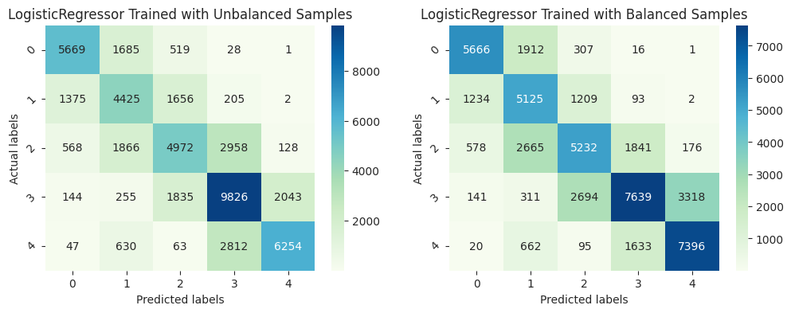
    


#### Evaluation: ROC_AUC
* Calculate the ROC_AUC score for each class (one-vs-rest) and the average among the 5 classes


```python
# https://stackoverflow.com/questions/39685740/calculate-sklearn-roc-auc-score-for-multi-class

# helper function 1: generate One-vs-Rest (OvR) ROC_AUC for each class
# Pass in the list of "actual_labels" and "predicted_labels" from our logistic regression classifier
def roc_auc_score_multiclass(actual_class, pred_class, average = "macro"):
    #creating a set of all the unique classes using the actual class list
    unique_class = set(actual_class)
    roc_auc_dict = {}
    for per_class in unique_class:
        #creating a list of all the classes except the current class
        other_class = [x for x in unique_class if x != per_class]
        #marking the current class as 1 and all other classes as 0
        new_actual_class = [0 if x in other_class else 1 for x in actual_class]
        new_pred_class = [0 if x in other_class else 1 for x in pred_class]
        #using the sklearn metrics method to calculate the roc_auc_score
        roc_auc = roc_auc_score(new_actual_class, new_pred_class, average = average)
        roc_auc_dict[per_class] = roc_auc
    return roc_auc_dict

# helper function 2: calculate the average ROC_AUC among the 5-class
def avg_roc_auc_multiclass(rocaucDict):
    return sum(rocaucDict.values()) / len(rocaucDict)
```


```python
print("ROC_AUC of LogisticRegressor Trained with Unbalanced Samples")
roc_ub = roc_auc_score_multiclass(y_test_logreg, y_pred_logreg_ub)
print(roc_ub)
print("Average ROC_AUC: %.4f"%(avg_roc_auc_multiclass(roc_ub))) # 0.7657
print()

print("ROC_AUC of LogisticRegressor Trained with Balanced Samples")
roc_bn = roc_auc_score_multiclass(y_test_logreg, y_pred_logreg_bn)
print(roc_bn)
print("Average ROC_AUC: %.4f"%(avg_roc_auc_multiclass(roc_bn))) # 0.7730
```

    ROC_AUC of LogisticRegressor Trained with Unbalanced Samples
    {0.0: 0.8333405477560366, 1.0: 0.7362937727616815, 2.0: 0.6853515117234253, 3.0: 0.7646720957075911, 4.0: 0.7918196630163011}
    Average ROC_AUC: 0.7623
    
    ROC_AUC of LogisticRegressor Trained with Balanced Samples
    {0.0: 0.8350644728708345, 1.0: 0.7688008758942808, 2.0: 0.6948032612460412, 3.0: 0.720874910073066, 4.0: 0.833577704783558}
    Average ROC_AUC: 0.7706


Oberservation:
* LogisticReg Trained with Unbalanced Samples: ROC_AUC =
$0.7657$ (Accuracy = $62.88\%$)
* LogisticReg Trained with Balanced Samples: ROC_AUC =
$0.7730$ (Accuracy = $62.35\%$)

Reflection:
* "Resampling" can help improve the performance of our LogisticRegressor by a bit. So we will use the **balanced** training dataset for the subsequent model tuning step.

### 3.4.6 Hyperparameters Tuning
* Use `RandomizedSearchCV()` cross-validator
    * Note: through testing, we found `GridSearchCV()` to be costing a long time to execute (i.e. takes ~16min). As such, we've decided to use `RandomizedSearchCV()` instead (takes ~8mins)
* Hyperparameters considered:
    * `penalty` (regularization types): `L1`, `L2`
    * `C`: `[0.001, 0.01, 0.1, 1]`
    * `solver`:  `['lbfgs', 'saga']`
        * `ibfgs` doesn't support ElasticNet. So can't put ElasticNet as a valid option to be explored.
        * `ibfgs` and `saga` both support multinomial classification.

Use scaled, PCA() and **balanced** dataset:  
* `X_train_logreg_rus`, `y_train_logreg_rus`  
* `X_test_logreg_pca`, `y_test_logreg`


```python
# takes 6m37s
# 1) initialize a new LogReg model for tuning
logregRSrus = LogisticRegression(random_state=42, multi_class='multinomial')
# 2) construct the search space of the hyperparamaters settings that we want to explore
search_space = dict()
search_space['C'] = [0.001, 0.01, 0.1, 1]
search_space['solver'] = ['lbfgs'] # for faster execution of RandomizedSearchCV()
# search_space['solver'] = ['lbfgs', 'saga'] # through repeated testing, we know 'saga' is not the best solver
search_space['penalty'] = ['l1', 'l2']
# 3) initiating Randomized Search Cross Validator
rsCVrus = RandomizedSearchCV(logregRSrus, search_space, n_jobs=-1)
rsCVrus.fit(X_train_logreg_rus, y_train_logreg_rus)
rsCVrus.best_estimator_.get_params()
```


    {'C': 0.01,
     'class_weight': None,
     'dual': False,
     'fit_intercept': True,
     'intercept_scaling': 1,
     'l1_ratio': None,
     'max_iter': 100,
     'multi_class': 'multinomial',
     'n_jobs': None,
     'penalty': 'l2',
     'random_state': 42,
     'solver': 'lbfgs',
     'tol': 0.0001,
     'verbose': 0,
     'warm_start': False}


Note: since `RandomizedSearchCV()` doesn't always guarantee to return the Optimal set of hyperparameters upon every execution. We have run it for several times and verified that the best combination of settings to be:  
* C = `0.01`, solver = `lbfgs`, penalty = `L2` (Ridge Regularization)


```python
# Since RandomizedSearchCV() doesn't always return the most Optimal Estimator
# (i.e. the model with the best settings)
# Hence, we keep this line of code commented out
#LogRegRusBest = rsCVrus.best_estimator_
################################################
# 1) retrain the best model according to the best hyperparameter settings
# 2) make predictions on testing set
# 3) Get the Model Accuracy
LogRegRusBest = LogisticRegression(C=0.01, solver='lbfgs', penalty='l2', random_state=42, multi_class='multinomial')
LogRegRusBest.fit(X_train_logreg_rus, y_train_logreg_rus)
y_pred_logregRusBest = LogRegRusBest.predict(X_test_logreg_pca)
accuracy_logregRusBest = accuracy_score(y_true=y_test_logreg, y_pred=y_pred_logregRusBest)
accuracy_logregRusBest # 0.6240919006544319
```


    0.6251851258856022


#### Evalution: Confusion Matrix & ROC_AUC
* Compare the Confusion Matrix of Untuned vs Optimized Logistic Regression Models


```python
# Confusion Matrix of the Best Logistic Regression Model
cfsMatrix_logregRusBest = confusion_matrix(y_test_logreg, y_pred_logregRusBest)
# plot heatmap
fig, axs =plt.subplots(1,2, figsize=(14,3))
# LogisticReg Untuned
sns.heatmap(cfsMatrix_logreg_bn, annot=True, fmt='g', cmap="GnBu", ax=axs[0])
axs[0].set_xlabel("Predicted labels") # every column is a predicted labelm so x axis
axs[0].set_ylabel("Actual labels") # every row is an actual label, so y axis
axs[0].set_title('LogisticRegressor Balanced (Untuned)')
axs[0].set_yticklabels(axs[0].get_yticklabels(), rotation=45)
# LogisticReg Optimized
sns.heatmap(cfsMatrix_logregRusBest, annot=True, fmt='g', cmap="GnBu", ax=axs[1])
axs[1].set_xlabel("Predicted labels") # every column is a predicted labelm so x axis
axs[1].set_ylabel("Actual labels") # every row is an actual label, so y axis
axs[1].set_title('LogisticRegressor Balanced (Optimized)')
axs[1].set_yticklabels(axs[1].get_yticklabels(), rotation=45)
plt.show()
```


    
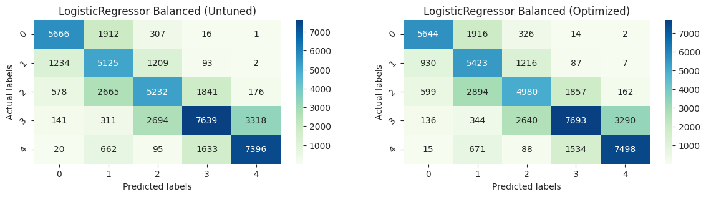
    


* Compare the ROC_AUC of Untuned vs Optimized Logistic Regression Models


```python
print("ROC_AUC of LogisticRegressor Trained with Unbalanced Samples (Untuned)")
print(roc_ub)
print("Average ROC_AUC: %.4f"%(avg_roc_auc_multiclass(roc_ub))) # 0.7657
print()

print("ROC_AUC of LogisticRegressor Trained with Balanced Samples (Untuned)")
roc_bn = roc_auc_score_multiclass(y_test_logreg, y_pred_logreg_bn)
print(roc_bn)
print("Average ROC_AUC: %.4f"%(avg_roc_auc_multiclass(roc_bn))) # 0.7730
print()

print("ROC_AUC of LogisticRegressor Trained with Balanced Samples (Optimized)")
roc_bn_best = roc_auc_score_multiclass(y_test_logreg, y_pred_logregRusBest)
print(roc_bn_best)
print("Average ROC_AUC: %.4f"%(avg_roc_auc_multiclass(roc_bn_best))) # 0.7742
```

    ROC_AUC of LogisticRegressor Trained with Unbalanced Samples (Untuned)
    {0.0: 0.8333405477560366, 1.0: 0.7362937727616815, 2.0: 0.6853515117234253, 3.0: 0.7646720957075911, 4.0: 0.7918196630163011}
    Average ROC_AUC: 0.7623
    
    ROC_AUC of LogisticRegressor Trained with Balanced Samples (Untuned)
    {0.0: 0.8350644728708345, 1.0: 0.7688008758942808, 2.0: 0.6948032612460412, 3.0: 0.720874910073066, 4.0: 0.833577704783558}
    Average ROC_AUC: 0.7706
    
    ROC_AUC of LogisticRegressor Trained with Balanced Samples (Optimized)
    {0.0: 0.837155208358304, 1.0: 0.7849945973519912, 2.0: 0.6832374412042955, 3.0: 0.7240581134147343, 4.0: 0.8392268093646219}
    Average ROC_AUC: 0.7737


Oberservation:
* LogisticReg Trained with Balanced Samples, Untuned: ROC_AUC = $0.7730$
* LogisticReg Trained with Balanced Samples, Optimized: ROC_AUC = $0.7742$

After tuning, the Optimized Logistic Regression Classifier can achieve ROC_AUC = $0.7742$ (accuracy = $62.41\%$)

## 3.5 Random Forest Classifier
* Since we didn't get a very good performance with the construct of Logistic Regression Models. We want to try if `RandomForestClassifier()` can give a better performance.
* `RandomForestClassifier()` [scikit Learn Doc](https://scikit-learn.org/stable/modules/generated/sklearn.ensemble.RandomForestClassifier.html)
* Use scaled, PCA() and **balanced** datasets:
    * Training Set: `X_train_logreg_rus`, `y_train_logreg_rus`
    * Testing Set: `X_test_logreg_pca`, `y_test_logreg`


```python
# takes 1m25s
# 1) instantiate the model
# 2) train model on the training set
# 3) make predictions on the testing set
# 4) Training Accuracy of RandomForestClassifier
RFclf = RandomForestClassifier(n_estimators=120, max_depth=30, random_state=42, class_weight='balanced') # see Part 0 "imports"
RFclf.fit(X_train_logreg_rus, y_train_logreg_rus)
y_pred_rf = RFclf.predict(X_test_logreg_pca)
accuracy_rf = accuracy_score(y_true=y_test_logreg, y_pred=y_pred_rf)
accuracy_rf # 0.8559849500670442
```


    0.8562822719449226


### Confusion Matrix and ROC_AUC
* Compare `RandomForestClassifer()` with the Optimized `LogisticRegression()`


```python
# compute the confusion matrix of RandomForestClassifer()
cfsMatrix_rf = confusion_matrix(y_true=y_test_logreg, y_pred=y_pred_rf)

# plot Confusion Matrix
fig, axs =plt.subplots(1,2, figsize=(14,3))
# RandomForestClassifer() Trained with Balanaced Samples
sns.heatmap(cfsMatrix_rf, annot=True, fmt='g', cmap="GnBu", ax=axs[0])
axs[0].set_xlabel("Predicted Nutrition Grades") # every column is a predicted labelm so x axis
axs[0].set_ylabel("Actual Nutrition Grades") # every row is an actual label, so y axis
axs[0].set_title("RandomForestClassifier() (Trained with Balanaced Samples)")
axs[0].set_yticklabels(axs[0].get_yticklabels(), rotation=45)

# Optimied LogisticRegression() Trained with Balanaced Samples
sns.heatmap(cfsMatrix_logregRusBest, annot=True, fmt='g', cmap="GnBu", ax=axs[1])
axs[1].set_xlabel("Predicted Nutrition Grades") # every column is a predicted labelm so x axis
axs[1].set_ylabel("Actual Nutrition Grades") # every row is an actual label, so y axis
axs[1].set_title('Optimized LogisticRegression() (Trained with Balanced Samples)')
axs[1].set_yticklabels(axs[1].get_yticklabels(), rotation=45)
plt.show()
```


    
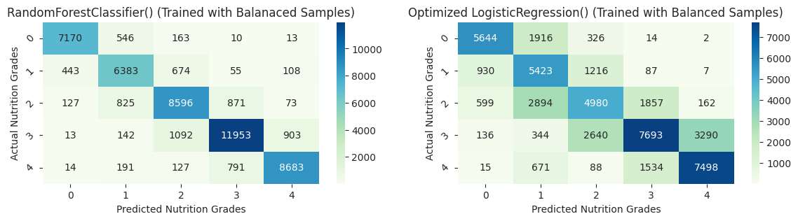
    


```python
print("ROC_AUC of Optimized LogisticRegression() Trained with Balanced Samples")
print(roc_bn_best)
print("Average ROC_AUC: %.4f"%(avg_roc_auc_multiclass(roc_bn_best))) # 0.7742
print()

print("ROC_AUC of RandomForestClassifer() Trained with Balanaced Samples")
roc_rf = roc_auc_score_multiclass(y_test_logreg, y_pred_rf)
print(roc_rf)
print("Average ROC_AUC: %.4f"%(avg_roc_auc_multiclass(roc_rf))) # 0.9111
```

    ROC_AUC of Optimized LogisticRegression() Trained with Balanced Samples
    {0.0: 0.837155208358304, 1.0: 0.7849945973519912, 2.0: 0.6832374412042955, 3.0: 0.7240581134147343, 4.0: 0.8392268093646219}
    Average ROC_AUC: 0.7737
    
    ROC_AUC of RandomForestClassifer() Trained with Balanaced Samples
    {0.0: 0.9465862825941481, 1.0: 0.8963413800680301, 2.0: 0.8836029858209222, 3.0: 0.8996973430261719, 4.0: 0.9290812707765715}
    Average ROC_AUC: 0.9111


### Observation
Indeed, `RandomForestClassifer()` outperformed `LogisticRegression()` as
* `RandomForestClassifer()`: ROC_AUC =
$0.9111$ (Accuracy $85.60\%$)
* Optimized `LogisticRegression()`: ROC_AUC =
$0.7742$ (Accuracy $62.41\%$)

## 3.6 Linear Regression Classifier (Regression)
Build a model to predict _Nutrition_Score_
* From `df_FdFts_zeroimp`, collect the relevant features columns to `features_linreg` and target column to `target_linreg`
* Feature Columns:   
`energy_100g`, `fat_100g`, `saturated-fat_100g`, `trans-fat_100g`, `cholesterol_100g`, `carbohydrates_100g`, `sugars_100g`, `fiber_100g`, `proteins_100g`, `salt_100g`, `sodium_100g`, `vitamin-a_100g`, `vitamin-c_100g`, `calcium_100g`, `iron_100g`
* Target Column: `nutrition-score-fr_100g`


```python
features_linreg = df_FdFts_zeroimp.drop(columns=["nutrition-score-fr_100g","nutrition_grade"])
target_linreg = df_FdFts_zeroimp['nutrition-score-fr_100g']
```

### 3.6.1 Splitting into training and testing data


```python
X_train_linreg, X_test_linreg, y_train_linreg, y_test_linreg = train_test_split(
    features_linreg, target_linreg, test_size=0.20, random_state = 42)
```

### 3.6.2 Standard Scaling


```python
stdscaler = StandardScaler()
X_train_linreg_scaled = stdscaler.fit_transform(X_train_linreg)
X_test_linreg_scaled = stdscaler.transform(X_test_linreg)
```

### 3.6.3 Dimensionality-Reduction PCA()
* Since `n_components` has been determined previously (in 3.4.3), we can use `n_components=14`


```python
# inistantiate a new PCA() with n=14 (as deduced from the last step),
# then fit and transform the Training Set, and transform the Testing set
pca = PCA(n_components=14, random_state=42)
X_train_linreg_pca = pca.fit_transform(X_train_linreg_scaled)
X_test_linreg_pca = pca.transform(X_test_linreg_scaled)
```

### 3.6.4 Resampling Not Needed
* Now we are building a Linear Regression Model, which aims to learn the "formula" to make predictions about the "Nutrition Score" of a given food. We don't need to be concerned about "balancing" our samples. Because every sample is considered to be a valid data point that can teach our model to learn the "best-fit-line".

### 3.6.5 Linear Regression (OLS)
Use _Scaled & PCA()_ Datasets:
* Training set: `X_train_linreg_pca`, `y_train_linreg`
* Testing set :`X_test_linreg_pca`, `y_test_linreg`

Evaluation: $R^2$ Score
* see `r2_score()` [sklearn Doc](https://scikit-learn.org/stable/modules/generated/sklearn.metrics.r2_score.html)


```python
# Instantiate model with default parameters and fit it on the training set
# Use the model to predict on the testing set
# Evaluation: Return the R-squared (R^2) score
LinReg = LinearRegression(n_jobs=-1)
LinReg.fit(X_train_linreg_pca, y_train_linreg)
y_pred_linreg = LinReg.predict(X_test_linreg_pca)
r2_linreg = r2_score(y_true=y_test_linreg, y_pred=y_pred_linreg)
r2_linreg # 0.6546114491261625
```


    0.6536611177844148


```python
# the Model's learned Coefficients (one for each of the 14 PCA()ed features) and Intercept
linreg_coef , linreg_intercept= LinReg.coef_, LinReg.intercept_
print("Coefficients:", linreg_coef)
print("Intercept:", linreg_intercept)
```

    Coefficients: [ 3.64221231  0.80427608 -1.44026962 -1.26281831  0.09730879 -0.57332443
      2.85770365 -0.26740931  0.12289027 -0.63787678 -0.05654754 -1.43303238
      0.84874205 -0.65500943]
    Intercept: 9.159886920844592


Evaluation: Visualize Predictions vs Actual labels
* use a scatter plot (implemented as seaborn `regplot()`) to visualize predicted labels vs actual labels


```python
##################################################
# Helper Function: zip the lists of predicted Labels and actual labels together,
#                  for evaluation & visualization
###################################################
def zip_pred_true(y_pred, y_true):
    y_pred_series = pd.Series(y_pred, name="predicted_nutrition_score")
    return pd.concat([y_pred_series, y_true.reset_index(drop=True)], axis=1)
```


```python
# Visualizing Predictions vs Actual
linreg_result = zip_pred_true(y_pred_linreg, y_test_linreg)
fig, scatterAX = plt.subplots(figsize=(6,6))
sns.regplot(data=linreg_result, x="nutrition-score-fr_100g", y="predicted_nutrition_score", ax=scatterAX,
            scatter_kws={'s': 2})
scatterAX.set_title("Linear Regression (OLS), Untuned")
scatterAX.set_ylabel("Predicted Nutrition Scores")
scatterAX.set_xlabel("Actual Nutrition Scores")
scatterAX.set_xticks(range(-15,41,5))
scatterAX.xaxis.set_minor_locator(tck.AutoMinorLocator())
scatterAX.yaxis.set_minor_locator(tck.AutoMinorLocator())
plt.show()
```


    
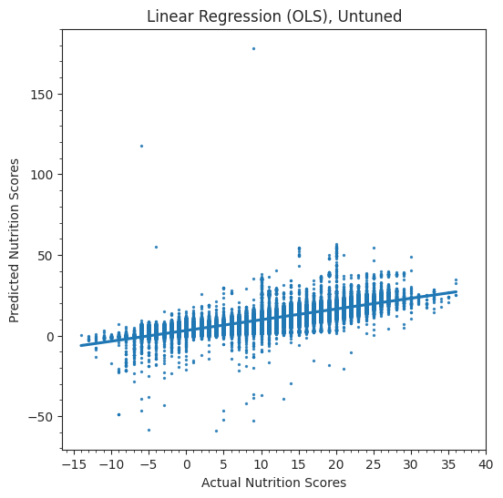
    


Observation:
* Ideally, if we had a good model, we would see a tendency of data points being centralized around the line of $x=y$. Also, x-axis and y-axis should have similar scales (i.e. `[-15:40]`).
* Apperantly, the OLS linear Regression Model doesn't perform very well:
    * y-axis scale is greatly expanded, which means the predications are frequently off.
    * There are many predicted scores above `40` and below `-15`. Recall that the Nutri-Score should be ranged within `[-15:40]`

### 3.6.6 Linear Regression ElasticNet (Tuning)

* for sklearn, the `LinearRegression()` model cannot be further tuned by  `GridSearchCV()` or `RandomizedSearchCV()`. Instead, we have two options for hyperparameter tuning:
    * Option 1: use `ElasticNetCV()`
    * Option 2: try cross-validate `Lasso()`, `Ridge()` and `ElasticNet()` seperately with `GridSearchCV()`(or `RandomizedSearchCV()`).
    * We choose to go with Option 1.
* Hyperparameters considered:
    * `l1_ratio`: control the weighing/balancing of the regularization contributed by `L1` and `L2`
        * i.e. `l1_ratio=1` means Lasso() Regression, `l1_ratio=0` means Ridge() Regression
    * `alpha`: control the overall regularization strength on L1+L2 entirely


```python
# take 33s
ratio_space = np.arange(0, 1.1, 0.2) # [0.0, 0.2. 0.4, 0.6 .. 1.0]
alpha_space = [0.001, 0.01, 0.1, 0.0, 1.0, 10.0]
ElasticNetRegCV = ElasticNetCV(l1_ratio=ratio_space, alphas=alpha_space, cv=5, n_jobs=-1)
ElasticNetRegCV.fit(X_train_linreg_pca, y_train_linreg)
# get the chosen hyperparameter settings:
print('alpha: %f' % ElasticNetRegCV.alpha_)
print('l1_ratio_: %f' % ElasticNetRegCV.l1_ratio_)
#################################
# 1) use the best model to make predictions on testing set
# y_pred_enreg = ElasticNetRegCV.predict(X_test_linreg_pca)
# 3) Evaluation: Return the R-squared (R^2) score
# r2_enreg = r2_score(y_true=y_test_linreg, y_pred=y_pred_enreg)
# r2_enreg # 0.6569240416462294
```

    alpha: 0.010000
    l1_ratio_: 1.000000


Note: since `ElasticNetCV(()` doesn't always guarantee to return the Optimal set of hyperparameters upon every execution. We have run it for several times and verified that the best combination of settings to be:  
* * `alpha`= `0.1`, `l1_ratio`= `1.0` (Lasso Regularization)


```python
from sklearn.linear_model import ElasticNet
# 1) re-train the best model
# 2) use the best model to make predictions on testing set
# 3) Evaluation: Return the R-squared (R^2) score
ElasticNetReg = ElasticNet(alpha= 0.1, l1_ratio= 1.0, random_state=42)
ElasticNetReg.fit(X_train_linreg_pca, y_train_linreg)
y_pred_enreg = ElasticNetReg.predict(X_test_linreg_pca)
r2_enreg = r2_score(y_true=y_test_linreg, y_pred=y_pred_enreg)
r2_enreg # 0.6569240416462294
```


    0.6556808311142359


Evaluation: Compare Performance of Optimized vs Untuned Linear Regression Models


```python
# Gather Predictions vs Actual Label Together
enreg_result = zip_pred_true(y_pred_enreg, y_test_linreg)
# Plot
fig, scatterAX = plt.subplots(1, 2, figsize=(12,6))
# L1 Linear Regression
sns.regplot(data=enreg_result, x="nutrition-score-fr_100g", y="predicted_nutrition_score",
            ax=scatterAX[0],scatter_kws={'s': 2})
scatterAX[0].set_xticks(range(-15,41,5))
scatterAX[0].set_title("Linear Regression (L1), Optimized")
scatterAX[0].set_ylabel("Predicted Nutrition Scores")
scatterAX[0].set_xlabel("Actual Nutrition Scores")
scatterAX[0].xaxis.set_minor_locator(tck.AutoMinorLocator())
scatterAX[0].yaxis.set_minor_locator(tck.AutoMinorLocator())
# OLS Linear Regression
sns.regplot(data=linreg_result, x="nutrition-score-fr_100g", y="predicted_nutrition_score",
            ax=scatterAX[1], scatter_kws={'s': 2})
scatterAX[1].set_title("Linear Regression (OLS), Untuned")
scatterAX[1].set_ylabel("Predicted Nutrition Scores")
scatterAX[1].set_xlabel("Actual Nutrition Scores")
scatterAX[1].set_xticks(range(-15,41,5))
scatterAX[1].xaxis.set_minor_locator(tck.AutoMinorLocator())
scatterAX[1].yaxis.set_minor_locator(tck.AutoMinorLocator())
plt.show()
```


    
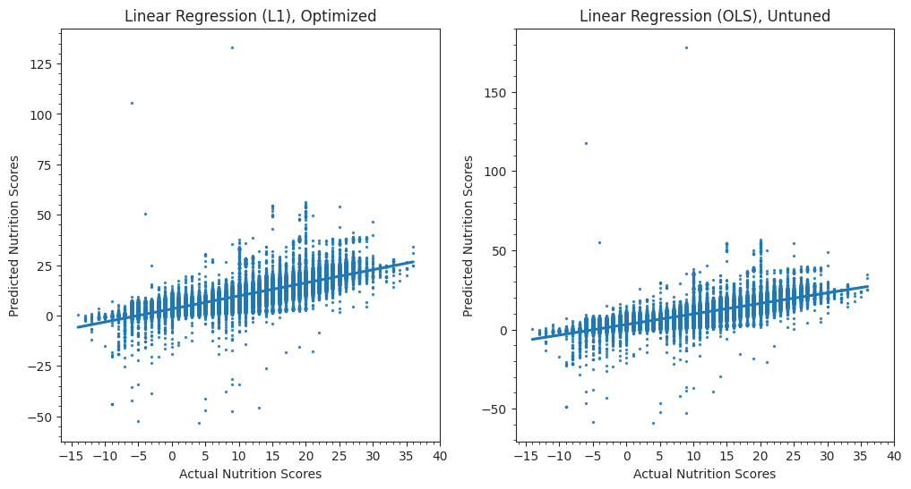
    


Observation:
* Linear Regression (OLS): R2 Score =
$0.6546$
* Linear Regression with 100% L1 Regularization: R2 Score =
$0.6569$
    * `alpha`= `0.1`, `l1_ratio`= `1.0`
* L1 Regularization has helped improve the Linear Regression Model:
    * y-axis scale expansion has been reduced, which means the predications are frequently off.
    * Although, there are still many predicted scores above `40` and below `-15`.

## 3.7 Random Forest Regressor
* Since we didn't get a very good performance with the construct of Linear Regression Models. We want to try if `RandomForestRegressor()` can give a better performance.
* `RandomForestRegressor()` [sklearn Doc](https://scikit-learn.org/stable/modules/generated/sklearn.ensemble.RandomForestRegressor.html)


```python
# takes 3m25s
# 1) Initialize model with default parameters and fit it on the training set
# 2) Use the model to predict on the testing set
# 3) Evalution: return the R-squared score
RFrgr = RandomForestRegressor(random_state=42, n_jobs=-1)
RFrgr.fit(X_train_linreg_pca, y_train_linreg)
y_pred_rfrgr = RFrgr.predict(X_test_linreg_pca)
r2_rfrgr = r2_score(y_true=y_test_linreg, y_pred=y_pred_rfrgr)
r2_rfrgr # 0.9504981915300356 (score improved by +30%)
```


    0.9511054498894453


Evaluation: Compare Performance of RandomForestRegressor() vs Optimized L1 Lasso Regression


```python
# Gather Predictions vs Actual Label Together of RandomForestRegressor()
rfrgr_result = zip_pred_true(y_pred_rfrgr, y_test_linreg)
# Plot
fig, scatterAX = plt.subplots(1, 2, figsize=(12,6))
# RandomForestRegressor()
sns.regplot(data=rfrgr_result, x="nutrition-score-fr_100g", y="predicted_nutrition_score",
            ax=scatterAX[0],scatter_kws={'s': 2})
scatterAX[0].set_xticks(range(-15,41,5))
scatterAX[0].set_yticks(range(-15,41,5))
scatterAX[0].set_title("RandomForestRegressor()")
scatterAX[0].set_ylabel("Predicted Nutrition Scores")
scatterAX[0].set_xlabel("Actual Nutrition Scores")
scatterAX[0].xaxis.set_minor_locator(tck.AutoMinorLocator())
scatterAX[0].yaxis.set_minor_locator(tck.AutoMinorLocator())
# L1 Linear Regression
sns.regplot(data=enreg_result, x="nutrition-score-fr_100g", y="predicted_nutrition_score",
            ax=scatterAX[1], scatter_kws={'s': 2})
scatterAX[1].set_title("Linear Regression (L1), Optimized")
scatterAX[1].set_ylabel("Predicted Nutrition Scores")
scatterAX[1].set_xlabel("Actual Nutrition Scores")
scatterAX[1].set_xticks(range(-15,41,5))
scatterAX[1].xaxis.set_minor_locator(tck.AutoMinorLocator())
scatterAX[1].yaxis.set_minor_locator(tck.AutoMinorLocator())
plt.show()
```


    
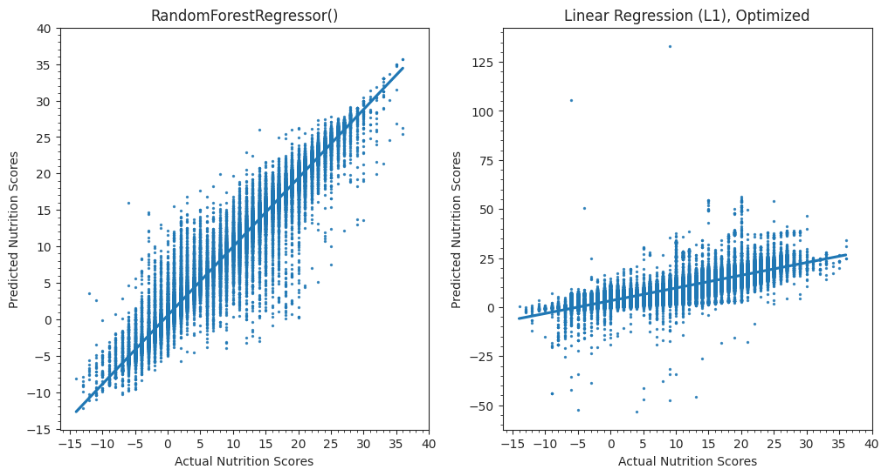
    


Observation:
* Linear Regression with L1: R2 Socre $0.6569$
* `RandomForestRegressor()`: R2 Score $0.9505$
    * `RandomForestRegressor()` has significantly outperformed `LinearRegression()` models. In fact, this graph very closely reseamble the "ideal" look we described previously -- data points centralized around the line of $x=y$ .
    * All predicted scores are within the range of `[-15:40]`.

# Part 4: Project Conclusion


## 4.1 Analysis Summary and Model Comparisons

For Basis Analysis of the Open Food Fact Dataset:
* We made discovery about the common allergens among the given dataset.
* We revealed the brands that produce high-sugar content foods, as well as brands that make energy-dense foods.
* We spotted the trend that Foods sold exclusively in France are a bit healthier than foods which exclusively sold in the US.
* We revealed the correlations amoung the various nutrients.


For Classification Models:
* RandomForestClassifier() outperformed all constructs of Logistic Regression Models.
    * Just as mentioned in Module 9 lecture.
    > "Random forests are one of the most popular and accurate method classifiers for big data"
* Performance Overview:
    * Untuned LogisticReg Trained with Unbalanced Samples: ROC_AUC =
$0.7657$ (Accuracy = $62.88\%$)
    * Untuned LogisticReg Trained with Balanced Samples: ROC_AUC =
$0.7730$ (Accuracy = $62.35\%$)
    * Optimized LogisticReg Trained with Balanced Samples: ROC_AUC = $0.7742$ (Accuracy $62.41\%$)
        * `C` = `0.01`, `solver` = `lbfgs`, regularization mode = `L2` (Ridge Regularization)
    * RandomForestClassifer() Trained with Balanced Samples: ROC_AUC =
$0.9111$ (Accuracy $85.60\%$)

* Reflection: We found that the balanced training set together with Lasso (L2) Regularization produced the best LogisticRegression model, even though the ROC_AUC scores among the three Logistic Regression models were very close. We attribute such improvement to:  
    * 1) Ridge's ability to shrink the coefficient(s)/weight(s) or non-important feature(s) towards zero. Greatly suppressed the effect of trivial features.   
    * 2) A balanced traning set can help teach the model to learn making categorical predictions in a more unbias way (i.e. the model doesn't favor the majority class just because it contains more data.)


For Regression Models:
* RandomForestRegressor() outperformed all constructs of Linear Regression Models.
    * Again, just as mentioned in Module 9 lecture.
* Performce Overview:
    * Linear Regression (OLS): R2 Score =
$0.6546$  
    * Linear Regression (L1): R2 Score = $0.6569$  
        * `alpha`= `0.1`, `l1_ratio`= `1.0` (Lasso Regularization)
    * RandomForestRegressor(): R2 Score $0.9505$
* Reflection: We found that the balanced training set together with Lasso (L1) Regularization produced the best LinearRegression model, even though the $R^2$ scores among the two LinearRegression models were very close. We attribute such improvement to:  
    * 1) Lasso's ability to push the coefficient(s)/weight(s) or non-important feature(s) to zero (i.e. feature selection).   

Principal Component Analysis (PCA)
* Additionally, it is important to highlight the utilization of PCA for dimensionality reduction. PCA effectively trims redundant features, retaining only the pivotal ones. This not only addresses multicollinearity and eliminates superfluous data, but also diminishes noise and data volume, leading to enhanced training efficiency. Moreover, this approach contributes to mitigating overfitting to a considerable extent.

## 4.2: Challenges Encountered

* **Data Cleaning:**
    1. NULL elimination: Our raw dataset contained a lot of NULL values distributed randomly across all columns at various. We had to experiment with multiple approaches of dropping NULLs, remove duplicated values and imputing. Luckily, we found an appropriate procedure to process our dataset, which preserved 249834 records for us to play around with after data cleaning.
    2. Data Unit Confusion: The data source was not complemented with an information sheet, so we couldn't make sense of what measurement units the nutrients were recorded in.  
    ex. was it `10g` or `10mg` sodium ?  
    Luckily, our data provider had a great [website](https://world.openfoodfacts.org/) build upon these data records. And we were able to infer the nutrients' measurement units by a food product's data record with its corresponding webpage.

* **Data Source Constrain**: We initially imagined of building an allergen predicting ML model, but `allergens` column contains too little valid entries to begin with. Out of the `350k` starting records, only `37k` (less than `25%`) had valid entries for `allergens`, and was therefore excluded during the data cleaning (NULL eliminiation) process.
    * We still managed to rescue this records back, and performed a section (2.1) of text-based analysis.

* **Text Data of Mixed Language:** Since the dataset contains food facts **worldwidely**, a significant amount of text was in non-English (predominantly in French).
    * ex. many entries in `allergens` columns were non-English.
    * To resolve this, we experimented with using the `google translator` package, and encountered an issue with **execution time cost**:
        * high time cost for translating all 37176 records: it took `5m14s` to go through & translate 1000 rows, and there are a total of 37176 rows to be translated, which would require at least `195 min` to execute.
    * Hence, we decided to skip the translation for words appeared in the WordCloud. And as a proof of concept, we performed a quick translation (~`43s`) for the 100 allergens used to construct "Top 50 Common Allergens".

* **Nutrition Score:** Since the "Nutri-Score" system was a French national scoring system, and all of our team members were foreign to this system (as North American residents).
    * Initially, we were mislead by assuming all scores should be above `0`, and eliminated records with negative scores.
    *  To our surprises, the scores actually range in `[-15 : 40]`, and the Healthier the Food, the LOWER the score. i.e. `-15` is the best score a food can get, and `40` is the worst score.
    * After reviewing several literatures, we realized our mistake and corrected this act. Otherwise, we would have eliminated a significant portion of grade "a" (i.e. the best grade) food products from our analysis.
   


## 4.3 Future Improvement

1. **Allergen Predicting Model**: Due to the data source constraint, we weren't able to achieve our proposal about making an Allergen Predicting Model.
    * As a future direction, we would like to delve more into our data source to see if we can extract more allergen datas from the `ingredients_text` entries.
2. **Food-Geo Predicting Model**: We also want to try make a new classification model that predict whether a food is sold in the US or in the France. This was proposed in our project proposal, but due to the time constraint of this project, we haven't been able to implement this model.
3. **Full Translation**: We would like to fully translate all relevant entries from other language sources to English.
    * This might need to be done in an "offline" fashion during the data cleaning stage, i.e. translate the entire dataset and save as a new file, then load from this new file for the cleaned & translated dataset.
4. **Alternative Value Imputation**: We would like to experiment with more approaches of Value Imputation. For instance mean-imputation, boolean features of "Value-is-Null", k-Nearest Neighbor etc. ... And to see if different approaches will result in a better performance for our models.
5. **More Powerful ML Models**: We would like to explore models from the **"boosting"** family i.e. `GradientBoostingClassifier()` and `GradientBoostingRegressor()`. To see if they can give as-good or even-better performance than "RandomForest" Models


This project has been an insightful and rewarding experience!  
CHEERS !!! 😃


```python

```
